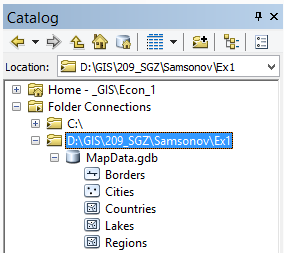
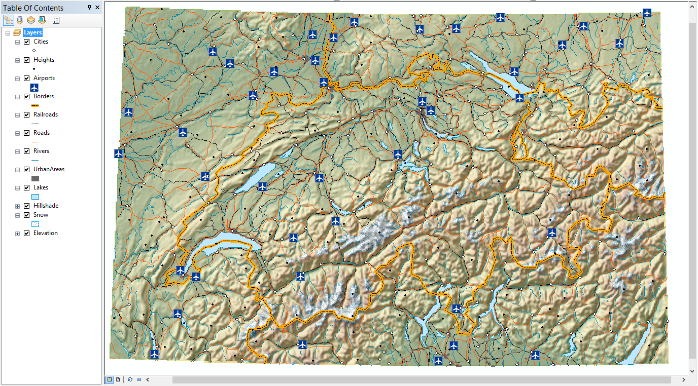
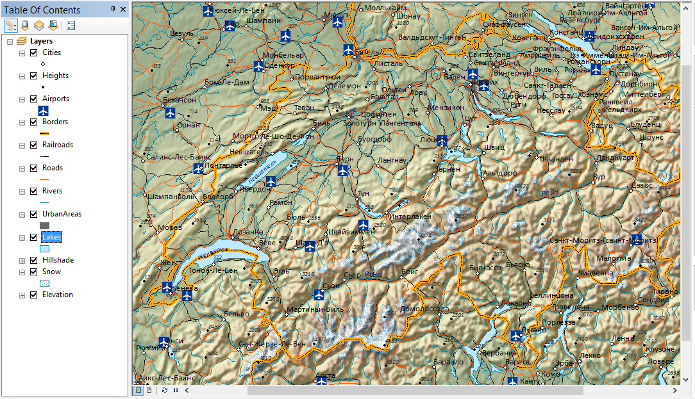
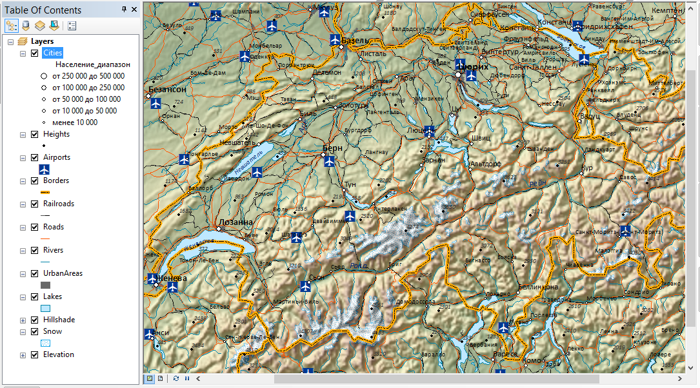
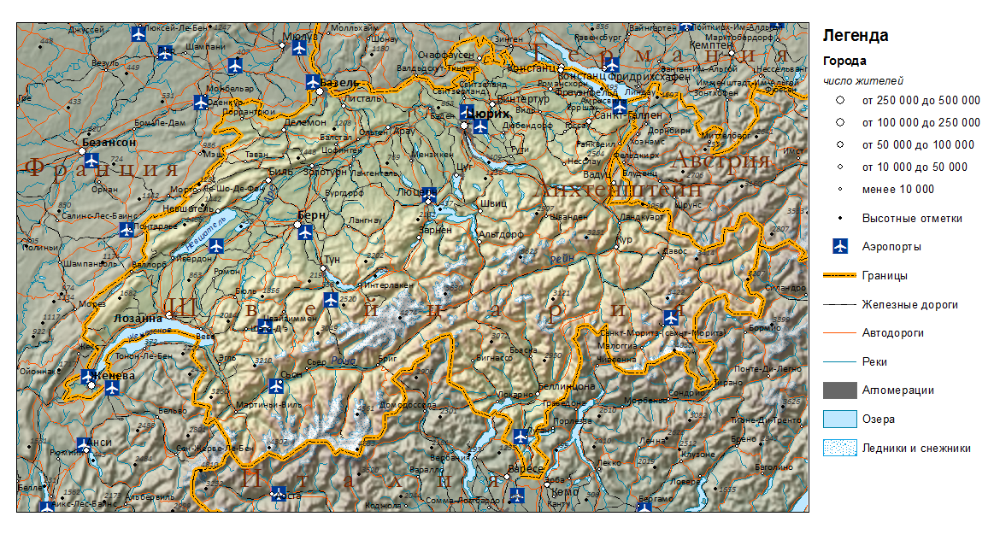
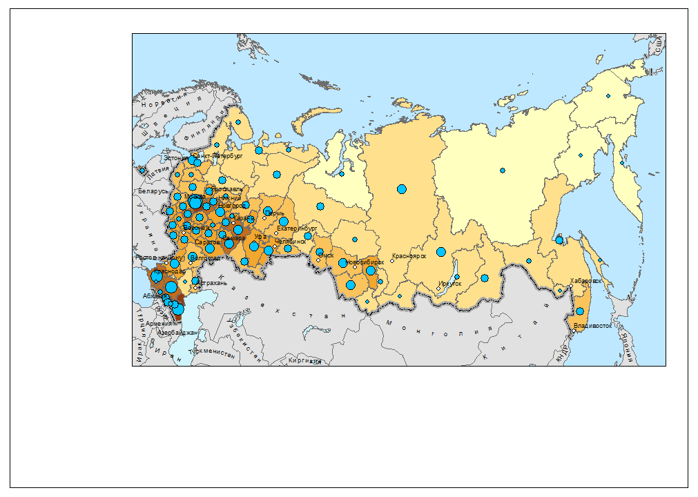
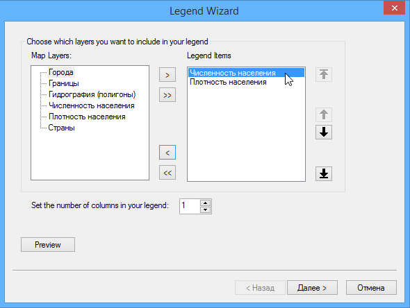
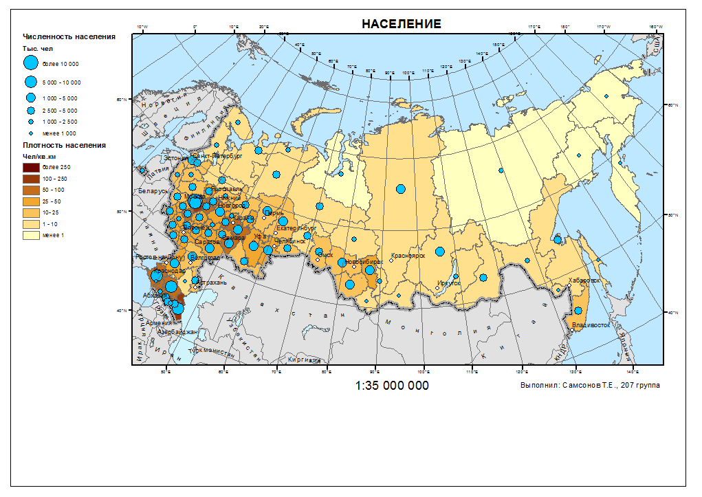

# Оформление социально-экономической карты {#map-design-economic}

## Введение

**Цель задания** --- знакомство с моделями пространственных объектов и базой пространственных данных. Визуализация данных на карте. Оформление легенды и компоновки карты.

Параметр                    Значение
--------------------------  --------
*Теоретическая подготовка*  Модели пространственных данных, модели пространственных объектов, базы пространственных объектов, картографические проекции
*Практическая подготовка*   Не требуется
*Исходные данные*           Сетка субъектов Федерации с привязанной статистикой по населению, государственная граница России, крупнейшие города России, крупнейшие озера, страны.
*Результат*                 Тематическая карта «Население России» масштаба 1:35 000 000
*Ключевые слова*            Модели пространственных данных, модели пространственных объектов, базы пространственных данных, классы пространственных объектов, визуализация пространственных данных, геоинформационное картографирование

### Контрольный лист

* Добавить на карту слои базы пространственных данных и оформить их
* Настроить подписи объектов
* Создать компоновку карты, легенду и координатную сетку
* Экспортировать результат в графический файл

### Аннотация

Задание посвящено знакомству с созданием тематических карт на основе баз пространственных данных. Вы познакомитесь с представлением площадных, линейных, точечных объектов в базе пространственных данных. Научитесь создавать карты на их основе, оформлять легенду, сетку координат и зарамочные элементы карты, познакомитесь с применением картограмм и картодиаграмм в геоинформационном картографировании.

## Начало работы
[В начало упражнения ⇡](#map-design-economic)

В каталоге *Ex02* находится база геоданных *MapData.gdb*, содержащая исходные данные для выполнения задания.

> **База геоданных** — это структурированное хранилище, внутри которого можно создавать слои данных, группировать их и связывать различными отношениями.

Внутри базы геоданных могут быть объекты следующих типов:

-  --- слои векторных данных (классы пространственных объектов),
-  — слои растровых данных;
-  — обычные таблицы;

> **Класс пространственных объектов (feature class)** --- это набор пространственных объектов одного типа геометрии (точки, линии, полигоны или объемные тела). Для класса могут быть определены атрибуты, а его представлением является таблица, содержащая как обычные столбцы (текстовые, числовые и т.д.) так и специальное поле Shape, в котором хранится информация о геометрии. Каждая строчка в таблице — это описание одного объекта.

1. Запустите приложение **ArcMap** и откройте окно **Каталога**

2. Подключитесь к рабочему каталогу *Ex02* в окне **Сatalog**:

    

1. Раскройте базу данных *MapData.gdb* и изучите классы пространственных объектов внутри нее:

    **Класс**    **Содержание**
    ------------ ----------------------------
    *Borders*    Государственная граница РФ
    *Cities*     Города
    *Lakes*      Озера
    *Regions*    Субъекты федерации
    *Countries*  Страны

    К какому типу геометрии относятся данные классы?

1. Дважды щелкните на слое *Regions* и перейдите на вкладку **XY Coordinate System**.

    Внимательно прочитайте информацию. Этот слой хранится в *Географической системе координат (GCS)*, отнесенной к эллипсоиду WGS-1984. Это означает, что координаты каждого объекта хранятся в виде широты и долготы. Этот слой можно спроецировать в любую проекцию. При этом координаты будут представлены в метрических единицах, а система координат получит название *Проецированной системы координат (PCS)*.

## Оформление тематических слоев
[В начало упражнения ⇡](#map-design-economic)

1. Добавьте на карту слой *Regions*. Для этого просто перетащите его из окна Каталога на карту.

2. Переименуйте его в «*Плотность населения*». Для этого дважды (медленно) щелкните на названии слоя или выделите его и нажмите клавишу <kbd>F2</kbd>:

    

1. Измените проекцию карты на равновеликую коническую проекцию Альберса. Ее можно найти по следующему пути:

    **Projected Coordinate Systems > Continental > Asia > Asia North Albers Equal Area Conic**

    Обратите внимание на то, как изменится форма отображаемых объектов.

1. Откройте таблицу атрибутов слоя. Найдите в ней столбец *Density*, просмотрите его значения. Это поле таблицы хранит значения плотности населения по субъектам.

2. Найдите поля *Shape* и *ObjectID*.

    > В поле *ObjectID* хранится уникальный идентификатор каждого объекта. Он нужен системе для того, чтобы каждый объект можно было гарантированно найти по некому однозначному критерию.

    > В поле *Shape* хранится геометрия объектов. Если слой точечный — это будут просто пары координат X и Y для каждого объекта. Для линейных и полигональных слоев это будет уже упорядоченный набор пар координат вершин границы объекта. Геометрия редактируется специальными инструментами, поэтому содержимое поля Shape скрыто от пользователя.

1. Дважды щелкните на названии слоя и на вкладке **Symbology** и выберите способ изображения *Quantity — Graduated colors* (Картограммы).

2. Выберите в списке **Value Field** поле *Density*, система автоматически сформирует список классов, созданных методом естественных интервалов.

    > Существует множество методов классификаций: равных интервалов, квантилей, стандартных отклонений и т.д. По умолчанию всегда выбирается метод естественных интервалов, т.к. считается, что он в среднем неплохо отражает особенности распределения. Следует знать, однако, что этот метод классификации плохо справляется с распределениями, обладающими значительной асимметрией и эксцессом (*heavy-tail distribution*).

1. Измените число классов на 7:

    

1. Измените метод классификации. Для этого нажмите **Classify**. В появившемся диалоговом окне выберите в списке сверху ручной метод задания интервалов (*Manual*) и в правом столбце замените первые шесть значений на следующие: 1, 10, 25, 50, 100, 250. Максимальное значение оставьте без изменений. Жмите **ОК**:

    

1. На вкладке **Symbology** выберите цветовую шкалу *Yellow To Dark Red*:

    

1. Инвертируйте сортировку классов, чтобы наверху оказались максимальные градации:

    

1. Инвертируйте цветовую шкалу, чтобы цвета соответствовали градациям:

    

1. В основном диалоге настройки символов исправьте подписи классов (столбец *Label*) в соответствии с нижеприведенным фрагментом:

    

1. Нажмите **ОК**.

2. Переименуйте показатель в «*чел/кв. км*»:

    

    Результат:

    

1. Сохраните карту

2. Скопируйте и вставьте слой «*Плотность населения*». Переименуйте его в «*Численность населения*»:

    

1. Разместите новый слой поверх слоя плотности населения.

2. Измените его способ изображения на *Картодиаграммы (Quantities > Graduated Symbols)*.

3. Выберите для отображения поле *SUM\_Все\_население*. Появится шкала классификации картодиаграмм.

4. Измените цвет кружка на голубой. Для этого нажмите кнопку **Template**, выберите значок *Circle 2* с тонкой обводкой и смените цвет заливки:

    

1. Установите число классов равным 6:

    

1. Аналогично предыдущему слою выберите ручной метод классификации и введите следующие границы классов: $500, 1000, 2500, 5000, 10000$. Максимальную границу оставьте прежней:

    

1. Нажмите ОК

2. Инвертируйте порядок классов и порядок символов в классификации (аналогично предыдущему слою) так чтобы наверху оказались максимальные значения.

3. Установите на вкладке **Symbology** максимальный и минимальный размер значка равным 18 и 4 пункта соответственно:

    

1. Отредактируйте подписи классов по аналогии с картограммами:

    

1. Задайте символ фона картодиаграмм в виде полигона с пустой заливкой и пустой обводкой. Для этого щелкните на кнопке **Background** и выберите режим *No Color* для заливки и для обводки:

    

1. Нажмите **ОК**.

    Результат:

    

1. Сохраните карту

## Оформление общегеографических слоев
[В начало упражнения ⇡](#map-design-economic)

1. Добавьте на карту слои *Borders*, *Cities*, *Countries* и *Lakes*. Установите следующий порядок слоев в таблице содержания:

    a. *Cities*
    b. *Borders*
    c. *Lakes*
    d. *Численность населения*
    e. *Плотность населения*
    f. *Countries*

2. Переименуйте вновь добавленные слои следующим образом:

    **Исходное название**   **Результирующее название**
    ----------------------- -------------------------
    *Cities*                Города
    *Borders*               Граница РФ
    *Lakes*                 Озера
    *Countries*             Страны

1. Присвойте слою *Граница РФ* единый символ *Boundary, National.*

2. Присвойте слою *Озера* единый символ *Lake.*

3. Измените цвет точек слоя *Города* на белый.

4. Установите следующие параметры оформления для площадного слоя *Страны*:

    **Параметр**      **Значение**
    ----------------- -----------
    *Цвет заливки*    Серый 10%
    *Цвет обводки*    Серый 50%
    *Толщина обводки* 1

    Результат:
    

1. Сохраните карту

## Настройка подписей
[В начало упражнения ⇡](#map-design-economic)

1. Включите механизм размещения подписей **Maplex**:

    

1. Включите подписи для слоя *Города* на вкладке **Labels**. Выберите в качестве поля для подписей *name\_2.* Остальные настройки оставьте по умолчанию:

    

1. Включите подписи для слоя Страны. Настройте подписи следующим образом:

    **Параметр**                          **Значение**
    ------------------------------------- ------------------------
    *Поле (label field)*                  Название
    *Тип размещения*                      Криволинейное (Curved)
    *Разрядка слов*                       Да
    *Разрядка букв*                       Да
    *Подписывать только наибольшую часть* Да

    Результат:

    

## Настройка компоновки
[В начало упражнения ⇡](#map-design-economic)

1. Переключитесь в вид компоновки через команду меню **View > Layout View**

2. Настройте макет страницы следующим образом:

    - Размер А4
    - Альбомная ориентировка

3. Установите масштаб карты равным $1:35 000 000$. Подгоните размер фрейма данных таким образом, чтобы он был слегка больше контура России. Для этого используйте стрелку  на панели **Tools**. Разместите его в правом верхнем углу карты.

4. Отцентрируйте контур России внутри фрейма (рамки). Для этого используйте лапу  на панели **Tools**.

5. Смените цвет фрейма данных (фона) на светло-голубой.

    Результат:
    

1. Добавьте на карту легенду, включив в нее только слои *Численность населения* и *Плотность населения.* Нажмите **Далее**.

    

1. В следующем диалоге название легенды оставьте пустым:

    

1. Далее все параметры оставьте по умолчанию.

2. Добавьте сетку координат со следующими параметрами:

    **Параметр**      **Значение**
    ----------------- -----------
    *Тип сетки*       градусная
    *Шаг по широте*   10
    *Шаг по долготе*  10

1. Отключите отображение нулевых минут и секунд

2. Разместите над картой текст заголовка карты, используя панель **Drawing** или меню **Insert**:

    

1. Разместите под картой по центру численный масштаб $1:30 000 000$.

2. Разместите в правом нижнем углу карты текст «Выполнил» и свое ФИО.

    Результат:
    

1. Сохраните карту.

## Экспорт в графический файл
[В начало упражнения ⇡](#map-design-economic)

1. Экспортируйте карту из режима компоновки в формат **PNG** с разрешением 300 точек на дюйм. Сохраните его в свою директорию.

2. Вставьте карту в отчетный файл

## Контрольные вопросы
[В начало упражнения ⇡](#map-design-economic)

Ответьте на вопросы в отчетном файле. После окончания положите ваш отчет в сетевую папку для проверки преподавателем
