# (PART) Базовые технологии {-}

# Привязка и цифрование туристской карты {#map-ref-general}

[Скачать данные и файл отчета](http://autolab.geogr.msu.ru/gis/data/Ex05.zip)

## Введение {#map-ref-general-intro}

**Цель задания** --- знакомство с привязкой, трансформированием и цифрованием геоизображений.

Параметр                    Значение
--------------------------  --------
*Теоретическая подготовка*  Системы координат и проекции на картах, привязка геоизображений, трансформирование геоизображений, цифрование геоизображений. Методы трансформации: аффинное, проективное, полиномиальное, метод резинового листа (сплайны).
*Практическая подготовка*   Знание основных компонент интерфейса ArcGIS Desktop (каталог, таблица содержания, карта). Работа с базой геоданных. Настройка символики и подписей объектов.
*Исходные данные*           Растровые карты для привязки, база пространственных данных на территорию Швейцарии.
*Результат*                 База данных со следующими слоями: границы природных зон; линии туристического маршрута; остановки вдоль маршрута; проект карты карта с компоновкой
*Ключевые слова*            Системы координат, проекции, трансформирование координат, пространственная привязка, цифрование, классы пространственных объектов, база пространственных данных,

### Контрольный лист {#map-ref-general-control}

* Привязать растровые карты к опорным данным
* Создать базу геоданных и классы пространственных объектов
* Наполнить классы пространственных объектов путем цифрования привязанных карт
* Наполнить атрибуты объектов значениями
* Разработать символику и подписи для слоев карты
* Подготовить компоновку карты
* Экспортировать карту в графический файл

### Аннотация {#map-ref-general-anno}

Задание посвящено знакомству с привязкой растровых карт, созданием и наполнением баз пространственных данных путем цифрования, оформлением карт на их основе.

В задании предлагается привязать в координатную систему карту природных зон и карту туристического маршрута по территории Швейцарии. По результатам цифрования этих карт вы составите туристскую карту, показывающую прохождение маршрута по разным природным зонам.

## Привязка карт {#map-ref-general-referencing}
[В начало упражнения ⇡](#map-ref-general)

1. Внимательно прочтите раздел **Привязка растровых данных (Georeferencing)** в разделе **Описание функций**.

1. Добавьте на карту слой *Countries* из базы данных упражнения 3.

2. Добавьте на карту растр *SwissRegions.gif*. Появится диалог, предупреждающий вас, что добавляемый файл не имеет пространственной привязки. Нажмите **ОК**:

    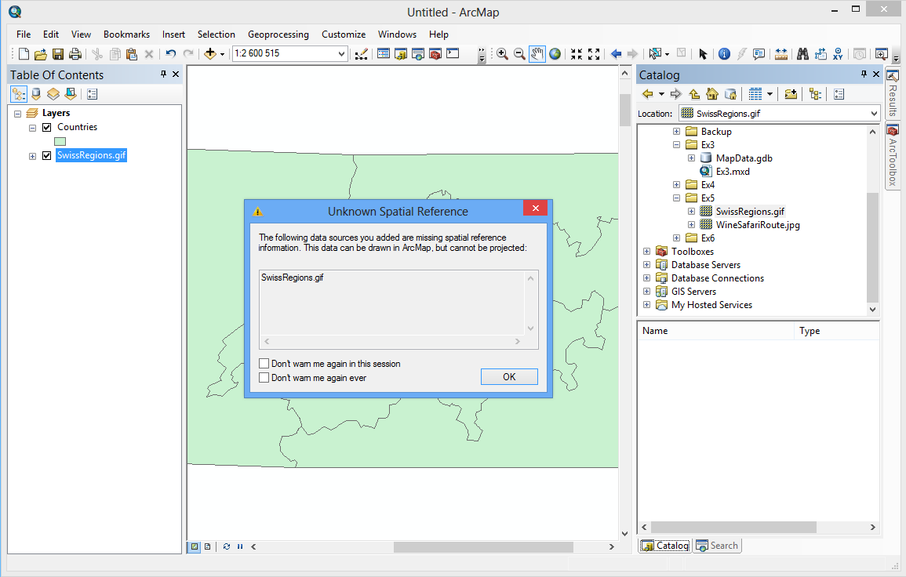

1. Убедитесь, что контур страны отображается примерно посередине экрана.

2. Откройте панель инструментов **Georeferencing**. Выберите в меню команду **Fit to Display**, чтобы переместить непривязанный растр на середину области отображения:

    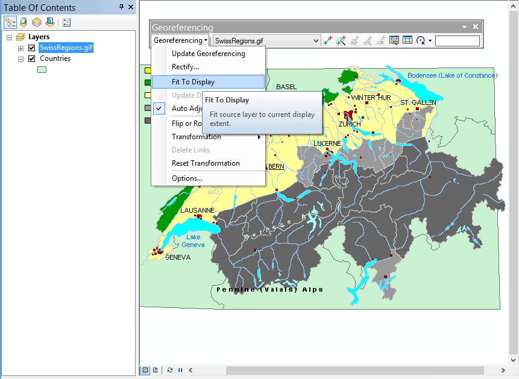

1. Сделайте растровый слой прозрачным на *50%*.

2. Используя **инструмент расстановки контрольных точек**, укажите *3-6* соответствующих точек по границе страны на характерных выступах контура:

    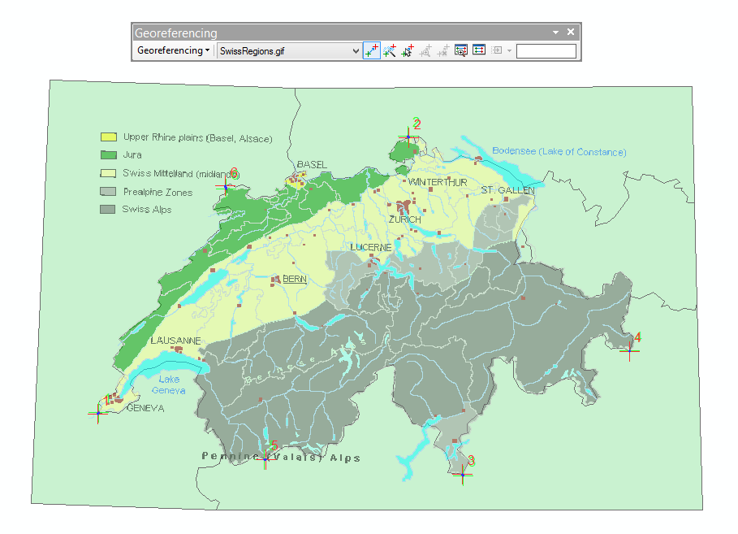

1. Выберите команду меню **Georeferencing > Update Georeferencing**, чтобы завершить привязку растра. При этом по умолчанию будет примененоаффинное преобразование с минимизацией среднеквадратической ошибки отклонения исходных и целевых координат:

    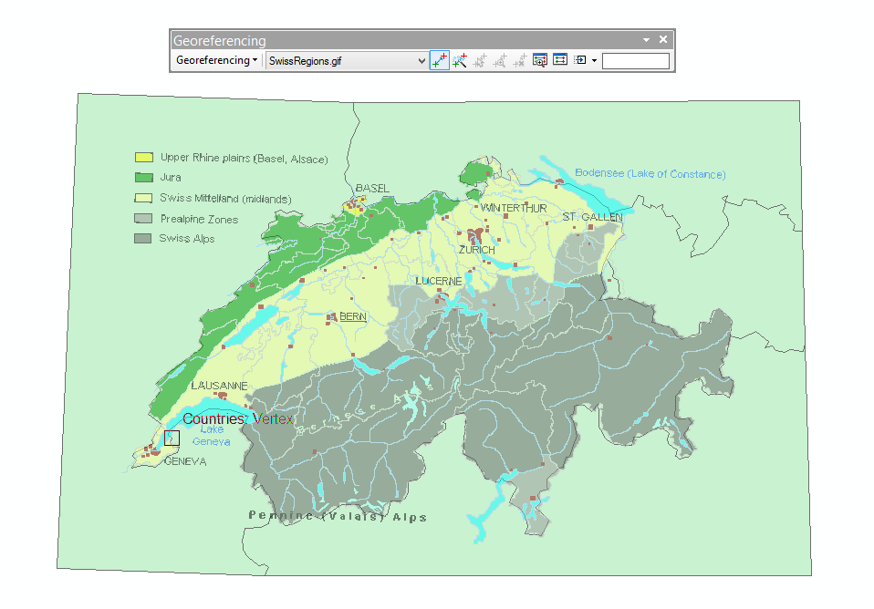

<kbd>**Снимок экрана №1**. Привязанная карта физико-географических регионов</kbd>

1. Добавьте на карту слой *WineSafariRoute.jpg*.

2. Выберите его в списке на панели **Georeferencing**:

    

1. Отключите слой *SwissRegions.gif* в таблице содержания.

2. Привяжите растр *WineSafariRoute* аналогично предыдущему растру, используя контрольные точки:

    

1.Выберите команду **Georeferencing > Update georeferencing**, чтобы завершить привязку второго растра.

<kbd>**Снимок экрана №2**. Привязанная карта маршрута</kbd>

## Создание базы данных и классов пространственных объектов {#map-ref-general-geodatabase}
[В начало упражнения ⇡](#map-ref-general)

1. Создайте в папке *Ex05* базу геоданных под названием *RouteMap.gdb*.

2. Создайте в базе данных *классы пространственных объектов* со следующими параметрами:

Название  Модель пространственных объектов  Атрибутивные поля Проекция
--------  --------------------------------- ----------------- --------  
*Regions* Полигональная (polygon features)  NAME (text)       `WGS_1984_UTM_Zone_32N` (импортируйте у слоя карты)
*Routes*  Линейная (line features)          -                 `WGS_1984_UTM_Zone_32N` (импортируйте у слоя карты)
*Places*  Точечная (point features)         NAME (text)       `WGS_1984_UTM_Zone_32N` (импортируйте у слоя карты)

По завершению создания слоев они автоматически будут добавлены на карту:

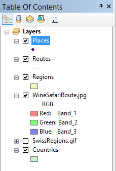

## Цифрование регионов {#map-ref-general-digitizing}
[В начало упражнения ⇡](#map-ref-general)

1. Оставьте включенными только слои *Regions*, *SwissRegions* и *Countries*.

2. Уберите *прозрачность* у слоя *SwissRegions*.

3. Откройте сеанс редактирования для слоя *Regions*. Появится панель редактирования **Editor**, а также окно шаблонов объектов **Create Features**:

    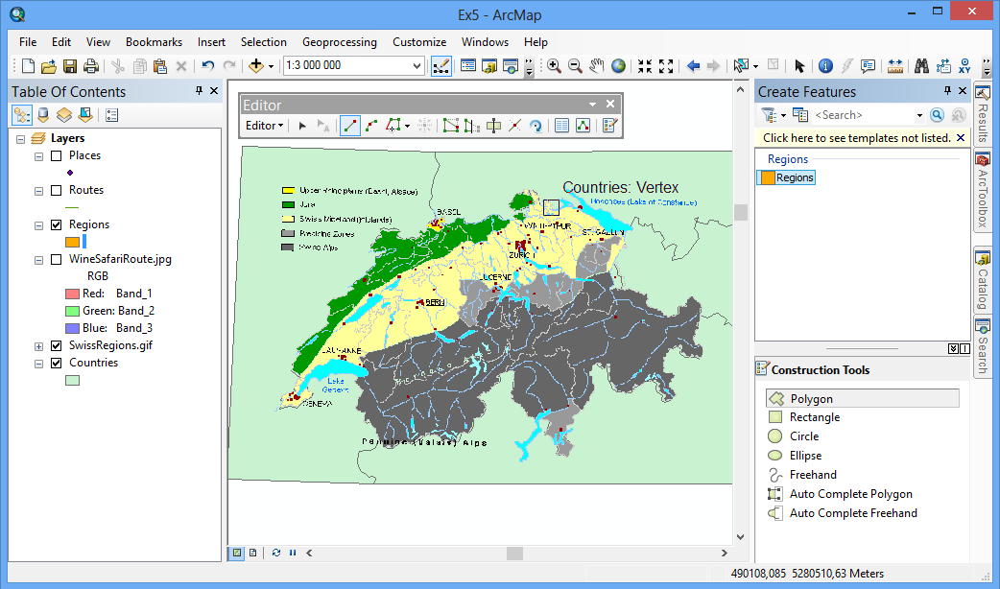

1. Щелкните на шаблоне объекта *Regions* в окне **Create Features** и выберите режим цифрования **Polygon**:

    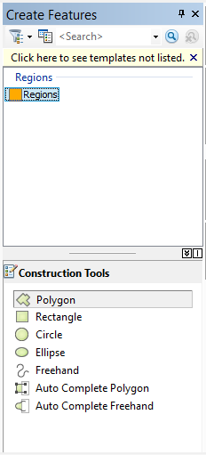

1. Оцифруйте регион *Prealpine Zones* в центре карты. По завершению дважды щелкните мышкой:

    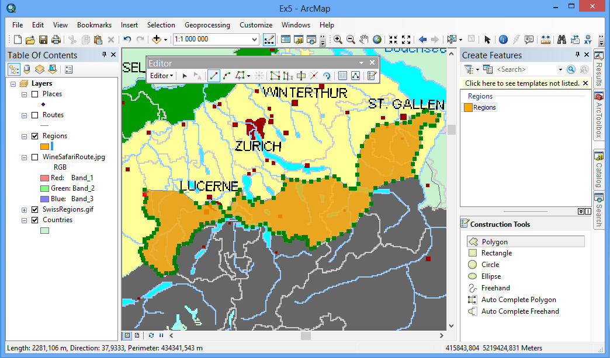

1. Чтобы появилась возможность пристыковать остальные регионы к границам стран, **выделите** в слое *Countries* все страны, кроме Швейцарии, **скопируйте** их в буфер обмена и **вставьте** в слой *Regions*:

    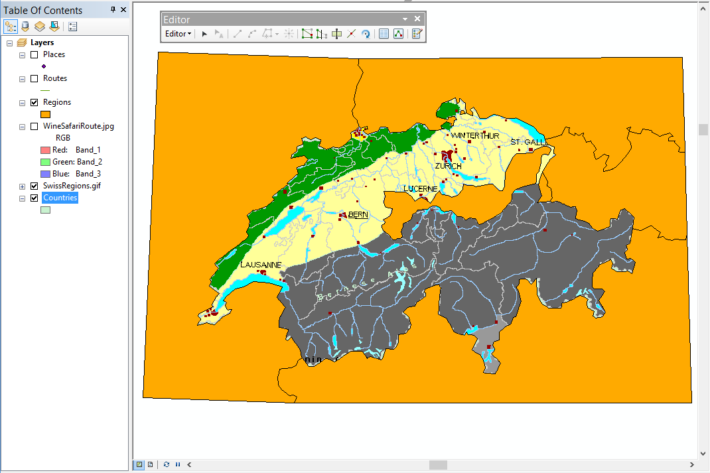

1. Выделите опять шаблон *Regions* в окне **Create Features**.

2. Используя режим **Auto-Complete Polygon**, оцифруйте границы оставшихся регионов в следующем порядке:

    - Сначала небольшие регионы, примыкающие к границам:

        

    - Затем область второго порядка (горы *Юра*):

        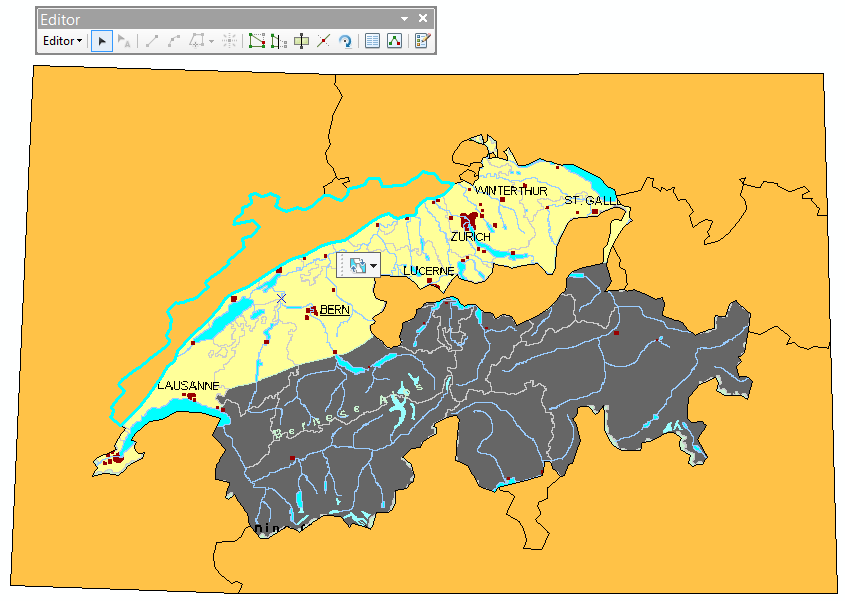

    - Наконец, границу между центральными регионами:

        

1. Выделите в слое *Regions* границы стран и удалите их.

2. Выберите команду **Editor > Save Edits**, чтобы сохранить результаты редактирования.

*Результат*:
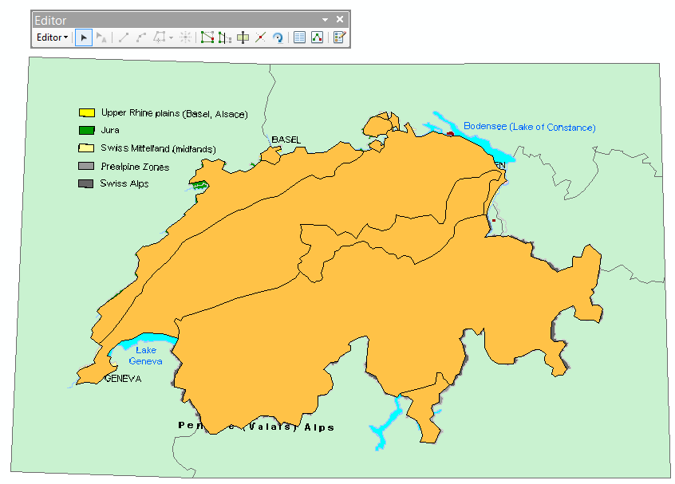

<kbd>**Снимок экрана №3**. Векторный слой физико-географических регионов</kbd>

## Атрибутирование регионов {#map-ref-general-attributes}
[В начало упражнения ⇡](#map-ref-general)

1. Уберите заливку регионов, линии сделайте толщиной 1.5-2 пиксела:

    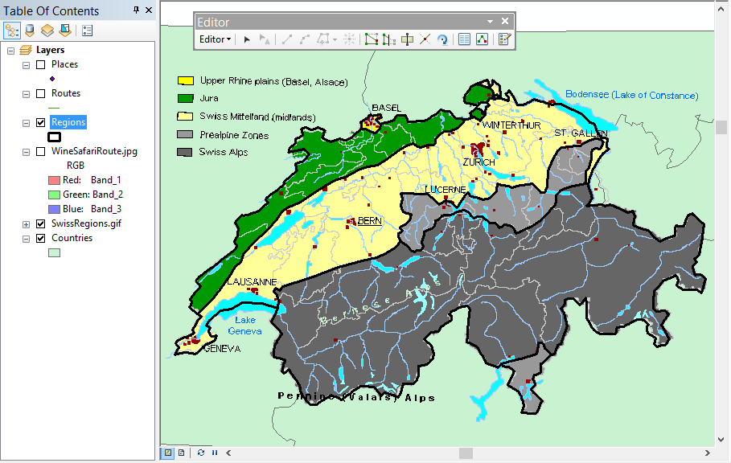

1. Откройте атрибутивную таблицу слоя *Regions*.

2. Поочередно выделяя каждый объект в таблице или на карте, заполните его атрибуты в соответствии с легендой:

    

1. Сохраните изменения и завершите сеанс редактирования.

<kbd>**Снимок экрана №4**. Атрибутированные регионы</kbd>

## Цифрование маршрутов и точек интереса {#map-ref-general-routes-poi}
[В начало упражнения ⇡](#map-ref-general)

1. Выключите слои *Regions* и *SwissRegions.gif*.

2. Включите слои *WinSafariRoute*, *Routes* и *Places*.

3. Оцифруйте объекты слоев *Places* и *Routes*, используя инструменты панели **Сreate Features**:

    - Начните с расстановки точек:

        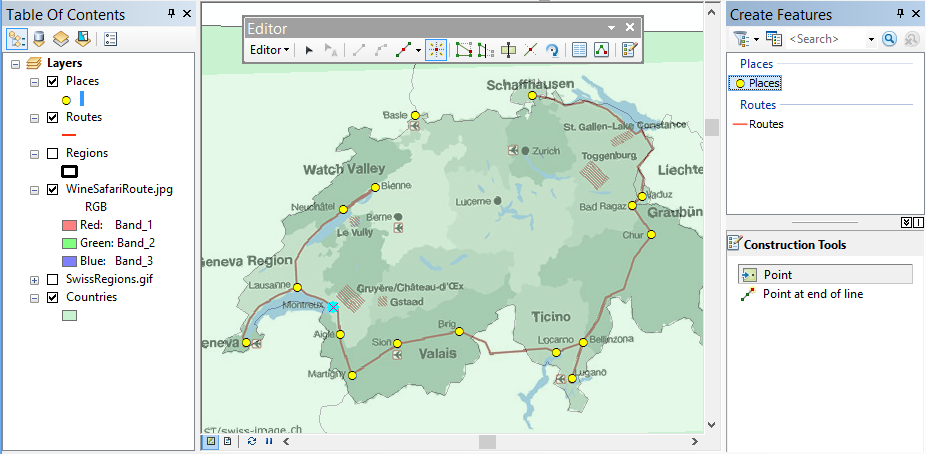

    - Увеличьте масштаб, чтобы были хорошо видны изгибы линий:

        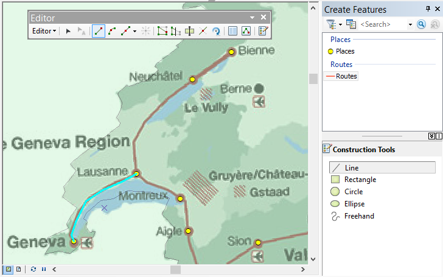

    - Проведите линии через получившиеся точки, повторяя контур исходной линии на растровой подложке. Каждую линию начинайте в точке и завершайте двойным щелчком в перекрестке:

        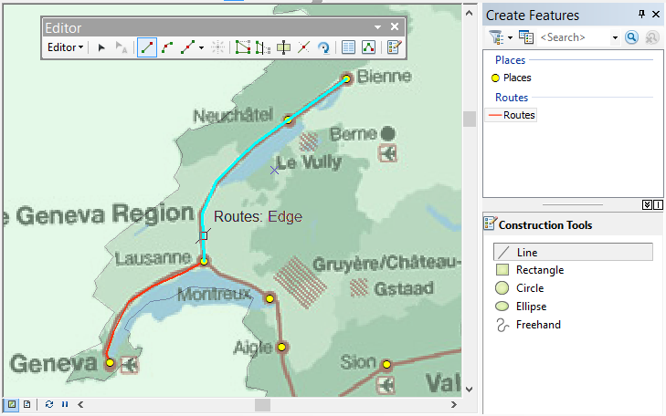

    *Результат*:
    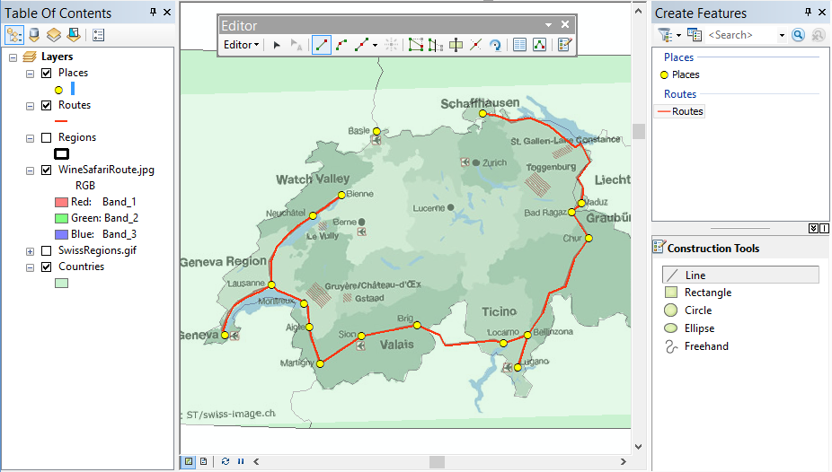

1. Заполните названия городов в слое *Places*.

    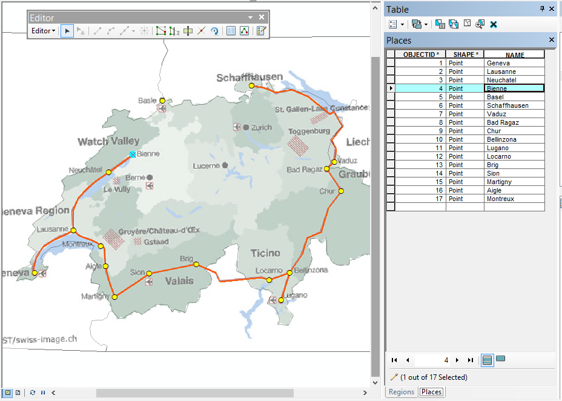

1. Сохраните изменения и завершите сеанс редактирования.

<kbd>**Снимок экрана №5**. Слои маршрута и пунктов назначения</kbd>

## Оформление карты {#map-ref-general-design}
[В начало упражнения ⇡](#map-ref-general)

1. Оставьте включенными слои *Regions*, *Routes*, *Places* и *Countries*. Остальные слои выключите.

2. Уберите заливку у слоя *Countries*.

3. Оформите слой *Regions* методом категорий по полю *NAME*:

    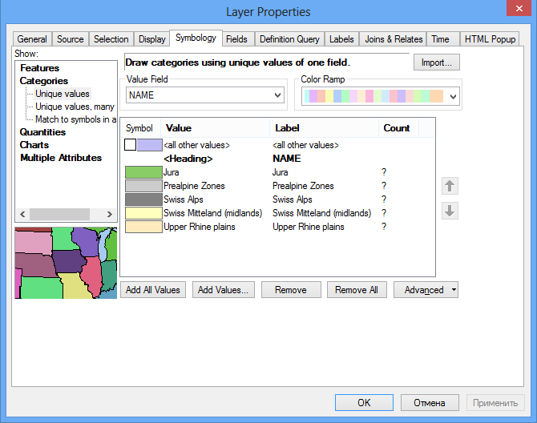

1. Оформите слои *Routes* и *Places* по аналогии с нижеприведенным фрагментом:

    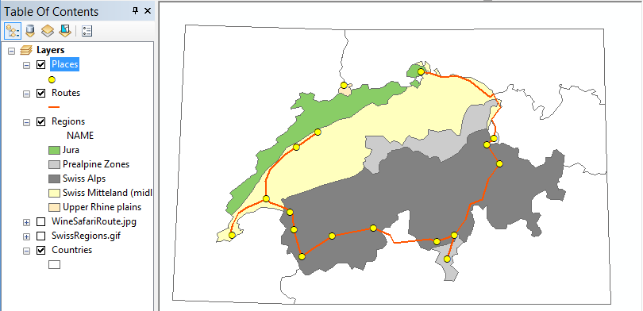

1. Откройте панель **Labeling** и включите **Maplex** для размещения подписей.

2. Включите подписи для слоя *Places* со следующими настройками:

    Параметр                Значение
    ----------------------- ---------
    *Поле для подписей*     NAME
    *Шрифт*                 Tahoma
    *Кегль (размер)*        12
    *Цвет*                  Черный
    *Начертание*            Обычное

    *Результат*:
    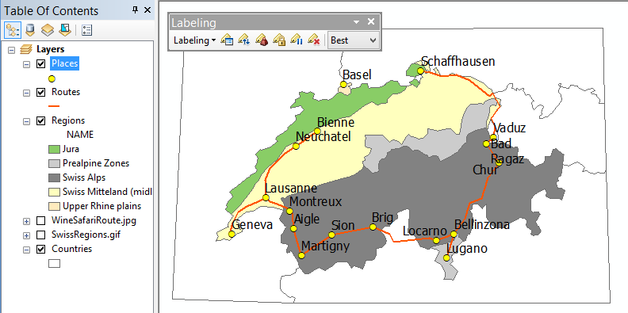

Некоторые подписи могут быть размещены не очень удачно. Чтобы они не перекрывали линии маршрута и значки выполните следующие действия:

1. Откройте *настройки весов подписей* **Label Weight Ranking** на панели **Labeling**

2. Установите вес равным *1000* слоям *Places* и *Routes:*

    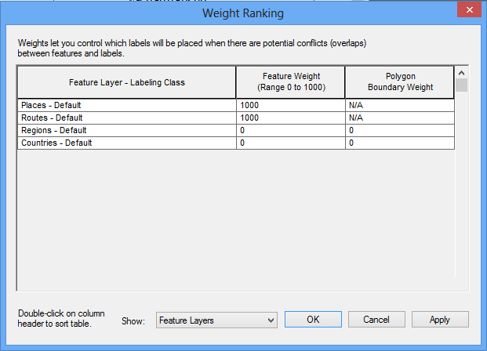

    *Результат*:
    

1. Добавьте на карту слой *Hillshade* из базы данных упражнения 3, разместите его над слоем Regions и установите прозрачность _80%_.

    *Результат*:
    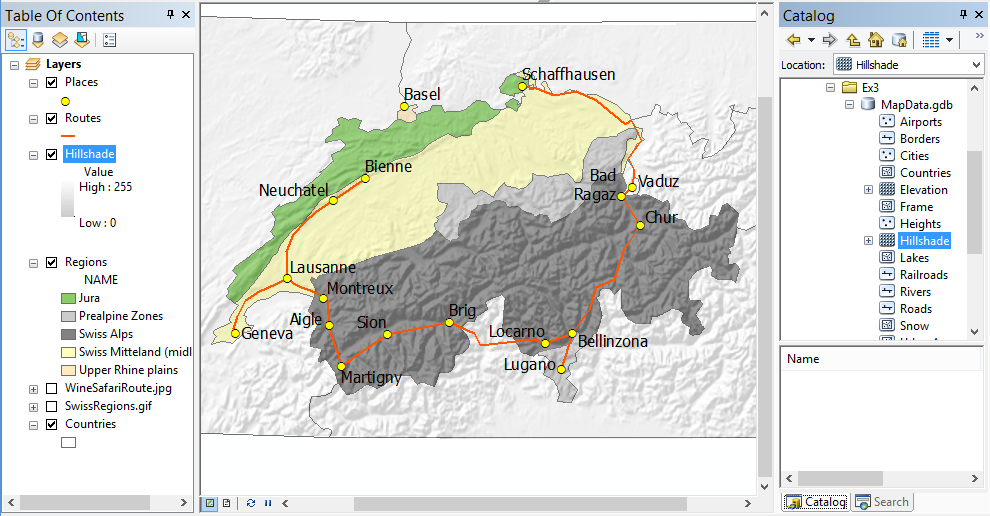

1. Добавьте на карту слой *Lakes* и присвойте ему символ полигона с голубой заливкой без обводки.

    *Результат*:
    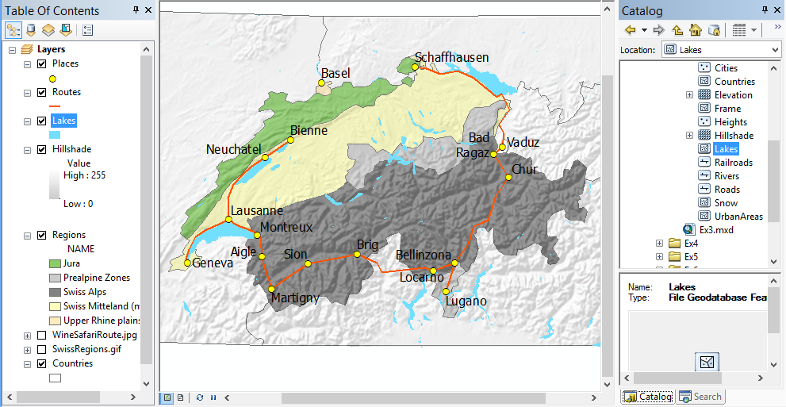

<kbd>**Снимок экрана №6**. Оформление карты</kbd>

## Компоновка карты {#map-ref-general-layout}
[В начало упражнения ⇡](#map-ref-general)

1. Переключитесь в **режим компоновки**.

2. Установите альбомную ориентировку листа.

3. Оформите компоновку в соответствии с нижеприведенным образцом:

    

<kbd>**Снимок экрана №7**. Компоновка карты</kbd>

1. Экспортируйте карту в формат <kbd>PNG</kbd> с разрешением *300 dpi*.

2. Сохраните документ карты.

## Контрольные вопросы {#map-ref-general-questions}
[В начало упражнения ⇡](#map-ref-general)

1. В какой последовательности расставляются контрольные точки при привязке данных? Каково их оптимальное расположение?

2. Какой метод трансформирования изображения вы использовали в работе?

3. Как пристыковать один полигон к другому, не оцифровывая их общую границу? Опишите последовательность действий.
