# Привязка и цифрование административной карты {#map-ref-economic}

[Скачать данные и файл отчета](http://autolab.geogr.msu.ru/gis/data/Ex07.zip)

## Введение {#map-ref-economic-intro}

**Цель задания** — знакомство с привязкой, трансформированием и цифрованием геоизображений, элементами базовых технологий ГИС (оверлей, пространственные запросы).

Параметр                    Значение
--------------------------  --------
*Теоретическая подготовка*  Системы координат и проекции на картах, привязка геоизображений, трансформирование геоизображений, цифрование геоизображений. Методы трансформации: аффинное, проективное, полиномиальное, метод резинового листа (сплайны). Пространственные запросы, атрибутивные запросы, оверлей.
*Практическая подготовка*   Знание основных компонент интерфейса ArcGIS Desktop (каталог, таблица содержания, карта). Работа с базой геоданных. Настройка символики и подписей объектов.
*Исходные данные*           Cлои картографической основы OpenStreetMap, растровая карта районов Лондона.
*Результат*                 База данных со слоем границ районов Лондона. Результаты выборки и статистика по количеству отелей в пределах каждого района. Картодиаграммы по числу отелей в каждом районе. Проект карты с оформленной компоновкой
*Ключевые слова*            Системы координат, проекции, трансформирование координат, пространственная привязка, цифрование, оверлей, пространственные запросы, атрибутивные запросы, библиотеки символов, картодиаграммы  

### Контрольный лист {#map-ref-economic-control}

* Привязать растровую карту к опорным данным
* Дополнить класс районов путем цифрования растровой карты
* Заполнить названия новых районов
* Определить путем пространственного запроса количество отелей в каждом районе.
* Построить картодиаграммы по полученным значениям с использованием нестандартных библиотек символов
* Подготовить проект карты с компоновкой

### Аннотация {#map-ref-economic-annotation}

Задание посвящено знакомству с привязкой растровых карт, созданием и наполнением баз пространственных данных путем цифрования, оформлением карт на основе баз данных. В этом задании вы также познакомитесь с запросами, с помощью которых можно ограничивать число отображаемых объектов.

В задании предлагается выполнить координатную привязку карты районов Лондона и оцифровать недостающие районы для создания персональной БГД «Административные районы Лондона». Далее, используя запросы к БГД, по каждому району определить количество входящих в него отелей, и построить социально-экономическую карту, которая показывает способом картодиаграмм количество отелей в каждом районе. Работа завершается оформлением компоновки карты.

## Добавление референцных данных {#map-ref-economic-reference}
[В начало упражнения ⇡](#map-ref-economic)

1. Скопируйте каталог *Ex07* в свою папку и разархивируйте внутри него файл *London.zip* — он содержит базу геоданных для выполнения упражнения.

2. Подключитесь в окне Каталога к вашей папке *Ex07*. Убедитесь, что в ней находится база геоданных *London.gdb* и растровый файл *InnerLondon.png*:

    

1. Раскройте базу геоданных и перенесите на карту класс пространственных объектов *Roads*, присвойте ему символ в виде черной линии толщиной 0,5 пункта.

2. Добавьте на карту также слой *Water* и присвойте ему символ *Lake* (голубой полигон с синей обводкой). Картографическое изображение примет следующий вид:

    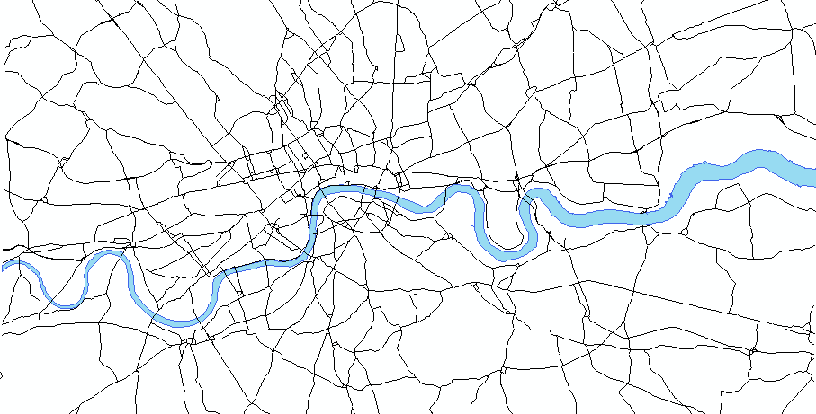

    <kbd>**Снимок экрана №1**.   Картографическая основа</kbd>

1. Сохраните документ карты в *свою* папку *Ex07* под именем *London.mxd*.

## Привязка карты {#map-ref-economic-referencing}
[В начало упражнения ⇡](#map-ref-economic)

1. Добавьте на карту из окна каталога слой *InnerLondon.png* и поместите его под слои *Water* и *Roads*. При добавлении слоя появится диалоговое окно, предупреждающее о том, что файл не имеет привязки. Закройте его.

2. Расположите карту в центре окна **ArcMap**.

    > Для выполнения дальнейшей работы прочтите раздел **[Привязка растровых данных](#manual-georef)** в приложении.

1. Откройте панель инструментов **Georeferencing**. Выберите в ее меню команду **Fit to Display**, чтобы переместить непривязанный растр на середину области отображения.

3. Используя инструмент расстановки контрольных точек на панели **Georeferencing**, укажите по крайней мере 3 контрольные точки в разных частях города:

    

    Щелкайте сначала на растре, затем на векторном слое. В качестве точек используйте перекрестки дорог, которые вы можете найти как на растре, так и на картографической основе. Например, и на растре и на основе хорошо распознается перекресток на западной окраине *Хемпстеда*:

    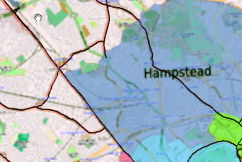

    Желательно, чтобы точки были равномерно распределены по полю карты (по краям и в центре) и не располагались на одной линии — это обеспечит хорошие коэффициенты трансформации.

1. Ознакомьтесь с доступными методами трансформирования по контрольным точкам. Для этого в меню на панели **Georeferencing** выберите команду **Transformation**. По умолчанию выбрано аффинное преобразование. При пяти контрольных точках будет доступно также проективное преобразование. Оставьте выбранным аффинное преобразование:

    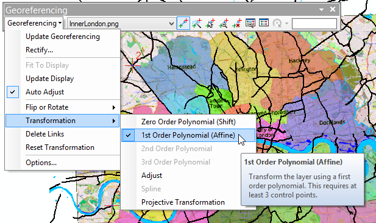

1. Осуществите трансформирование растра. Для этого на панели инструментов **Georeferencing** выберите команду меню **Georeferencing > Update Georeferencing**. После выполнения трансформирования контрольные точки удалятся.

    Картографическое изображение примет следующий вид:

    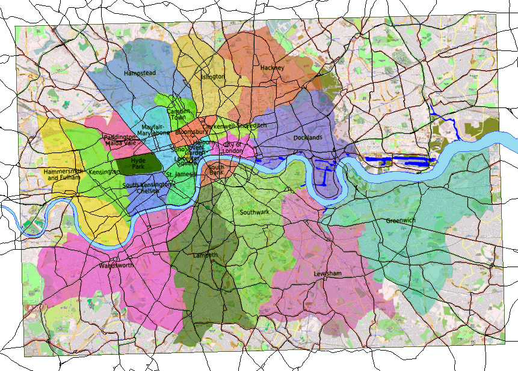

    <kbd>**Снимок экрана №2**   Привязанный растровый слой</kbd>

2. Сохраните документ карты в папке отчета.

## Создание слоя городских районов {#map-ref-economic-regions}
[В начало упражнения ⇡](#map-ref-economic)

1. Отключите слой дорог и слой гидрографии, оставив видимой только подложку.

2. Добавьте на карту класс пространственных объектов *Districts*. Он содержит районы северного берега Темзы. Вам необходимо его дополнить, оцифровав районы южного берега реки:

    

    > Для выполнения дальнейшей работы прочтите раздел **[Редактирование](#manual-edit)** в приложении.

1. Включите режим редактирования слоя *Districts*. Для этого в его контекстном меню выберите команду **Edit Features > Start Editing**.

3. Откройте список шаблонов слоя, нажав кнопку **Create Features** на панели **Editor** и посмотрите доступные опции.

4. Оцифруйте недостающие городские районы. Выполняйте работу в следующей последовательности:

    * Сначала оцифруйте район *Wandsworth* с помощью обычного инструмента **Polygon**.

    * Далее последовательно пристыкуйте к нему оставшиеся районы южного берега с помощью инструмента **Auto-Complete Polygon**.

    * Участки, примыкающих к реке, аккуратно проведите по береговой линии аналогично районам северного берега.

5. После того как редактирование районов завершено, сохраните изменения, выбрав команду **Editor > Save Edits**.

6. Откройте таблицу атрибутов слоя районов (<kbd>Ctrl</kbd> + двойной щелчок мышью по названии слоя). Поочередно выделяя каждый из новых районов, введите в поле *Name* его название, ориентируясь по карте.

7. После ввода названий снова сохраните изменения.

8. Завершите редактирование, выбрав команду **Editor > Stop Editing**.

9. Измените оформление слоя следующим образом: сделайте пустую заливку, а обводку сделайте оранжевого цвета толщиной 1,5 пункта.

10. Включите подписи районов по полю *Name*.

11. Отключите слой растровой карты.

12. Включите слой дорог и установите ему прозрачность, равную *60%*.

    Картографическое изображение примет следующий вид:

    

    <kbd>**Снимок экрана №3**. Оцифрованные городские районы с подписями</kbd>

1.  Сохраните документ карты.

## Расчет статистики по районам {#map-ref-economic-stats}
[В начало упражнения ⇡](#map-ref-economic)

В данной части работы предлагается определить количество отелей, которые попадают в пределы каждого района, затем построить картодиаграммы по полученным значениям. Для этого будет использован следующий алгоритм:

* Выбрать текущий район.

* Выбрать здания, попадающие в его пределы (*пространственный запрос*).

* Из полученной выборки оставить только здания, являющиеся отелями (*атрибутивный запрос*).

* Записать число отобранных зданий в атрибут *Hotels* текущего района.

Эти операции необходимо повторить для каждого района.

Перед выполнением анализа следует создать атрибутивное поле, в котором будет храниться число отелей. Для этого:

1. Остановите сеанс редактирования, если это не было сделано ранее (**Editor > Stop Editing**).

1. Откройте таблицу атрибутов слоя.

2. Выберите команду меню **Add Field…** (если она не активна, это значит, что вы не остановили сеанс редактирования на панели **Editor**).

    

1. Введите название поля *Hotels* и тип поля **Short Integer**. Диалог примет следующий вид:

    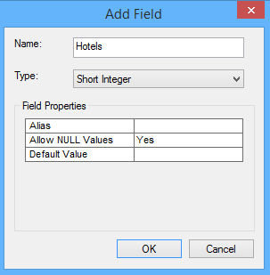

1. Нажмите **ОК**. Поле будет добавлено в слой.

2. Добавьте на карту класс *building_points* из базы геоданных *London.gdb*. Разместите его под слоем *districts*. В данном слое каждая точка соответствует зданию.

1. Откройте атрибутивные таблицы слоев *districts* и *buildings* и расположите их друг над другом в левой части окна:

    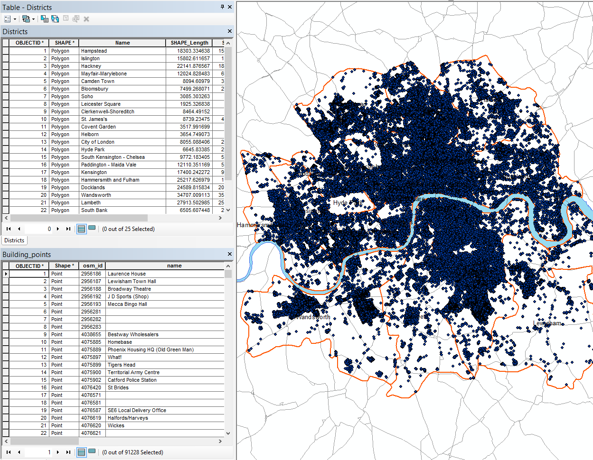

1. Включите редактирование слоя *districts* и выберите в его таблице первую строчку (нужно щелкнуть на заголовке слева от строки).

    > Для выполнения дальнейшей работы прочтите раздел **[Выборка объектов](#manual-select)** в приложении.

2. Откройте диалог пространственной выборки (**Selection > Select by Location**) и диалог атрибутивной выборки (**Selection > Select by > Attributes**). Расположите их рядом.

3. Выберите в диалоге пространственной выборки слой *building\_points* в качестве выбираемого (**target**) и слой *districts* в качестве выбирающего (**source**). Отметьте галочкой пункт **Use Selected Features** --- это позволит выбирать с использованием уже выбранного района. Диалог примет следующий вид:

    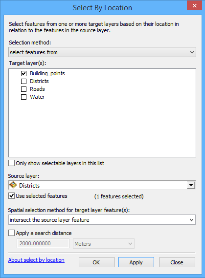

1. Нажмите кнопку **Apply** --- на карте должны выбраться здания, попавшие в пределы выбранного района. Не закрывайте диалог.

2. Перейдите в диалог атрибутивной выборки. В качестве выбираемого слоя укажите *building\_points* и смените режим выборки на **Select from current selection**. В этом режиме будет осуществляться подвыборка среди уже выбранных объектов.

3. Введите следующий атрибутивный запрос, чтобы отобрать отели:
    ```
    type = 'hotel'
    ```
    Диалог примет следующий вид:

    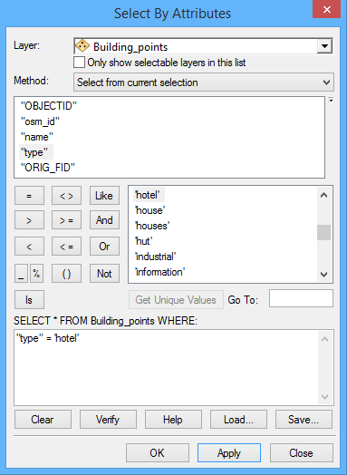

1.  Нажмите **Apply**. *Не закрывайте диалог атрибутивной выборки*. На карте останутся выбранными только те здания текущего района, которые являются отелями. Чтобы ознакомиться с их списком, перейдите в атрибутивную таблицу слоя *building\_points* и включите режим показа только выбранных объектов (**Show selected records**):

    

    Внизу таблицы вы можете увидеть число выбранных объектов (на рисунке их 8, у вас может получиться другое число, если выделен другой район).

1. Внесите указанное число в атрибутивную таблицу слоя *districts* для текущего выбранного района:

    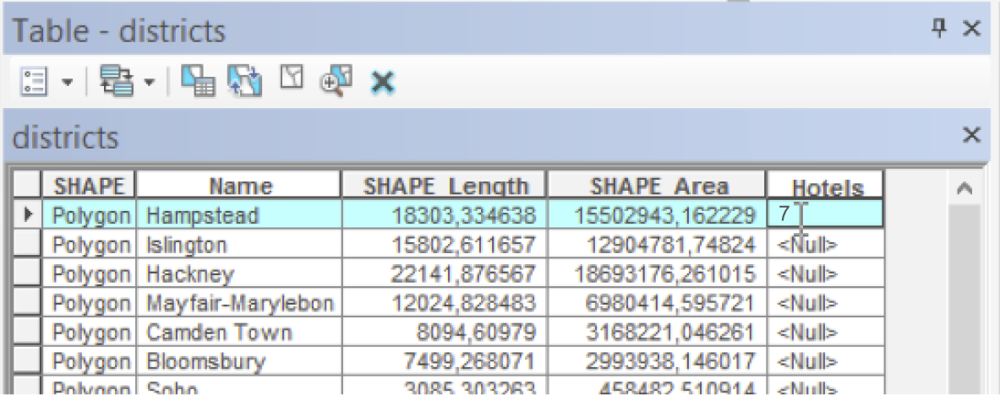

1. Выберите следующий район в таблице слоя *districts* (на рисунке выше это будет район *Islington*).

2. Повторите шаги 5--10 для всех оставшихся районов. На всем протяжении выполнения этих операций у вас должны быть открыты таблицы обоих слоев, а также диалоговые окна атрибутивной и пространственной выборки.

3. Сохраните документ карты

Законченная таблица должна содержать в поле *Hotels* число отелей для каждого района:

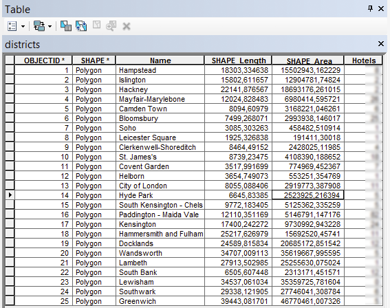

<kbd>**Снимок экрана №4**. Атрибутивная таблица с числом отелей по каждому району</kbd>

## Построение картодиаграмм {#map-ref-economic-diagrams}
[В начало упражнения ⇡](#map-ref-economic)

1. Отключите слой *building\_points*.

2. Создайте точки для размещения картодиаграмм числа отелей. Для этого

    * Щелкните правой кнопкой мыши по базе данных *London.gdb* и выберите пункт **Make Default Geodatabase**, чтобы результаты обработки складывались в эту базу.

    * Откройте **ArcToolbox** и запустите инструмент геообработки **Data Management Tools > Features > Feature to Point**.

    * Укажите в качестве **Input Features** слой *Districts*. Исправьте название выходного класса на *Hotels*. Диалог примет следующий вид:

      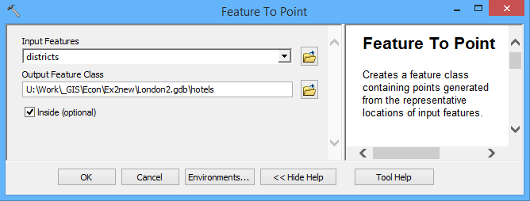

1. Нажмите **ОК**. Созданный слой точек будет добавлен на карту.

2. Создайте картодиаграммы на основе полученных точек. Для этого:

    * Включите режим **Graduated Symbols** на вкладке **Symbology**.

    * Выберите поле *Hotels* в качестве поля по которому будет производиться классификация.

    * Аналогично первому упражнению, отредактируйте границы классов. Предлагается выделить следующие классы: менее *5, 5-9, 10-19, 20-29, 30* и более. Для этого необходимо нажать кнопку **Classify** и заменить границы первых четырех классов на *4, 9, 19, 29*. Максимальное значение не трогайте. Нажмите **ОК**.

    * Измените шаблон картодиаграммы на значок отеля. Для этого сначала прочтите разделы Подключение библиотек символов и поиск символов по названию в разделе **Описание функций**. Нажмите кнопку **Template** на вкладке **Symbology**. Далее подключите библиотеку *Civic* и найдите в ней символ *Hotel Information 1.* Выберите его и нажмите **ОК**.

    * Отредактируйте подписи классов, изменив первый на «*less than 5*», а последний — на «*30 and more*».

    * Измените максимальный и минимальный размер значка на *48* и *16* соответственно. Диалог настройки символов примет следующий вид:

      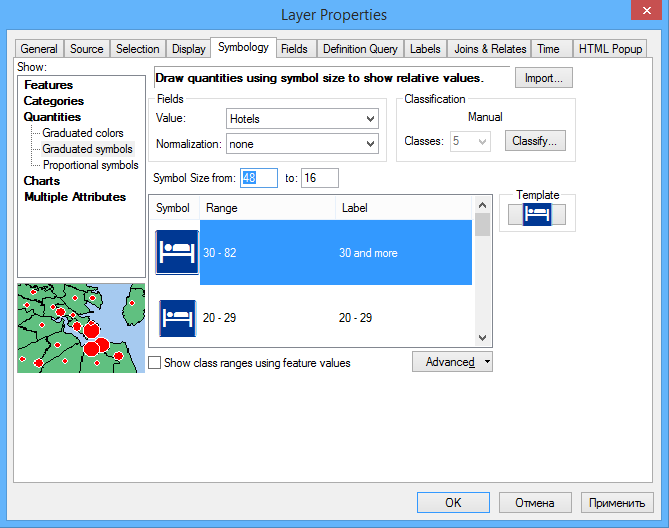

1. Нажмите **ОК**.

2. Сохраните документ карты

## Настройка оформления других слоев {#map-ref-economic-other}
[В начало упражнения ⇡](#map-ref-economic)

Требуется отредактировать оформление слоев, чтобы получить картографическое изображение хорошего стиля и качества.

1. Расположите слои в следующем порядке сверху вниз: *Hotels — Roads — Water  — Districts — InnerLondon*.

2. В настройках слоя *Districts*:

    * Измените цвет заливки на серый *10%*.

    * Измените символ обводки на *Boundary, County*. Увеличьте его толщину до *6* пунктов, а цвет установите серый *20%*.

    * Замените стандартный шрифт подписей на более современный *Euphemia*, установите размер *8* и **жирное** начертание. Включите гало подписей, чтобы они хорошо читались на фоне.

3. Для слоя *Water* отключите обводку, оставив только голубую заливку.

4. Необходимо запретить подписям районов перекрывать значки картодиаграмм. Для этого откройте панель **Labeling**, откройте на ней меню **Labeling** и убедитесь, что включен механизм размещения подписей **Maplex**. Далее нажмите кнопку **Label Weight Ranking**:

    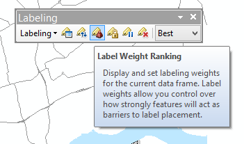

    В открывшемся диалоге исправьте значение **Feature Weight** для слоя
    *Hotels* на *1000*.

    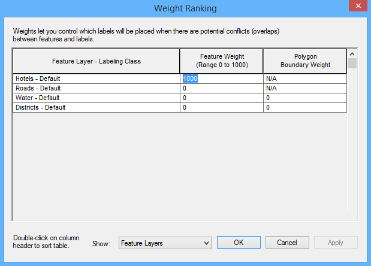

    > Любому слою может быть присвоен вес от *0* до *1000*. Чем выше вес, тем меньше вероятность, что слой будет перекрываться подписями.

    Нажмите **ОК**. Картографическое изображение примет следующий вид:

    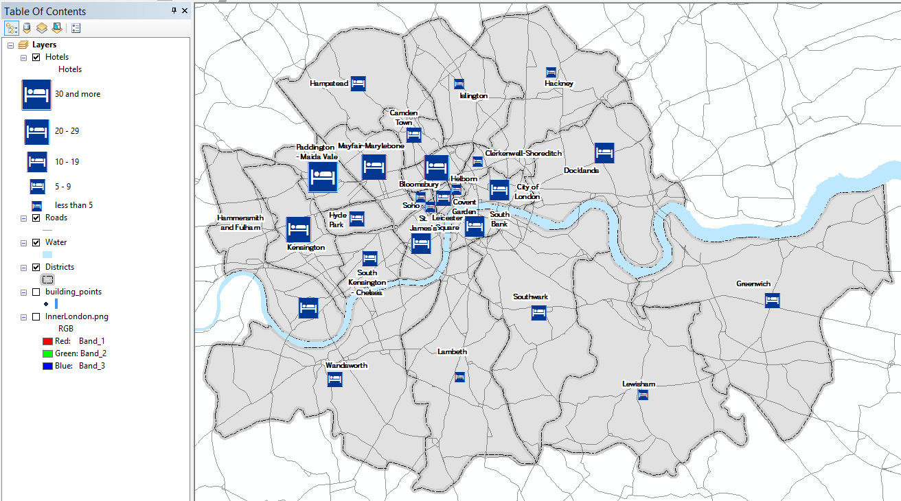

    <kbd>**Снимок экрана №5.**  Картодиаграммы числа отелей по городским районам</kbd>

1. Сохраните документ карты

## Компоновка {#map-ref-economic-layout}
[В начало упражнения ⇡](#map-ref-economic)

Оформите компоновку карты с легендой в соответствии со следующим
образцом.

  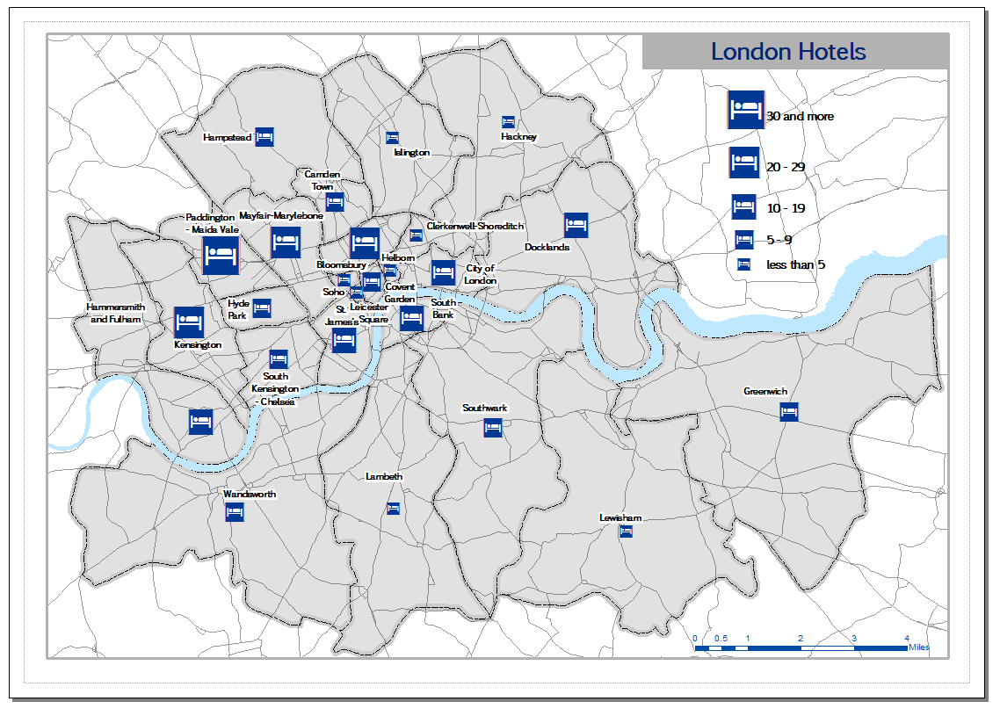

Для этого:

1. Установите масшта равным *1:100 000*.

2. Для заголовка карты используйте также шрифт *Euphemia* синего цвета.

3. Под заголовок подложите прямоугольник серого цвета *30%*.

4. Добавьте масштабную линейку в милях синего цвета.

5. Добавьте легенду к слою *Hotels*, отключите в ней названия самого слоя и единиц измерения, чтобы остались только плашки и их подписи.

6. Добавьте к фрейму данных рамку серого цвета *30%*. Для этого в свойствах фрейма данных на вкладке *Frame* выберите границу *Border* и измените ее параметры. Выровняйте прямоугольник названия по верхнему правому углу карты.

По завершению оформления **Экспортируйте карту** в файл формата *PNG* в вашей директории *Ex07* с разрешением *150* точек на дюйм, чтобы вставить ее в отчет.

## Контрольные вопросы {#map-ref-economic-questions}
[В начало упражнения ⇡](#map-ref-economic)

1. В какой последовательности расставляются контрольные точки при привязке данных? Каково их оптимальное расположение?

2. Какой метод трансформирования изображения вы использовали в работе?

3. Как пристыковать один полигон к другому, не оцифровывая их общую границу? Опишите последовательность действий.

4. Что такое атрибутивная и пространственная выборка? В чем их отличие?
