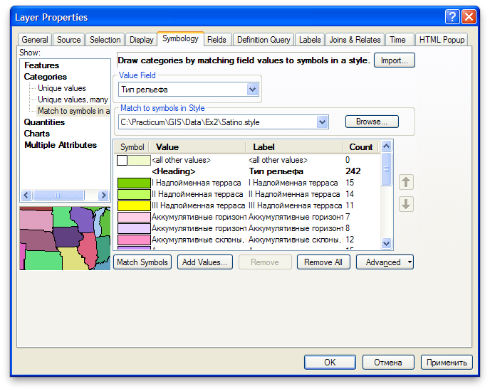
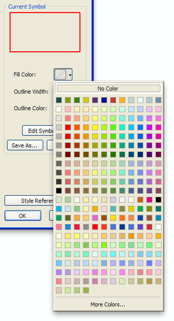
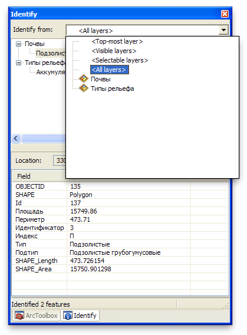
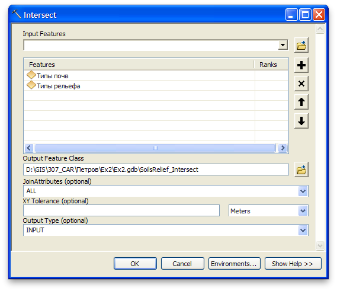
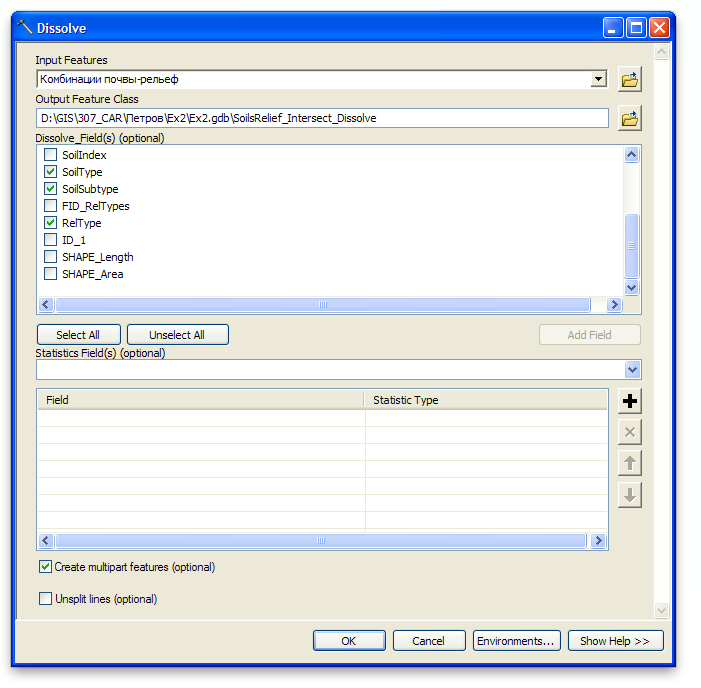
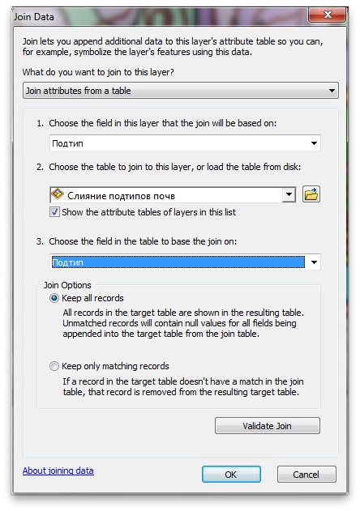
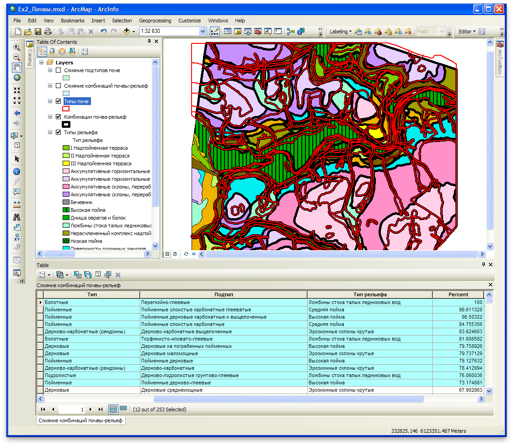

# Анализ пространственных взаимосвязей {#overlay}

## Введение {#overlay-intro}

**Цель** --- научиться определять пространственную приуроченность двух явлений на основе процента взаимного покрытия их площадей (методом оверлея).

Параметр                    Значение
--------------------------  --------
*Теоретическая подготовка*  Оверлей пространственных объектов, геометрическое определение вероятности как отношения мер (площадей), соединение таблиц в реляционных базах данных, внешний и внутренний ключ соединения.
*Практическая подготовка*   Знание основных компонент интерфейса ArcGIS Desktop (каталог, таблица содержания, карта). Работы с базой пространственных данных. Настройка символики и подписей объектов. Владение базовыми ГИС-технологиями: пространственные и атрибутивные запросы, оверлей.
*Исходные данные*           База данных ГИС «Сатино».
*Результат*                 Таблица взаимного покрытия площадей типов рельефа и подтипов почв.
*Ключевые слова*            Базовые технологии ГИС, оверлей, геометрическая вероятность.  

### Контрольный лист {#overlay-control}

* Добавить на карту слои типов почв и рельефа, оформить их
* Произвести оверлей слоев
* Произвести слияние данных и соединение таблиц
* Подсчитать процент покрытия площадей

### Аннотация {#overlay-annotation}

Задание посвящено знакомству с пространственным анализом на основе векторных данных. Векторная модель представляет объекты в виде отдельных геометрических фигур с набором атрибутов. Она является объектно-ориентированной и удобна для анализа формы, размеров объектов, их взаимной конфигурации в пространстве.  Одним из широко используемых методов анализа на основе векторных данных является оверлей.

> При *оверлее* происходит наложение двух или более слоев, в результате чего образуется их графическая композиция. Полученные участки наследуют атрибуты от каждого слоя. Эта операция базируется на стандартных отношениях множеств, таких как пересечение, объединение и симметрическая разность.

С помощью оверлея можно, например, установить, к каким генетическим типам рельефа приурочены различные типы и подтипы почв. В общем случае оверлей позволяет установить, какие комбинации объектов встречаются в пространстве. В задании предлагается исследовать методом оверлея взаимосвязь типов рельефа и типов и подтипов почв.

## Визуальный анализ векторных слоев {#overlay-vectors}
[В начало упражнения ⇡](#overlay)

В первую очередь при анализе данных следует провести их визуальную оценку, которая может натолкнуть на отыскание закономерностей во взаимном расположении объектов.

1. Скопируйте папку *Ex10* из серверной директории в свой рабочий каталог с помощью Проводника.

2. Откройте **ArcMap** и в нем — окно **Catalog**.

3. Найдите базу геоданных   *Satino.gdb* в своем каталоге *Ex10* и перенесите на карту два тематических слоя:  *SoilTypes* (Типы почв) и  *RelTypes* (Типы рельефа) из группы *Thematic*.

4. Поместите слой *Типы рельефа* вниз таблицы содержания, откройте его свойства (двойным щелчком на названии) и перейдите на вкладку **Symbology**.

5. Выберите тип отображения **Categories** и в нем — режим **Match to Symbols In a Style**, который позволяет настроить символы в соответствии с заранее определенным стилем.

6. В качестве определяющего поля **Value field** выберите *Тип рельефа*. Далее нажмите кнопку Browse и выберите стиль *Satino.style*, лежащий в вашем каталоге *Ex10*. Нажмите кнопку **Match symbols**. Снимите флажок со строчки **All other values**. Окно свойств слоя должно принять вид, аналогичный представленному на рисунке. Нажмите **ОК**.

    

1. Настройте отображение слоя *Типы почв* в виде полигонов без заливки с ярко красной обводкой толщиной *1.5* пиксела. Чтобы сделать полигон без заливки, необходимо выбрать в меню **Fill Color** режим **No Color**. Нажмите **ОК**:

    

2. Выберите инструмент идентификации  и щелкните в пределах карты на любом полигоне.

1. Переведите инструмент идентификации в многослойный режим. Для этого в окне **Identify** раскройте верхний список **Identify From** и выберите пункт **All layers**. Попробуйте идентифицировать полигоны в разных участках карты, обращая внимания на информацию, которая отображается в окне идентификации.

    

> Проанализируйте совмещенное изображение границ типов почв и рельефа. Есть ли какие-то совпадения или подобия их рисунков в пределах речных долин, междуречий, малых эрозионных форм?

Теперь, когда данные исследованы визуально и путем идентификации, можно перейти к их анализу с помощью оверлея. Предварительно следует организовать рабочее пространство, чтобы результаты анализа хранились в структурированном виде и не смешивались с базовыми слоями.

## Организация рабочего пространства {#overlay-workspace}
[В начало упражнения ⇡](#overlay)

Поскольку в процессе оверлея будет создан новый слой (а затем еще и другие), возникает задача хранения вновь создаваемых данных. База геоданных *Satino* содержит базовые слои, и производные результаты лучше помещать в другое хранилище.

1. Сохраните документ карты в свой каталог *Ex10* под именем     *Ex10_Оверлей.mxd*

2. Откройте окно **Catalog** и обратите внимание на то, в нем наверху     появился домашний каталог под именем *Home - Фамилия/Ex10.*. Раскройте его.

    > *Домашний каталог* --- директория файловой системы, в которой хранится документ карты, с которым вы работаете в данный момент. Обычно в том же каталоге стараются хранить и сами данные (если они не берутся из внешней СУБД), чтобы избежать путаницы.

1. Щелкните правой кнопкой мыши по домашнему каталогу и выберите **New > File Geodatabase** для того, чтобы создать новую базу геоданных.

2. Назовите ее *Ex10.gdb*

3. Щелкните по *Ex10.gdb* правой кнопкой мыши и выберите пункт **Make Default Geodatabase**. Эта команда указывает программе, что все результаты обработки данных следует помещать в выбранную базу геоданных.

## Оверлей слоев методом пересечения {#overlay-intersect}
[В начало упражнения ⇡](#overlay)

Оверлей осуществляется в ArcGIS с помощью инструментов геообработки.

> *Геообработка* (geoprocessing) в терминологии ArcGIS — это анализ и преобразование пространственных данных. Доступ к инструментам геообработки осуществляется через окно *ArcToolbox*, где они сгруппированы по назначению. Некоторые наборы инструментов, такие как *Spatial Analyst* и *3D Analyst*, являются дополнительными модулями ArcGIS, предназначенными для решения специализированного круга задач: растровый анализ, трехмерный анализ, сетевой анализ и т.д.

1. Откройте **ArcToolbox** с помощью красной кнопки  на панели инструментов.

2. Раскройте группу инструментов **Analysis Tools > Overlay**. Здесь можно найти различные режимы оверлея.

    > Чем отличаются друг от друга режимы оверлея Intersect, Symmetrical Difference и Union?*

1. Запустите инструмент **Intersect**, который ищет геометрическое пересечение нескольких слоев. Изучите пояснительную иллюстрацию в правой части окна.

2. Перенесите из таблицы содержания в список **Input features** слой *Типы почв*, затем слой *Типы рельефа*

    Обратите внимание на то, что система автоматически определила адрес и
    название выходного класса объектов в следующем виде:
    ```
    D:/GIS/207/CAR/Петров/Ex10/Ex10.gdb/SoilTypes/Intersect
    ```
1. Замените *SoilTypes_Intersect* на *SoilsRelief_Intersect*, чтобы из названия было ясно, что с чем пересекается.

2. Параметр **Join Attributes** оставьте *ALL*. В этом режиме результат оверлея унаследует все поля из обоих слоев.

3. Диалог инструмента **Intersect** примет вид, аналогичный представленному на рисунке. Запустите вычисления, нажав кнопку **ОК**.

    

1. Дождитесь, пока в таблицу содержания добавится слой *SoilsRelief_Intersect* и переименуйте его в *Комбинации почвы-рельеф*. Для этого выделите слой в таблице содержания и нажмите <kbd>F2</kbd> на клавиатуре, либо найдите пункт **Rename** в контекстном меню.

2. Поместите полученный оверлеем слой между слоями типов почв и рельефа, и настройте его отображение в виде полигона без заливки с черной обводкой толщиной 4 пиксела. Там, где границы совпадают с контурами типов рельефа, они будут черного цвета, а там где они совпадают с контурами типов почв, будет красная линия с черной обводкой.

3. Раскройте атрибутивную таблицу слоя *Комбинации почвы-рельеф*.

> Какие поля содержатся в атрибутивной таблице полученного слоя? Сравните его границы с границами двух исходных слоев.*

## Слияние результатов пересечения с целью получения показателя пространственной связи {#overlay-merge}
[В начало упражнения ⇡](#overlay)

Поскольку каждый полигон в оверлейном слое содержит значение типа/подтипа почвы и типа рельефа, появляется возможность установить приуроченность типов и подтипов почв к определенным типам рельефа.

Чтобы подсчитать долю каждого типа рельефа в площади каждого подтипа почв, необходимо просуммировать площади каждой их уникальной комбинации. Например, дерново-карбонатные выщелоченные почвы (*Д-в-к*) на крутых эрозионных склонах встречаются в пределах Сатинского полигона в виде 6 разрозненных участков, имеющих некоторую суммарную площадь. Эта площадь, деленная на суммарную площадь почв подтипа *Д-в-к* даст вероятностный критерий приуроченности почв *Д-в-к* к крутым эрозионным склонам. То же самое касается остальных комбинаций подтипов почв и типов рельефа.

С точки зрения рабочих процессов ГИС, операцию следует разбить на 5 шагов:

* подсчет суммарной площади каждой комбинации подтипа почв и типа рельефа;

* подсчет суммарной площади каждого подтипа почв;

* добавление поля, в которое будет записана процентная доля;

* соединение таблиц комбинаций и подтипов почв по названию подтипа почв;

* деление площади комбинации на площадь подтипа почв и запись результата в соответствующее поле.

> Объединение разрозненных объектов, обладающих одинаковым набором атрибутов, осуществляется с помощью *операции слияния* (Dissolve). Причем, если объекты примыкают друг к другу, граница между ними будет стерта, а если объекты разнесены в пространстве, на выходе получится сложный составной объект (Multipart feature), состоящий из нескольких полигонов. Слияние — это один из методов генерализации.

## Подсчет суммарной площади каждой комбинации подтипа почв и типа рельефа {#overlay-sumarea-combination}
[В начало упражнения ⇡](#overlay)

1. Откройте в ArcToolbox инструмент геообработки **Data Management Tools > Generalization > Dissolve**. Изучите пояснительный рисунок в правой части окна интерфейса.

2. Выберите в качестве значения параметра **Input Features** слой *Комбинации почвы-рельеф*

3. В списке **Dissolve Fields** следует отметить поля *SoilType*, *SoilSubtype* и *RelType*, тем самым можно будет найти все уникальные комбинации подтипов почв и типов рельефа.

> Поле *SoilType* необходимо отметить для того, чтобы в таблице результирующего слоя сохранилась информация о типах почв. Это не повлияет на сам результат, поскольку количество комбинаций типа и подтипа почв равно количеству самих подтипов.

4. Введите название выходного класса *SoilsRelief_Intersect_Dissolve*. Диалог инструмента **Dissolve** примет вид, аналогичный представленному на рисунке ниже.

    

5. Остальные параметры оставьте по умолчанию и нажмите **ОК**.

6. После того как результат появится в таблице содержания, назовите полученный слой *Слияние комбинаций почвы-рельеф*.

7. Отключите этот слой в таблице содержания.

## Подсчет суммарной площади каждого подтипа почв {#overlay-sumarea-subtypes}
[В начало упражнения ⇡](#overlay)

1. Запустите инструмент **Dissolve** еще раз.

2. Выберите в качестве **Input Features** слой *Типы почв*.

3. В списке **Dissolve fields** выберите поля *SoilType* и *SoilSubtype*.

4. Введите название выходного класса *SoilTypes_Dissolve*.

5. Остальные параметры оставьте по умолчанию и нажмите **ОК**.

6. Назовите полученный слой *Слияние подтипов почв*. В данном слое в результате операции слияния каждый подтип почв будет представлен единственным объектом, а в его поле *Shape_Area* будет записана суммарная площадь данного подтипа

7. Отключите этот слой в таблице содержания.

## Добавление нового поля для результирующих значений {#overlay-field}
[В начало упражнения ⇡](#overlay)

1. Откройте таблицу слоя *Слияние комбинаций почвы-рельеф*.

2. Выберите в окне таблицы пункт меню  **Table Options > Add Field…**

3. В диалоге введите название поля *Percent*.

4. Выберите тип поля **Float** (с плавающей точкой). Оставьте остальные параметры по умолчанию и нажмите **ОК**.

## Соединение таблиц по названию подтипа почв {#overlay-join}
[В начало упражнения ⇡](#overlay)

Для расчета пространственной взаимосвязи необходимо поделить площадь каждой комбинации на площадь соответствующего подтипа почв. Эти площади находятся сейчас в разных таблицах — *Слияние подтипов почв* и *Слияние комбинаций почвы-рельеф*. Их можно соединить по полю *Подтип*.

> *Соединение таблиц* (table join) — операция, в результате которой к одной таблице временно добавляются столбцы из другой таблицы. Чтобы установить соответствие между строками исходной и присоединяемой таблицы, необходимо иметь в каждой таблице поле с общими для них значениями. Например, это может быть числовой код объекта или, как в нашем случае, подтип почв.

1. Перейдите в контекстное меню слоя *Слияние комбинаций почвы-рельеф* и     выполните команду **Joins and Relates > Join**. Внимательно изучите содержимое появившегося диалога.

5. Выберите *Подтип* в качестве поля **1**, по которому будет делаться соединение:

    

6. Выберите *Слияние подтипов почв* в качестве присоединяемой таблицы **2**.

7. Выберите *Подтип* в качестве поля, по которому будет присоединяться таблица *Слияние подтипов почв*.   

8. Нажмите **OK**.

> Что изменилось в атрибутивной таблице слоя *Слияние комбинаций почвы-рельеф*?

## Вычисление результирующих значений {#overlay-resulting}
[В начало упражнения ⇡](#overlay)

1. Откройте таблицу слоя *Слияние комбинаций почвы-рельеф*.

2. Щелкните правой кнопкой мыши на заголовке поля *Percent*, вызовите **Field Calculator** и введите туда указанное ниже выражение для подсчета процента площади. Вы можете просто набрать `100 *`, а затем дважды щелкнуть по названию каждого поля в списке, чтобы не вписывать их вручную:

    ```
    100 * [SoilsRelief_Intersect_Dissolve.SHAPE_Area] /
    [SoilTypes_Dissolve.SHAPE_Area]
    ```
    > *Калькулятор поля* (field calculator) используется для вычисления значений атрибутов. Вы можете, например, умножить значение одного поля на 100 и записать в другое, соединить несколько текстовых полей в одно предложение или просто скопировать значение одного поля в другое.

1. Нажмите **ОК**. Посмотрите получившиеся значения в поле *Percent*.

2. Удалите соединение таблиц через контекстное меню слоя *Слияние комбинаций почвы-рельеф* командой **Joins and Relates > Remove Joins > Remove All joins**.

1. В атрибутивной таблице слоя *Слияние комбинаций почвы-рельеф* щелкните на любом поле правой кнопкой мыши и выберите команду **Advanced Sorting**.

2. Выберите в качестве первого поля *Подтип* и установите порядок сортировки **Ascending** (в сторону увеличения).

3. Выберите в качестве второго поля *Percent* и порядок сортировки **Descending** (в сторону уменьшения).

4. Растяните таблицу таким образом, чтобы хорошо было видно поле типа почв, поле подтипа почв, поле типа рельефа и поле *Percent.*

5. Нажмите **ОК**.

6. Отключите оба слоя слияния в таблице содержания.

7. Сохраните документ карты.

    Получившаяся таблица отображает для каждого подтипа почвы типы рельефа в порядке уменьшения их доли в площади. Первая строка для каждого подтипа почвы устанавливает наиболее вероятный тип рельефа.

    > *Какие почвы показывают наибольшую связь с определенным типом рельефа?*

1. Отсортируйте таблицу только по убыванию значений в поле *Percent* (нажав дважды и еще раз дважды на нем) и выделите строки, в которых значение процента в поле *Percent* более *75*.

2. Скомпонуйте окно приложения так, чтобы было видно целиком карту, а также выделенные в таблице строки, а также столбцы *Тип*, *Подтип*, *Тип рельефа* и поле *Percent*. Окно примет вид, аналогичный представленному на рисунке:

    

    <kbd>**Снимок экрана №1** --- Окно карты и результирующая таблица</kbd>

1. Сохраните документ карты

## Ответы на вопросы {#overlay-questions}
[В начало упражнения ⇡](#overlay)

Заполните отчетный файл и положите его в сетевую папку для проверки преподавателем.
