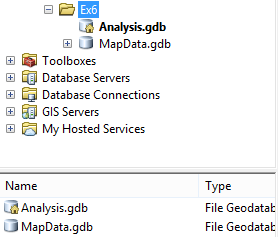
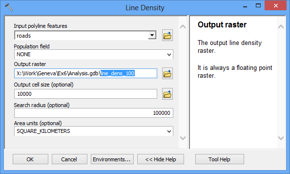
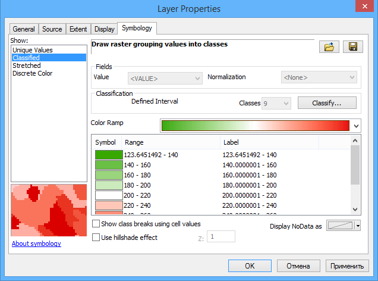
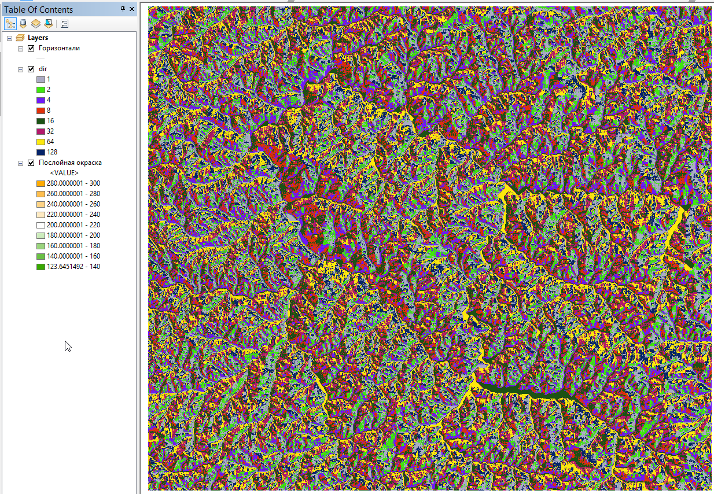
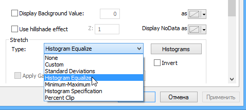
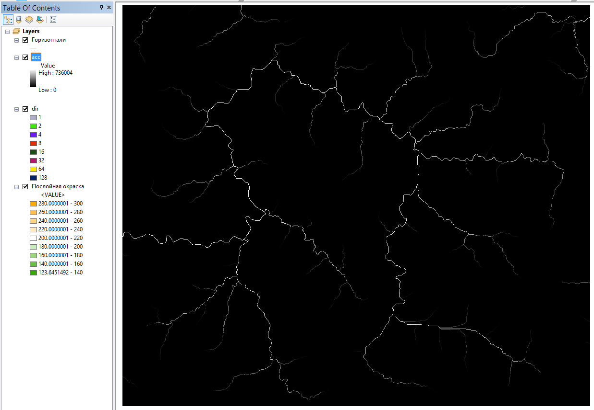
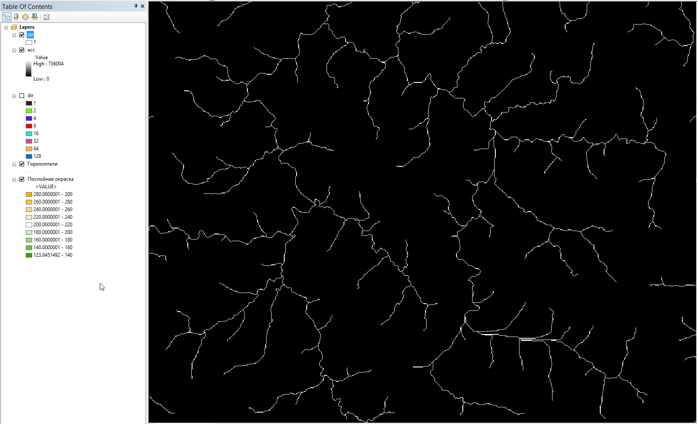
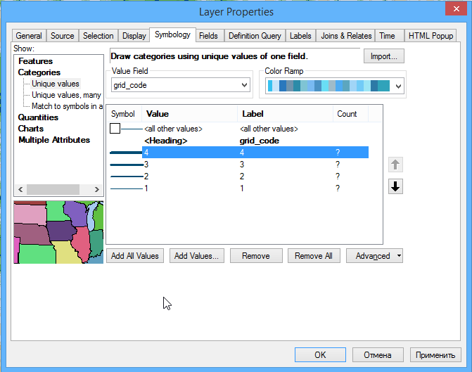
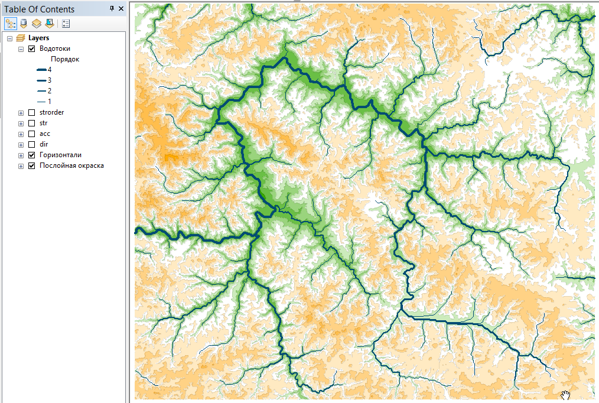
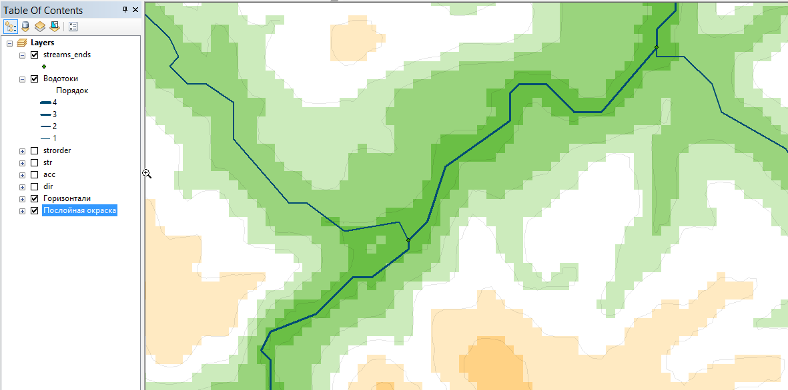

# Анализ плотности пространственного распределения {#density-analysis}

## Введение {#density-analysis-intro}

**Цель задания** --- научиться определять плотность распределения (густоту) линейных объектов с помощью метода плавающего окна.

Параметр                    Значение
--------------------------  --------
*Теоретическая подготовка*  Растровая модель пространственных данных, фильтрация растра, ядерное сглаживание, оценка плотности распределения.
*Практическая подготовка*   Знание основных компонент интерфейса ArcGIS Desktop (каталог, таблица содержания, карта). Настройка символики и подписей объектов. Инструменты геообработки
*Исходные данные*           База данных цифровой топографической карты 1:1 000 000 на территорию России
*Результат*                 Растры густоты дорожной сети, полученные методом простого подсчета длины линий и путем ядерного сглаживания с разным радиусом влияния. Карта густоты дорожной сети с компоновкой.
*Ключевые слова*            Пространственный анализ, плотность распределения, фильтрация растра, ядерное сглаживание.

### Контрольный лист {#density-analysis-control}

* Построить растры плотности и плотности ядер для линий
* Исследовать влияние радиуса вычислений на гладкость поверхности.
* Вырезать фрагмент результирующего растра на территорию России. Умножить значение плотности на 10, чтобы компенсировать эффект масштаба
* Подготовить проект карты густоты дорожной сети

### Аннотация {#density-analysis-annotation}

Задание посвящено знакомству с анализом плотности размещения объектов на примере густоты дорожной сети. Анализ густоты является одним из фундаментальных методов исследования географических закономерностей размещения объектов, который позволяет выявить неравномерности и связать их с географическими условиями и соседством.

Для анализа густоты дорожной сети вами будет использована фильтрация данных. Подсчет густоты основан на принципе скользящего окна: поверх исходного слоя строится растровая поверхность и в заданном радиусе относительно каждой ячейки растра подсчитывается суммарная длина линий. При использовании ядерного сглаживания (кернфункции) полученное значение густоты сглаживается.

## Оценка плотности дорожной сети {#density-analysis-estimation}
[В начало упражнения ⇡](#density-analysis)

1. Создайте в директории *Ex15* новую файловую базу геоданных и назовите ее *Analysis*

2. Назначьте созданную базу данных **базой данных по умолчанию**:

    

1. Добавьте на карту слой *Roads* из базы данных *MapData.gdb* в папке *Ex15*. Это дороги на территорию *России*, оцифрованные по картам масштаба *1:1 000 000*.

2. Используя команду меню **Cutomize > Extensions**, включите модуль **Spatial Analyst**

3. Откройте *ArcToolbox*

4. Запустите инструмент **Spatial Analyst Tools > Density > Line Density** и заполните его параметры следующим образом:

    Параметр                    Значение
    --------------------------- --------
    *Input polyline features*   Roads
    *Output cell size*          10000
    *Output raster*             \<путь к базе данных\>/line\_dens\_100
    *Search radius*             100000
    *Area units*                SQUARE\_KILOMETERS

    Диалог примет *следующий вид*:

    

1. Нажмите **ОК**, чтобы запустить инструмент. Когда вычисления закончатся, созданная поверхность будет добавлена на карту.

2. Отключите слой *roads* и установите **передискретизацию** слоя *line\_dens\_100* в режим *Cubic Convolution*.

3. Примените к растру цветовую шкалу от синего к красному.

    *Результат*:
    

1. Запустите инструмент **Spatial Analyst Tools > Density > Kernel Density** и заполните его параметры аналогично предыдущему инструменту. Назовите выходную поверхность *kernel\_dens\_100*:

    

1. Примените к получившемуся слою такую же цветовую шкалу, как и предыдущему

2. Установите режиме *передискретизации* результирующего слоя **Cubic Convolution**

3. Сделайте слой дорог черного цвета и установите ему **прозрачность**  *70%*.

4. Сравните растры, полученные методами *Line Density* (простой подсчет длины линий в пределах плавающего окна) и *Kernel Density* (подсчет с использованием кернфункции). Какой тип оператора дает более ровную поверхность?

     

## Оценка влияния радиуса поиска  {#density-analysis-radius}
[В начало упражнения ⇡](#density-analysis)

1. Создайте методом *Kernel Density* еще два растра густоты дорожной сети с радиусом поиска (*Search radius*) *200 000* и *400 000* м соответственно и разрешением (*Output cell size*) равным *20000* м. Назовите их *kernel\_dens\_200 и kernel\_dens\_400* соответственно.

2. Примените к полученным растрам настройки отображения по аналогии с предыдущими результатами.

3. Оцените влияние радиуса поиска на сглаженность поверхности:

      

1. Сохраните карту в каталог *Ex15* под названием *Roads.mxd*

## Масштабирование значение показателя {#density-analysis-scaling}
[В начало упражнения ⇡](#density-analysis)

Полученные растры отражают искаженное значение плотности, поскольку исходный слой дорог содержит не все дороги. Их количество преуменьшено примерно в *10* раз (карта масштаба *1:1 000 000*. Чтобы привести значение густоты к должно величине, необходимо умножить растр на *10*.

1. Запустите инструмент **Spatial Analyst > Math > Times**

2. Заполните его параметры в соответствии со следующим диалогом и запустите:

    

## Оформление слоя густоты дорожной сети {#density-analysis-layer}
[В начало упражнения ⇡](#density-analysis)

1. Оставьте включенным только слой *kernel\_dens\_100\_x10*

2. Добавьте на карту слой *countries* из базы данных *MapData.gdb*

3. Уберите у него заливку, а обводку установите черной, толщиной *1,5* пиксела.

4. *Выделите* на карте полигон *России*.

5. Запустите инструмент **Spatial Analyst > Extraction > Extract by Mask**, чтобы обрезать растр по границе России. Заполните его параметры в соответствии со следующим диалогом:

    

1. Примените к полученному растру следующие настройки отображения:

    Параметр                Значение
    ----------------------- --------
    *Метод отображения*     Classified
    *Метод классификации*   Natural Breaks (Jenks)
    *Число классов*         9
    *Шкала*                 От синего к красному

    Округлите значения полученных границ классов в столбце *Label* до одного-двух знаков после запятой и **отсортируйте** классы по убыванию значений.

    *Результат*:

    

1. **Переименуйте** слой в «*Густота дорожной сети*», а заголовок показателя в «км/кв.км»

    *Результат*:
    

## Оформление итоговой карты {#density-analysis-design}
[В начало упражнения ⇡](#density-analysis)

1. **Выделите** полигоны России, Аральского и Каспийского морей в слое Countries

2. **Инвертируйте** выборку.

3. **Создайте новый слой на основе выборки** и назовите его *«Страны»*. Присвойте ему символ с белой заливкой и черной обводкой толщиной 1,5 пункта.

4. **Переименуйте** исходный слой *Countries* в *“Границы”*

5. Установите **заливку фрейма данных** голубого цвета

    *Результат*:
    

1. Добавьте на карту слой *Cities*, примените к нему символ черного кружка диаметром 3 пункта и **включите подписи** по полю *Name\_normal* шрифтом *Tahoma* 8 кегля.

2. Оформите компоновку карты в соответствии со следующим образцом:

    

1. Сохраните документ карты.

## Контрольные вопросы {#density-analysis-questions}
[В начало упражнения ⇡](#density-analysis)

1. Для чего нужна оценка плотности пространственного распределения?

1. Как работает линейная оценка плостности распределения методом плавающего окна?

1. Как работает ядерная оценка плотности распределения (оценка по методу Парзена-Розенблатта)?

1. Как влияет на результат оценки величина радиуса поиска?
