# Оформление векторного слоя {#manual-vector}

## Единый символ для всего слоя

В свойствах слоя перейдите на вкладку Symbology и выберите режим Features---Single Symbol. Далее щелкните на кнопку Настройки символа:

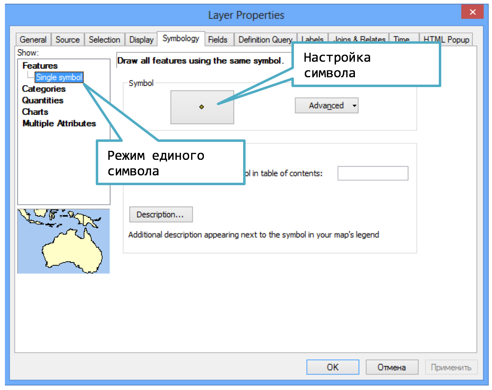

В появившемся диалоге вы можете выбрать готовый символ, настроить его, либо перейти к созданию нового символа.

## Категории (Categories)

В свойствах слоя перейдите на вкладку Symbology и выберите режим Features---Single Symbol. После этого выберите поле категорий в списке Value Field и нажмите Add All Values, чтобы подставить имеющиеся в поле категории в список. Чтобы отредактировать символ конкретной категории, дважды щелкните на нем.

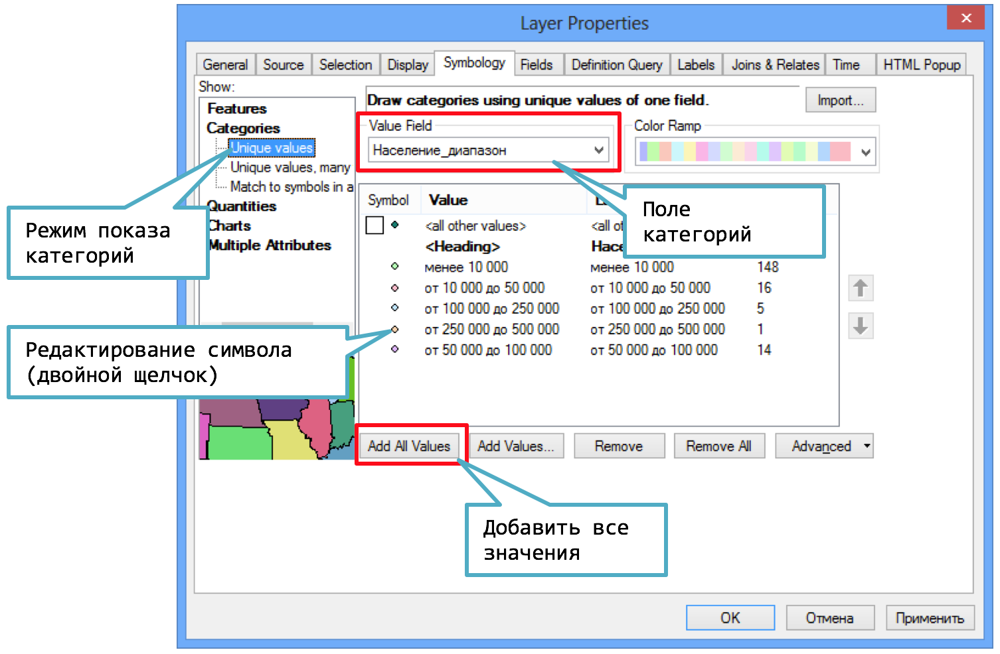

### Сортировка классов

Для сортировки категорий по значению категории или подписи щелкните по заголовку и выберите команду Reverse Sorting:

### Сортировка цветовой шкалы

Для сортировки категорий по значению категории или подписи щелкните по заголовку и выберите команду Flip Symbols:

### Подстановка стиля (Match Symbols In a Style)

На вкладке Symbology свойств слоя выберите режим Categories --- Match Symbols In a Style:

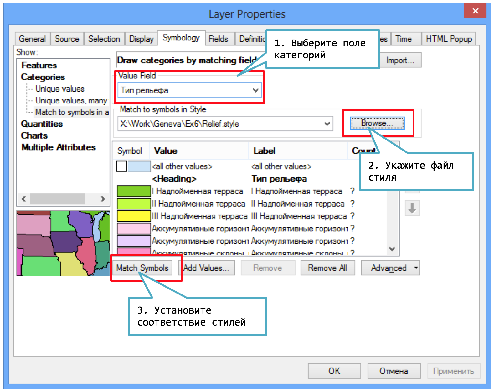

## Градуированные символы (картодиаграммы)

В свойствах слоя на вкладке *Symbology* выберите режим Graduated Symbols:

## Градуированные цвета (картограммы)

В свойствах слоя на вкладке *Symbology* выберите режим Graduated Colors:

## Секторная картодиаграмма (pie chart)

В свойствах слоя на вкладке *Symbology* выберите режим *Charts---Pie Charts*:

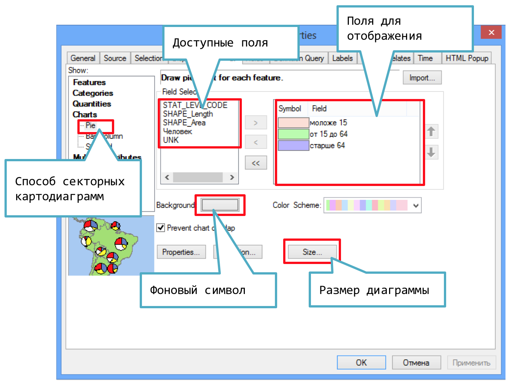

Чтобы размер диаграммы варьировался, нажмите кнопку Size. Появится диалог,в котором вы можете выбрать, как он будет меняться:

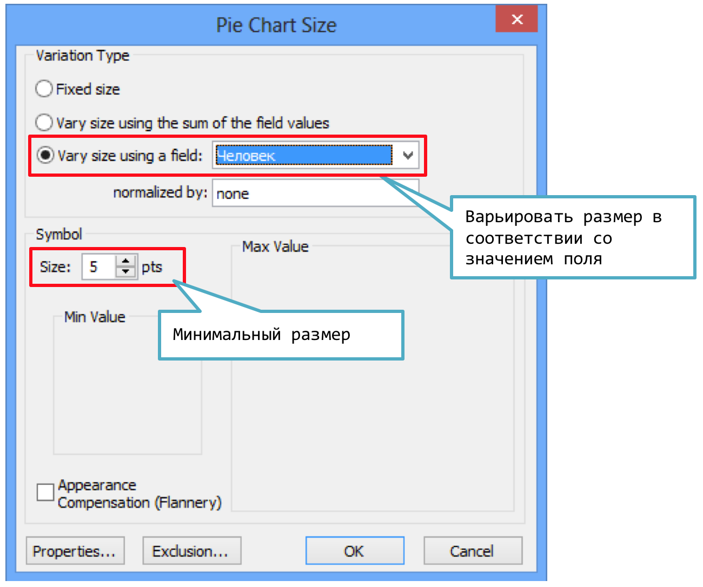

## Выбор метода классификации

Метод классификации выбирается после нажатия на кнопку Classify...

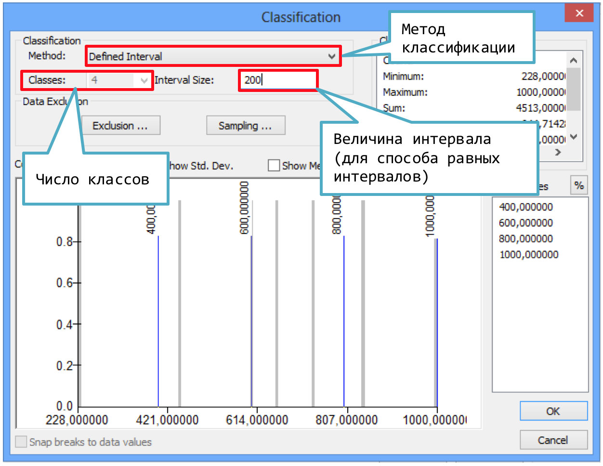

## Настройка символа для точечного объекта

При редактировании точечного объекта вы можете настраивать его размер и основной цвет. Нажав кнопку редактирования символа, вы можете сделать более тонкую настройку:

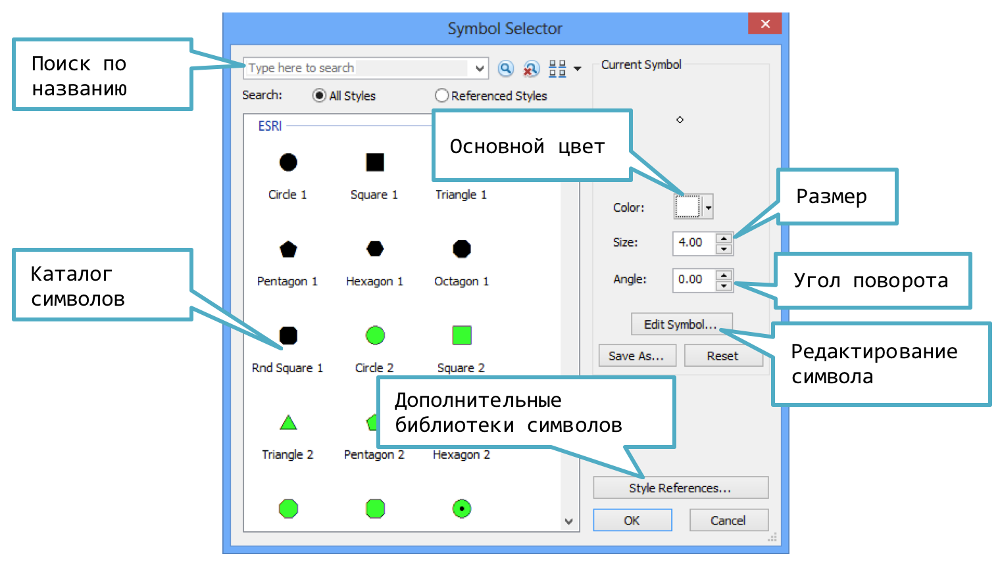

### Символьный маркер

Чтобы использовать шрифтовые символы для визуализации точечных слоев, в диалоге Symbol Selector (см. выше) нажмите Edit Symbol. В появившемся диалоге выберите тип символа Character Marker Symbol:

### Вращение символа

Вращение символа обычно используется для показа векторных величин в точках. Направление задается значением в заданном атрибутивном поле таблицы слоя. Чтобы включить функцию поворота, войдите в свойства слоя и на вкладке Symbology нажмите кнопку *Advanced --- Rotation...*:

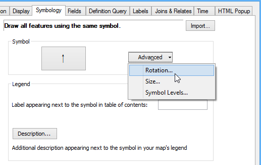

Далее, в появившемся диалоге выберите поле, в соответствии с которым будет осуществляться поворот символа, а также направление поворота:

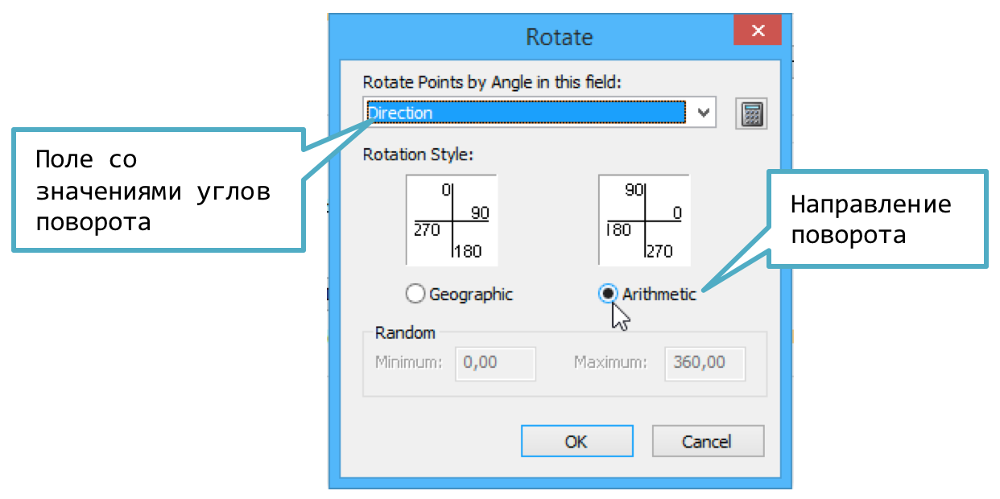

### Размер символа

Вы можете менять размера символа в соответствии со значением в атрибутивном поле. Для включения этого режима войдите в свойства слоя и на вкладке Symbology нажмите кнопку Advanced --- Size...:

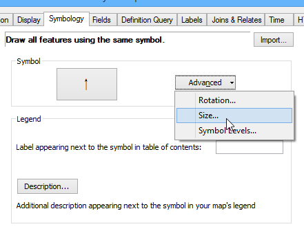

В появившемся диалоге выберите, в соответствии с каким полем следует менять размер символа:

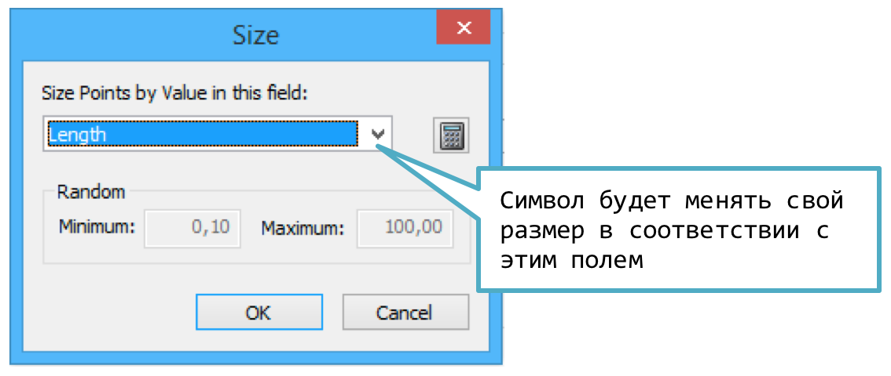

## Настройка символа для линейного объекта

При настройке символа для линейных объектов вы можете выбрать подходящий образец в списке слева, а затем настроить его цвет и толщину. Кнопка Edit Symbol позволяет осуществить более тонкую настройку символа, например, сделать линию с обводкой:

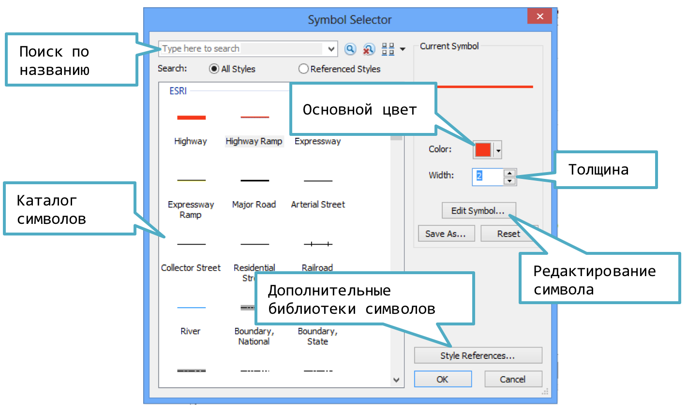

## Настройка символа для полигонального объекта

При редактировании символа полигонального объекта вы можете задавать цвет заливки и обводки, а также толщину обводки. Кнопка Edit Symbol позволяет сделать более тонкую настройку, например, добавить штриховку полигона:

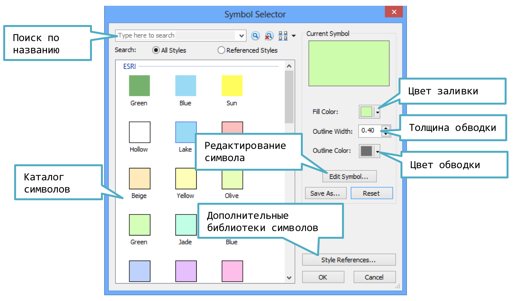

## Создание площадного объекта без заливки

Выберите в свойствах символа цвет заливки No Color:

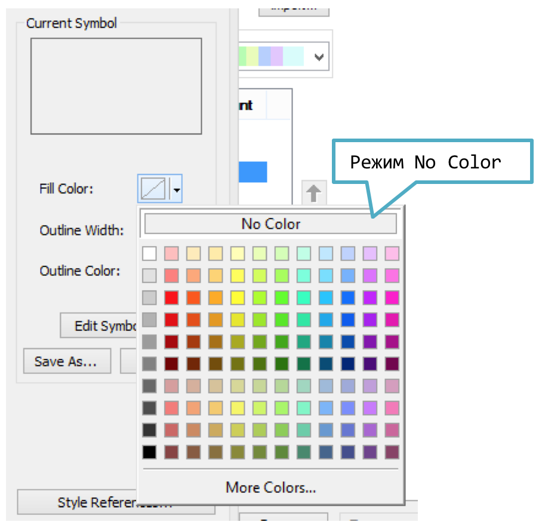

## Регулировка прозрачности векторного слоя

Перейдите на вкладку Display в свойствах слоя и введите значение прозрачности в поле Transparent:

## Поиск символа по названию

Для поиска символа по названию, используйте соответствующее поле в диалоге настройки символа:

## Подключение библиотек символов

Вы можете подключить дополнительные библиотеки символов. Для этого в настройках символов нажмите кнопку *Style References*:

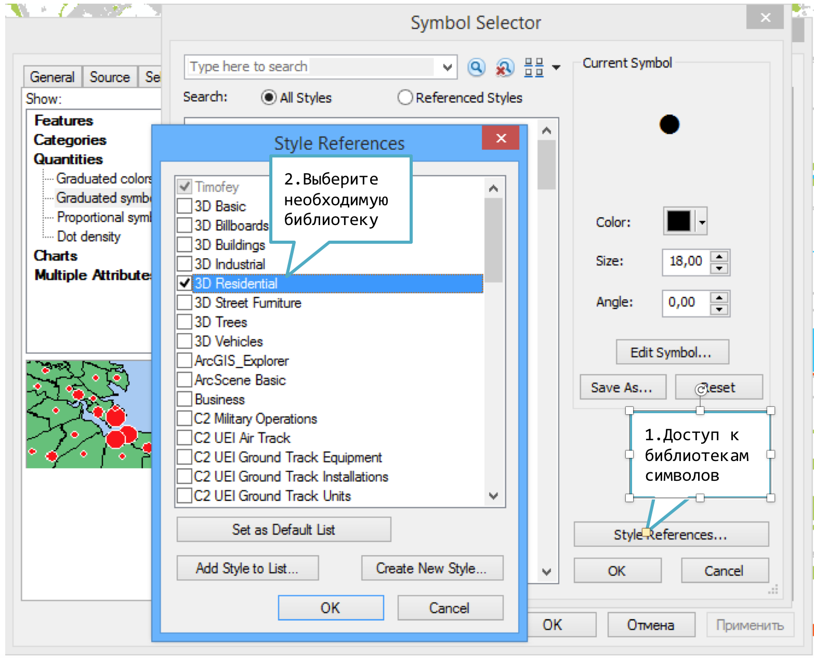
