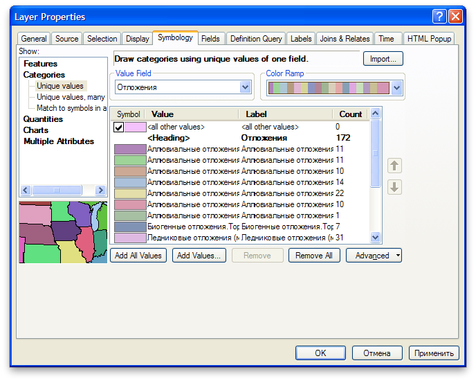
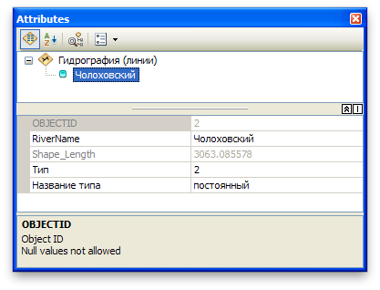
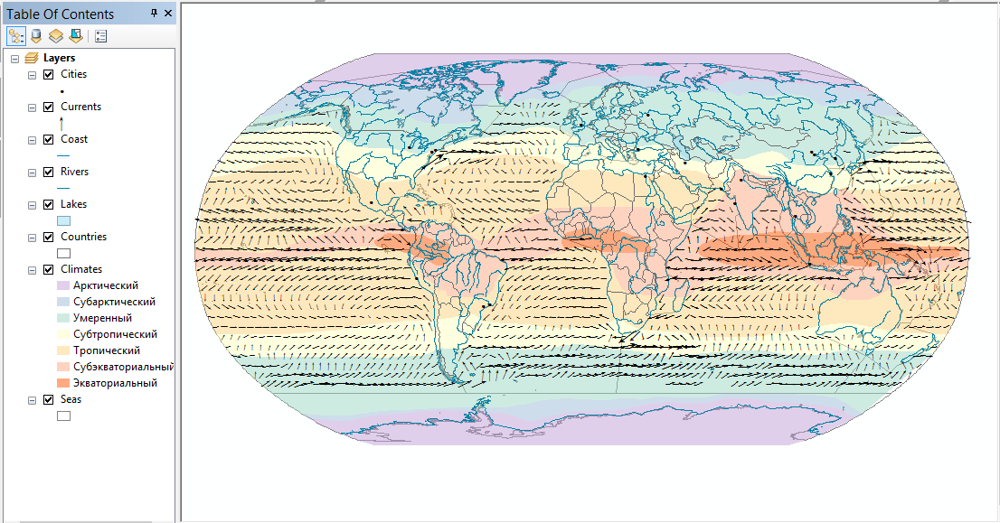
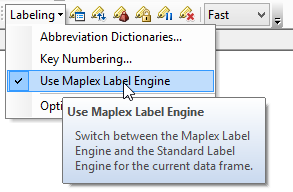
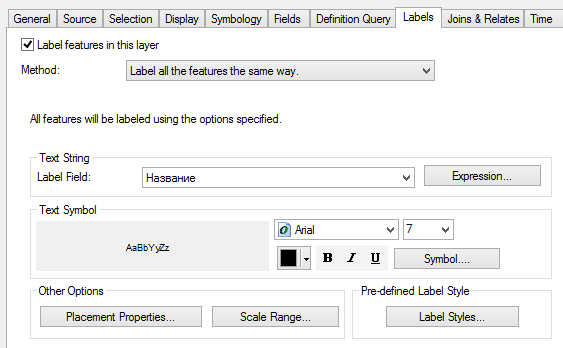
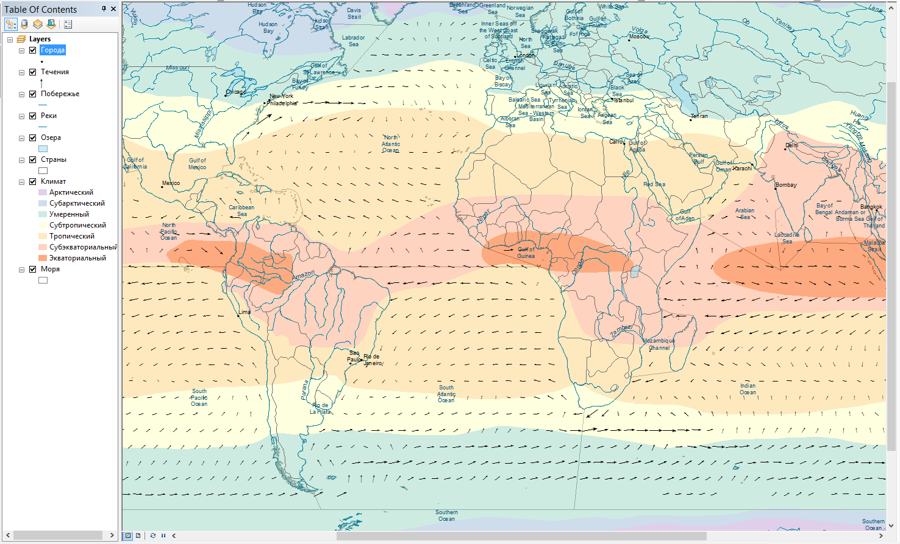
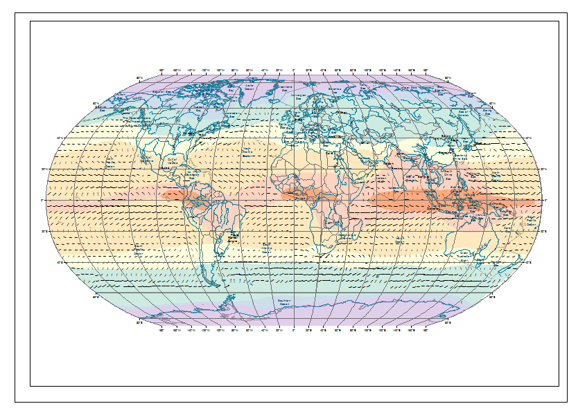
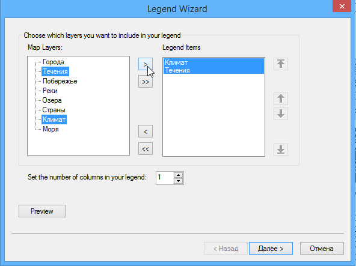

# Оформление климатической карты

## Введение

**Цель задания** --- знакомство с моделями пространственных объектов и базой пространственных данных. Визуализация данных на карте. Оформление легенды и компоновки карты.

**Параметр**               **Значение**
-------------------------  ----
*Поток*                    <kbd>Гидрометпоток</kbd>
*Теоретическая подготовка* Не требуется
*Практическая подготовка*  Модели пространственных данных, модели пространственных объектов, базы пространственных объектов, картографические проекции
*Исходные данные*          Климатические пояса по Алисову (полигональный слой), границы морей и океанов IHO (International Hydrographic Organization), направления основных течений OSCAR (Ocean Surface Current Analyses – Real time), крупнейшие мировые реки и озера, города (данные Esri).
*Результат*                Тематическая карта «Климат и основные объекты гидросферы» масштаба 1:90 000 000             
*Ключевые слова*           Модели пространственных данных, модели пространственных объектов, базы пространственных данных, классы пространственных объектов, визуализация пространственных данных, геоинформационное картографирование

### Контрольный лист

* [x] Добавить на карту слои базы пространственных данных и оформить их
* [x] Настроить подписи объектов
* [x] Создать компоновку карты, легенду и координатную сетку
* [x] Экспортировать результат в графический файл

### Аннотация

Задание посвящено знакомству с созданием тематических карт на основе баз
пространственных данных. Вы познакомитесь с представлением площадных,
линейных, точечных объектов в базе пространственных данных. Научитесь
создавать карты на их основе, оформлять легенду, сетку координат и
зарамочные элементы карты.

## Начало работы
[К содержанию ⇡](#оформление-климатической-карты)

В каталоге *Ex01* находится база геоданных *Ex01.gdb*, содержащая
исходные данные для выполнения задания.

> **База геоданных** --- это структурированное хранилище, внутри которого
можно создавать слои данных, группировать их и связывать различными
отношениями.

Внутри базы геоданных могут быть объекты следующих типов:

-  --- слои векторных данных (классы пространственных объектов),
-  — слои растровых данных;
-  — обычные таблицы;

> **Класс пространственных объектов (feature class)** --- это набор
пространственных объектов одного типа геометрии (точки, линии, полигоны
или объемные тела). Для класса могут быть определены атрибуты, а его
представлением является таблица, содержащая как обычные столбцы
(текстовые, числовые и т.д.) так и специальное поле Shape, в котором
хранится информация о геометрии. Каждая строчка в таблице — это описание
одного объекта.

1. Запустите приложение **ArcMap** и откройте окно **Catalog**, нажав кнопку  на панели инструментов

2. Раскройте папку *D:/GIS* в дереве каталогов и найдите в ней директорию *Ex01* в вашем каталоге, содержащую исходные данные для выполнения первого задания. Если директории *D:/GIS* нет в списке, подключитесь к ней c помощью кнопки .

3. Раскройте базу данных *MapData.gdb* и изучите ее содержимое, состоящее из следующих классов:

      **Класс**   **Содержание**
      ----------- --------------------
      *Cities*      Города
      *Climates*    Климатические зоны
      *Coast*       Побережье
      *Countries*   Страны
      *Currents*    Данные о течениях
      *Lakes*       Озера
      *Rivers*      Крупнейшие реки
      *Seas*        Моря

    К какому типу геометрии относятся данные классы?

1.  Дважды щелкните на слое *Climates* и перейдите на вкладку XY Coordinate System.

Внимательно прочитайте информацию. Этот слой хранится в *Географической
системе координат (GCS)*, отнесенной к эллипсоиду WGS-1984. Это
означает, что координаты каждого объекта хранятся в виде широты и
долготы. В любой момент этот слой можно спроецировать в любую проекцию.
При этом координаты будут представлены в метрических единицах, а система
координат получит название *Проецированной системы координат (PCS)*.

## Оформление слоев
[К содержанию ⇡](#оформление-климатической-карты)

1. Добавьте на карту слой *Countries*, просто перетащив его из окна каталога.

2. Дважды щелкните на названии слоя *Countries* и перейдите на вкладку Symbology.

3. Внимательно изучите список способов изображения слева. Они разделены на категории **Features** (единый символ), **Categories** (качественные характеристики), **Quantities** (количественные характеристики), **Charts** (картодиаграммы), **Multiple Attributes** (способы изображения по нескольким атрибутам).Разверните каждую группу и щелкните на каждом способе. Сопоставьте их с традиционной классификацией способов изображения:

    

1. Выберите способ единого символа (**Features > Single symbol**)

2. Щелкните на кнопке с изображением символа и измените оформление следующим образом:

    **Параметр**                      **Значение**
    --------------------------------- --------
    *Цвет заливки (Fill Color)*       Без заливки 
    *Цвет обводки (Outline Color)*    Серый 50% 
    *Толщина обводки (Outline width)* 0,5 

    Диалог свойств слоя:

    

    Результат:

    

1. Измените проекцию карты на *проекцию Робинсона (Robinson)*. Ее можно найти в группе **Projected Сoordinate Systems > World**. Обратите внимание на то, как изменятся очертания объектов:

    

1. Добавьте на карту слой *Coast*, расположите его поверх слоя *Countries* и измените цвет линии на *Delft Blue:*

    

1. Добавьте на карту слой *Rivers* расположите его поверх слоя *Coast* и измените цвет линии на *Delft Blue,* а толщину сделайте равной 0,5 пиксела*.*

2. Добавьте на карту слой *Lakes*, расположите его поверх слоя *Rivers* и измените его оформление следующим образом:

    **Параметр**      **Значение**
    ----------------- ---------------
    *Цвет заливки*      Sodalite Blue
    *Цвет обводки*      Delft Blue
    *Толщина обводки*   0,5

    Результат:

    

1. Сохраните карту в свою директорию *Ex01*.

2. Добавьте на карту слой *Cities*, расположите его поверх слоя *Lakes* и измените его параметры следующим образом:

    **Параметр** **Значение**
    ------------ ----------
    *Символ*     Circle 1
    *Цвет*       Черный
    *Размер*     4

    

1. Добавьте на карту слой *Seas*, расположите его внизу таблицы содержания и измените его параметры следующим образом:

    **Параметр**      **Значение**
    ----------------- -------------
    *Цвет заливки*    Нет заливки
    *Цвет обводки*    Серый 50%
    *Толщина обводки* 0,5
    *Прозрачность*    50%

    Результат:

    

1. Добавьте на карту слой *Сlimates*, расположите его внизу таблицы содержания.

2. Откройте таблицу атрибутов слоя *Сlimates*, щелкнув на его названии правой кнопкой мыши и выбрав команду **Open Attribute Table**. Найдите в ней столбец *Type*, просмотрите его значения. Это поле таблицы хранит информацию о типе климата для каждой области. Вы будете использовать ее для классификации при отображении данного слоя.

3. Найдите поля *Shape* и *ObjectID*.

    > В поле *ObjectID* хранится уникальный идентификатор каждого объекта. Он нужен системе для того, чтобы каждый объект можно было гарантированно найти по некому однозначному критерию.

    > В поле *Shape* (вспомните, что слой полигональный) хранится список координат вершин полигона. Геометрия объектов редактируется специальными инструментами, поэтому содержимое поля Shape скрыто от пользователя.

1. Климатические пояса показываются на картах способом *качественного фона*. Для этого измените оформление слоя *Climates* следующим образом:

    **Параметр**                    **Значение**
    ------------------------------- ----------------------------------------
    *Тип визуализатора*             Categories > Unique values
    *Поле классификации*            Type
    *Сортировка значений*           От арктического к экваториальному
    *Цвета полигонов*               Традиционные цвета климатических поясов (выберите вручную)
    *Обводка полигонов*             Нет обводки
    *Показывать остальные значения* Нет

    Диалог настройки символики слоя должен выглядеть следующим образом:

    

1.  Добавьте на карту слой *Сurrents*, расположите его поверх слоя *Сlimates*. Этот слой содержит данные о течениях *OSCAR (Ocean Surface Current Analyses – Real time)*, осредненные с 1993 по 2003 год.

    > Течения относятся к векторным полям. Существует множество способов визуализации векторных полей. В картографии распространен способ **градиентного поля**, при котором стрелки размещаются по регулярной сетке, их поворот соответствует направлению векторного поля в точке, а длина — скорости. Для реализации способа градиентного поля вам нужно выбрать символ (стрелку), а также указать атрибутивные поля слоя, в соответствии с которыми будет меняться их направление и длина.

1. Измените тип символа слоя на символьный маркер и задайте его параметры следующим образом:

    **Параметр** **Значение**
    ------------ --------------
    *Шрифт*      Esri Geology
    *Символ*     Unicode 83
    *Размер*     28
    *Цвет*       Серый 70%

    

1. Нажмите *ОК* и еще раз *ОК*.

2. Чтобы задать направление стрелки, не выходя из диалога свойств слоя на вкладке **Symbology** нажмите **Advanced > Rotation…** и настройте следующие параметры вращения:

    **Параметр**    **Значение**
    --------------- ----------------
    *Поле*          Direction
    *Направление*   Арифметическое

1. Для изменения размера стрелки в зависимости от скорости течения нажмите **Advanced > Size…** Выберите в списке поле *Length*. Нажмите ОК.

    Результат:
    

1. Сохраните карту.

## Настройка подписей
[К содержанию ⇡](#оформление-климатической-карты)

1. Включите механизм размещения подписей Maplex

    

1. Дважды щелкните на слое *Cities*, и перейдите на вкладку *Labels*.

2. Включите подписи для слоя *Cities*:

    

1. Настройте параметры подписей следующим образом:

    **Параметр**            **Значение**
    ----------------------- -----------------------------------
    *Label Field*           Название
    *Размер*                7
    *Цвет*                  Черный
    *Разрешение конфликтов* Never remove (никогда не удалять)

    

1. Включите подписи для слоя *Rivers* со следующими параметрами:

    **Параметр**        **Значение**
    ------------------- -----------------------------
    *Label Field*       Title
    *Размер*            8
    *Цвет*              Delft Blue
    *Начертание*        Курсивное
    *Размещение*        Curved (криволинейно вдоль)
    *Удалять дубликаты* Да

1. Включите подписи для слоя *Seas* со следующими параметрами:

    **Параметр** **Значение**
    ------------ ------------
    *Поле*       Name
    *Размер*     7
    *Цвет*       Delft Blue

1. Переименуйте все слои на русский язык следующим образом:

    **Исходное название**  **Результирующее название**
    ---------------------- -------------------------
    *Cities*               Города
    *Climates*             Климат
    *Coast*                Побережье
    *Countries*            Страны
    *Currents*             Течения
    *Lakes*                Озера
    *Rivers*               Реки

    Результат:

    

1. Сохраните карту.

## Настройка компоновки
[К содержанию ⇡](#оформление-климатической-карты)

1. Переключитесь в вид компоновки с помощью команды меню *View — Layout View*.

2. Настройте макет страницы следующим образом:

    - Размер А3
    - Альбомная ориентировка

3. Подгоните размер фрейма данных таким образом, чтобы карта заняла площадь всего листа с небольшим запасом.

4. Установите масштаб равным `1:90 000 000` и отцентрируйте карту в пределах листа.

    Результат:
    

1. Добавьте на карту легенду с помощью команды **Insert > Legend**, включив в нее только слои *Климат* и *Течения:*

    

1. В следующем диалоге название легенды оставьте пустым:

    

1. Далее все параметры оставьте по умолчанию.

2. Уберите заголовок поля для слоя *Климат*:

    
    

1.  Добавьте градусную сетку координат со следующими параметрами:

    **Параметр** **Значение**
    ------------ ----
    *Шаг по X*   20
    *Шаг по Y*   20

1. Измените начало расстановки линий сетки для оси *Y* на 0.

2. Отключите отображение нулевых минут и секунд

3. Разместите над картой текст «КЛИМАТ И ОСНОВНЫЕ ОБЪЕКТЫ ГИДРОСФЕРЫ».

4. Разместите под картой по центру численный масштаб `1:90 000 000`.

5. Разместите в правом нижнем углу карты текст «Выполнил» и свое ФИО.

    Результат:
    

1. Сохраните карту.

## Экспорт в графический файл
[К содержанию ⇡](#оформление-климатической-карты)

1. Экспортируйте карту из режима компоновки в формат `PNG` с разрешением 300 точек на дюйм с помощью команды **File > Export Map**. Сохраните его в свою директорию.

2. Вставьте карту в отчетный файл

## Ответы на вопросы
[К содержанию ⇡](#оформление-климатической-карты)

Ответьте на вопросы в отчетном файле. После окончания положите ваш отчет
в сетевую папку для проверки вашим преподавателем
