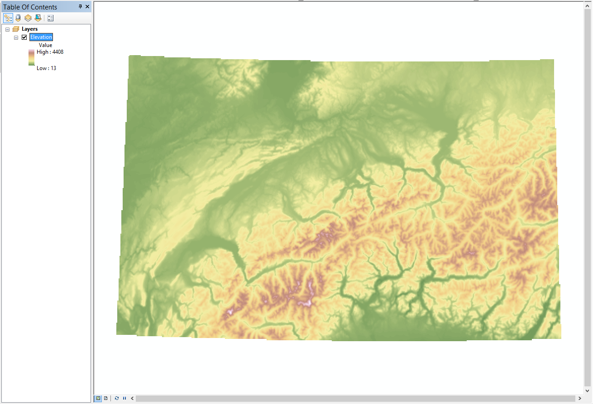
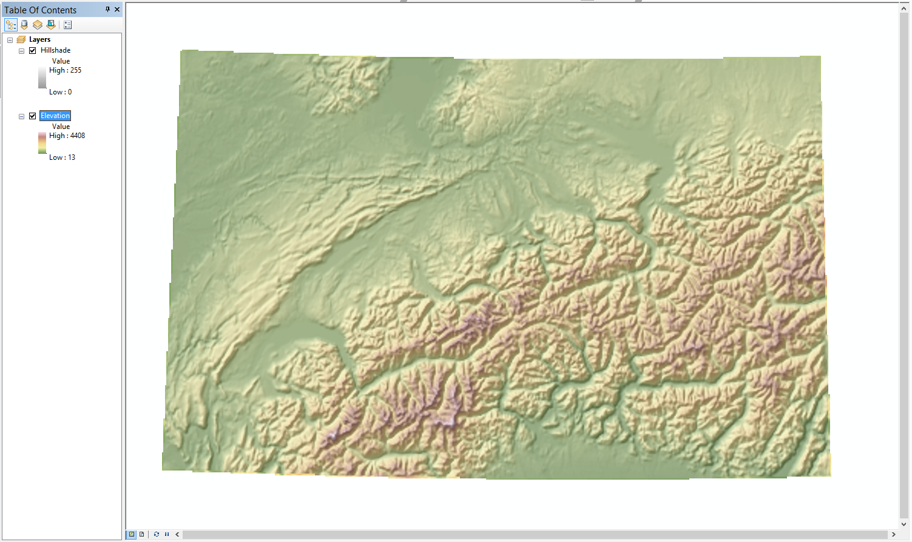
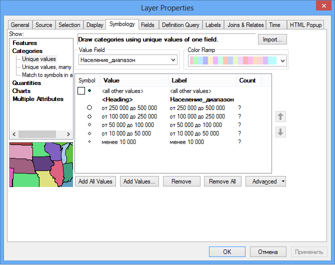
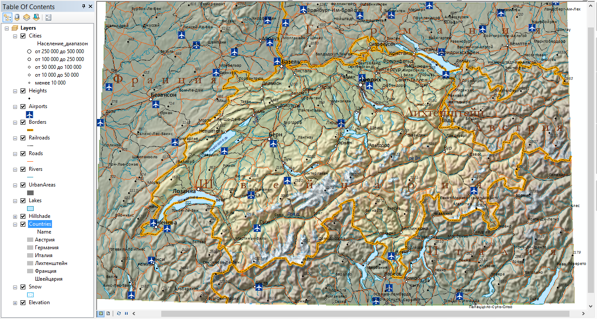
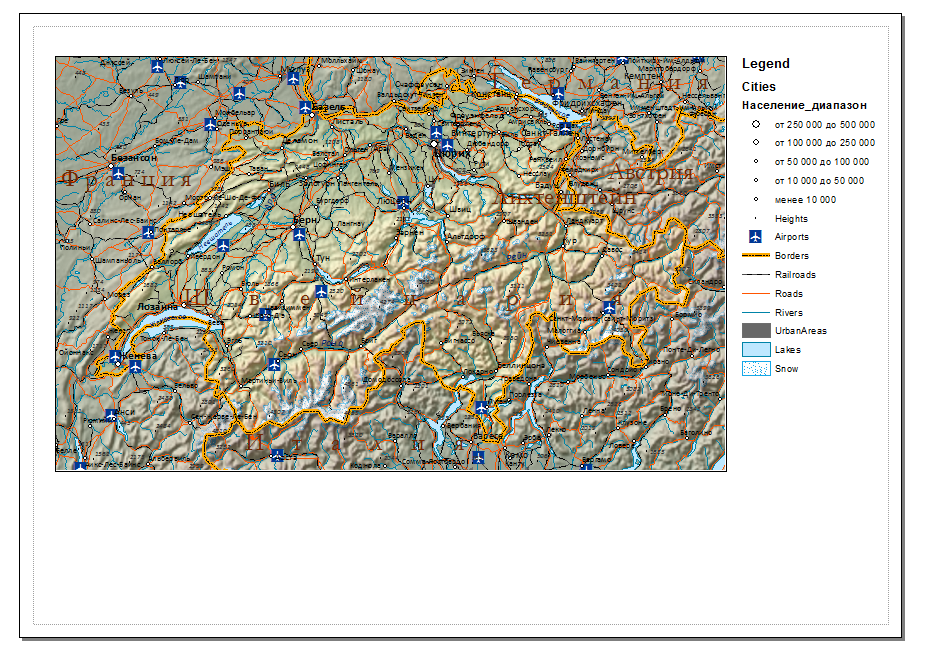
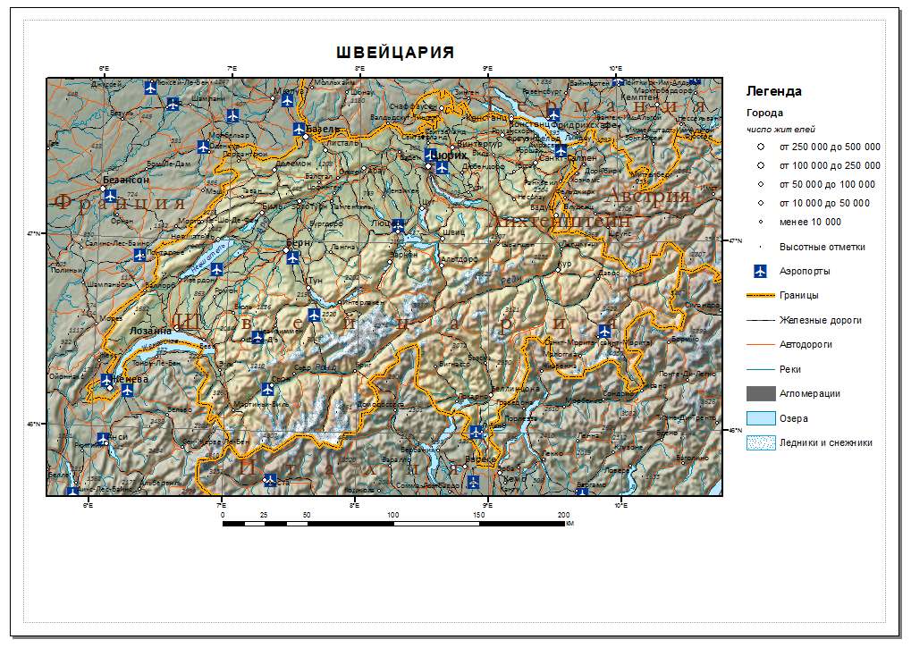

# Создание общегеографической карты {#map-design-general}

[Скачать данные и файл отчета](http://autolab.geogr.msu.ru/gis/data/Ex02.zip)

## Введение {#map-design-general-intro}

**Цель задания** --- знакомство с моделями пространственных объектов и базой пространственных данных. Визуализация данных на карте. Оформление легенды и компоновки карты.

Параметр                    Значение
--------------------------  --------
*Теоретическая подготовка*  Модели пространственных данных, модели пространственных объектов, базы пространственных объектов, картографические проекции
*Практическая подготовка*   Не требуется
*Исходные данные*           Картографическая база данных на территорию Швейцарии
*Результат*                 Общегеографическая карта Швейцарии в масштабе 1:1 750 000.
*Ключевые слова*            Модели пространственных данных, модели пространственных объектов, базы пространственных данных, классы пространственных объектов, визуализация пространственных данных

### Контрольный лист {#map-design-general-control}

* Добавить на карту слои базы пространственных данных и оформить их
* Настроить подписи объектов
* Создать компоновку карты и легенду
* Экспортировать результат в графический файл

### Аннотация {#map-design-general-annotation}

Задание посвящено знакомству с созданием тематических карт на основе баз пространственных данных. Вы познакомитесь с представлением площадных, линейных, точечных объектов в базе пространственных данных. Научитесь создавать карты на их основе, оформлять легенду, сетку координат и зарамочные элементы карты.

## Начало работы {#map-design-general-begin}
[В начало упражнения ⇡](#map-design-general)

1. Запустите приложение **ArcMap** и откройте окно **Сatalog**

2. Подключитесь к рабочему каталогу *Ex02* в окне **Сatalog**.

    В каталоге *Ex02* находится база геоданных *MapData.gdb*, содержащая исходные данные для выполнения задания. Внутри базы геоданных могут быть объекты следующих типов:

    -  --- слои векторных данных (классы пространственных объектов),
    -  — слои растровых данных;
    -  — обычные таблицы;

3. Раскройте базу данных *MapData.gdb* и изучите ее содержимое:

    

Векторные слои базы данных *MapData.gdb*:

Слой          Содержание
------------  -----------------------------
*Airports*    Аэропорты
*Borders*     Границы
*Cities*      Города
*Countries*   Страны
*Frame*       Рамка (фрейм)
*Heights*     Высотные отметки
*Lakes*       Озера
*Railroads*   Железные дороги
*Rivers*      Реки
*Roads*       Дороги
*Snow*        Ледники и снежники
*UrbanAreas*  Урбанизированные территории

Растровые слои базы данных *MapData.gdb*:

Слой        Содержание
----------- -----------------
*Elevation* Высоты рельефа
*Hillshade* Отмывка рельефа

## Оформление рельефа {#map-design-general-relief}
[В начало упражнения ⇡](#map-design-general)

1. Добавьте на карту слой *Elevation* из базы данных *MapData.gdb*.

2. В настройках оформления растрового слоя установите способ градиентной окраски со следующими параметрами:

    Параметр                Значение
    ----------------------  -------------------------------------------------
    *Шкала*                 Surface 
    *Растяжка гистограммы*  Минимум-Максимум (Minimum-maximum)

1. Установите передискретизацию слоя в режим кубической cвертки (*Cubic Convolution*).

    *Результат:*
    

1. Наложите отмывку поверх гипсометрической окраски. Для этого добавьте на карту слой отмывки *Hillshade* и установите для него следующие параметры:

    Параметр                  Значение
    ------------------------- --------------------
    *Прозрачность*            50%
    *Режим передискретизации* Кубическая свертка

    Остальные параметры оставьте по умолчанию.

    *Результат*:
    

<kbd>**Снимок экрана №1.** Картографическое изображение рельефа</kbd>

Сохраните документ карты в каталог Ex02 под названием Ex02\_Фамилия.

## Оформление векторных слоев {#map-design-general-vector}
[В начало упражнения ⇡](#map-design-general)

Добавьте на карту и оформите векторные слои, содержащиеся в базе данных *MapData.gdb*, все кроме слоя *Countries*. Для каждого слоя выберите единый символ. В качестве образца оформления используйте рисунок ниже.

Учтите, что:

- Слой *Snow* располагается между отмывкой и цветовой окраской рельефа. Это позволяет показать заснеженные территории, но при этом сохранить светотеневую пластику.

- При выборе значка для аэропорта следует воспользоваться поиском по символам, набрав ключевое слово *«airport»*

*Результат*:

<kbd>**Снимок экрана №2.** Оформление векторных слоев</kbd>

## Создание подписей {#map-design-general-labels}
[В начало упражнения ⇡](#map-design-general)

1. Установите масштаб карты равным 1:1 750 000.

2. Включите **Maplex** для размещения подписей и переведите его в режим *Best*

3. Сделайте подписи для слоев *Cities*, *Heights*, *Rivers*, *Lakes* со  следующими параметрами:

    *Cities*:

    Параметр      Значение
    -----------   -------------
    *Шрифт*       Calibri
    *Размер*      10
    *Цвет*        Черный
    *Начертание*  Обычный
    *Размещение*  По умолчанию
    *Образец*     -

    *Heights*:

    Параметр      Значение
    -----------   -------------
    *Шрифт*       Calibri
    *Размер*      7
    *Цвет*        Серый 80%
    *Начертание*  Курсивный
    *Размещение*  По умолчанию
    *Образец*     -

    *Rivers*:

    Параметр      Значение
    -----------   -------------
    *Шрифт*       Calibri
    *Размер*      10
    *Цвет*        Синий Dark Navy
    *Начертание*  Курсивный
    *Размещение*  Regular Placement > Offset Curved
    *Образец*     -

    *Lakes*:

    Параметр      Значение
    -----------   -------------
    *Шрифт*       Calibri
    *Размер*      8
    *Цвет*        Синий Dark Navy
    *Начертание*  Курсивный
    *Размещение*  Regular Placement > Curved
    *Образец*     -

*Результат* должен выглядеть примерно следующим образом:

## Классификация населенных пунктов {#map-design-general-cities}
[В начало упражнения ⇡](#map-design-general)

Недостатком полученной карты является то, что все населенные пункты показаны одинаково. Чтобы исправить этого, необходимо разделить их по категориям численности населения. Для этого:

1. В диалоге настройки символов слоя включите режим отображения **Categories (unique values)**, используя значения поля *Население\_диапазон*

2. Отсортируйте классы численности в нужном порядке, используя стрелочки.

3. Настройте размер кружка таким образом, чтобы его диаметр менялся от 3 до 7 пунктов

    *Результат*:
    

1. Перейдите на вкладку **Labels** и переключите подписи в режим нескольких классов.

2. Импортируйте классы с помощью кнопки **Get Symbol Classes**.

3. Настройте подписи следующим образом:

    - Шрифт *Calibri* черного цвета
    - Размер шрифта должен увеличиваться от низшего класса (менее 10 000) до самого крупного (от 250 000 до 500 000) с 8 до 12 пунктов.
    - Подписи городов крупнее 100 000 человек должны быть жирным шрифтом.

    *Результат*:
    

<kbd>**Снимок экрана №3.** Классифицированные населенные пункты с подписями</kbd>

## Маска и подписи стран {#map-design-general-mask}
[В начало упражнения ⇡](#map-design-general)

1. Добавьте на карту слой *Countries* и расположите его между слоями *Hillshade* и *Snow*.

2. Настройте отображение слоя способом **Categories (unique values)** по полю *Name*.

3. Установите следующие параметры отображения:

    Параметр            Значение
    ------------------- -------------
    *Цвет заливки*      Швейцария — нет заливки, остальные страны — серый 50%
    *Цвет обводки*      Нет
    *Прозрачность слоя* 50%

1. Включите подписи стран по полю *Name*, используя следующие параметры:

    Параметр      Значение
    -----------   -------------
    *Шрифт*       Garamond
    *Размер*      24
    *Цвет*        Коричневый/Бардовый
    *Начертание*  Обычный

1. Также установите следующие параметры размещения:

    Параметр                Значение
    ----------------------- -------------
    *Позиция*               Type > Land Parcel Placement
    *Растяжка*              Распределять символы (Spread Characters)
    *Плотность размещения*  Подписывать только крупнейшую часть (Label largest feature part)
    *Разрешение конфликтов* Никогда не удалять (Never Remove)
    *Образец*               -

*Результат*:

<kbd>**Снимок экрана №4.** Маска и подписи стран</kbd>

## Настройка компоновки карты {#map-design-general-layout}
[В начало упражнения ⇡](#map-design-general)

1. Переключитесь в вид компоновки

2. Настройте макет листа следующим образом:

    - Размер А4
    - Альбомная ориентировка

3. Подгоните размер фрейма данных таким образом, чтобы карта оказалась в верхней части листа

4. Установите масштаб равным 1:1 750 000

    *Результат*:
    

1. Используя настройки по умолчанию, вставьте легенду, включив в нее все слои, кроме *Elevation*, *Countries* и *Hillshade*

    *Результат*:
    

1. Измените название показателя для слоя *Cities* на «число жителей». Уменьшите размер шрифта до 9 и сделайте его курсивным.

2. Уменьшите размер шрифта для стиля названия слоя *Cities* до 10 пунктов.

3. Переименуйте все слои в таблице содержания на русский язык в соответствии с таблицей в начале упражнения. Обратите внимание на то, что в легенде они переименуются автоматически.

4. Переименуйте заголовок легенды на русский язык.

5. Увеличьте интервал между слоями в легенде до 10 пунктов.

    *Результат*:
    

1. Вставьте на карту координатную сетку типа **Graticule** с шагом 1° по широте и долготе. Отключите для градусной сетки показ минут и секунд.

2. Вставьте название карты над картой по центру, используя следующие параметры:

    Параметр        Значение
    --------------- -------------
    *Шрифт*         Arial
    *Размер шрифта* 16
    *Начертание*    Полужирный
    *Разрядка*      10 пунктов

1. Вставьте *километровую* масштабную линейку по нижеприведенному образцу:

    

1. Добавьте свою фамилию и инициалы справа внизу под легендой.

<kbd>**Снимок экрана №5.** Итоговая карта</kbd>

## Экспорт в графический файл {#map-design-general-export}
[В начало упражнения ⇡](#map-design-general)

Экспортируйте карту из режима компоновки в формат <kbd>PNG</kbd> с разрешением 300 точек на дюйм.

## Контрольные вопросы {#map-design-general-questions}
[В начало упражнения ⇡](#map-design-general)

1. Какие типы геометрии допустимы для слоев в базе геоданных? К каким типам относятся слои, использованные вами в работе?

2. В какой системе координат хранились данные, которые вы использовали для составления карты?  

3. Какая проекция была использована вами в работе? К какому типу по характеру искажений она относится?  

4. Где хранятся данные, которые используются для классификации символов при отображении?

5. За что отвечают системные поля Shape и ObjectID?

6. Чем отличается вид компоновки от вида данных?
