# Сетевой анализ {#network-analysis}

## Введение {#network-analysis-intro}

**Цель** --- научиться решать различные задачи логистики и оптимизации размещения с помощью сетевого анализа.

Параметр                    Значение
--------------------------  --------
*Теоретическая подготовка*  Понятие о сетевой модели данных, граф дорожной сети, сетевой анализ и его основные задачи: кратчайший маршрут, зона обслуживания, ближайший пункт обслуживания, размещение-распределение, управление парком транспортных средств.
*Практическая подготовка*   Знание основных компонент интерфейса ArcGIS Desktop (каталог, таблица содержания, карта). Инструмент геообработки. Настройка символики и подписей объектов. Выделение объектов на карте. Пространственные и атрибутивные запросы. Оверлей. Инструменты ArcToolbox.
*Исходные данные*           Cлои картографической основы OpenStreetMap, граф дорожной сети на основе данных OpenStreetMap на территорию Москвы.
*Результат*                 Маршрут до магазина. Зоны обслуживания магазина от 1 до 5 минут. Маршруты до ближайших магазинов. Результат размещения магазинов. Зонирование территории по принадлежности к магазинам. Проект карты зонирования с компоновкой
*Ключевые слова*            Сетевой анализ, граф дорожной сети, оптимизация размещения, логистика.      

### Контрольный лист {#network-analysis-control}

* Добавить на карту, слой улиц и слой зданий, граф дорожной сети
* Поставить точку магазина и точку потребителя, построить маршрут
* Поставить барьер на маршруте и перестроить маршрут с учетом барьера
* Рассчитать зоны обслуживания магазина от 1 до 5 минут движения на автомобиле
* Поставить еще одну точку магазина и 5 точек потребителя, рассчитать маршруты до ближайшего магазина
* Добавить на карту точки потребителей, расставить 7 точек потенциальных магазинов, выполнить анализ с выбором 4 мест из потенциальных
* Выполнить районирование территории по зонам обслуживания магазинов.
* Оформить карту с основными элементами компоновки (легенда, масштаб и т.д.)

### Аннотация {#network-analysis-annotation}

Задание посвящено знакомству с сетевым анализом. Задачи, предлагаемые в задании, связаны с определением оптимальных маршрутов, построением зон обслуживания, определением ближайших сервисных точек, размещением сервисных точек. Данные задачи активно используются в логистике — оптимизации перевозок, а также в геомаркетинге и оптимизации местоположения пунктов обслуживания (магазинов, складов, пожарных депо и т.д.). В основе решения этих задач лежит сетевая модель данных, являющаяся частным случаем векторной модели. В сетевой модели дорожная сеть представляется в виде графа.

## Оформление базовых слоев {#network-analysis-basemap}
[В начало упражнения ⇡](#network-analysis)

1. Подключитесь к базе геоданных *Ex12.gdb* в вашей папке *Ex12*.

2. Добавьте на карту слои *Buildings* (здания) и *Streets* (улицы).

3. Присвойте зданиям цвет серый (20%), уберите обводку (**Outline Color > No Color**).

4. Установите масштаб равным 1:10 000 для удобной работы с картой.

5. Включите подписи зданий со следующими параметрами:

    Параметр          Значение  
    ----------------- --------
    *Поле подписи*    A_HSNMBR
    *Цвет подписи*    Серый 80%
    *Размер подписи*  6 пунктов

1. Присвойте дорогам серый цвет (60%) и включите их подписи со следующими параметрами:

    Параметр          Значение  
    ----------------- --------
    *Поле подписи*    Name (tag value)
    *Цвет подписи*    Черный
    *Размер подписи*  8 пунктов
    *Начертание*      Жирное

1. Добавьте на карту граф дорожной сети *OSM*, который находится в наборе данных *OSM_nd* базы геоданных *Ex12*. В появившемся диалоге скажите *No* (Нет), чтобы не добавлять на карту поворотные точки и прочие вспомогательные элементы графа.

2. Задайте линиям графа такой же символ как и дорогам.

3. Сохраните документ карты в свою директорию *Ex12* под названием *Ex12_Network.mxd*.

Примерный результат должен выглядеть так:

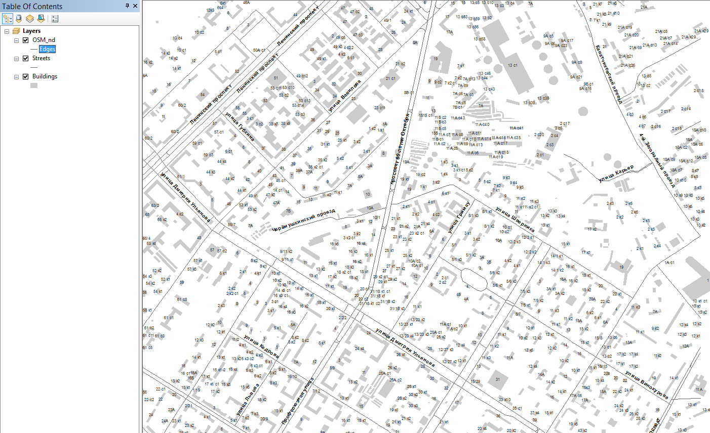

<kbd>**Снимок экрана №1** --- Базовые слои: улицы, здания, граф дорожной сети</kbd>

## Построение маршрута {#network-analysis-route}
[В начало упражнения ⇡](#network-analysis)

1. Включите модуль **Network Analyst** с помощью команды главного меню
  **Customize—Extensions**

2. Включите панель инструментов **Network Analyst**:

    

    Если все правильно, в ниспадающем списке панели будет отображаться граф дорожной сети *OSM_nd*

1. Создайте слой вычисления маршрутов с помощью команды **Network Analyst > New Route**:

    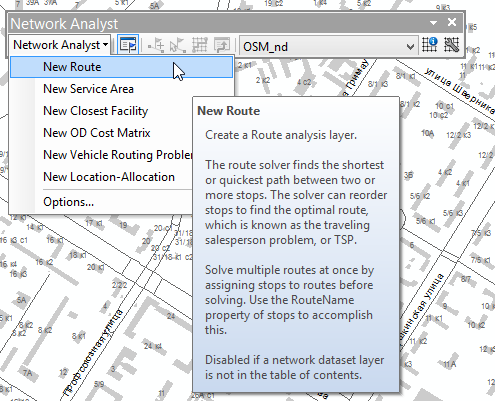

1. Откройте окно **Network Analyst Window**:

    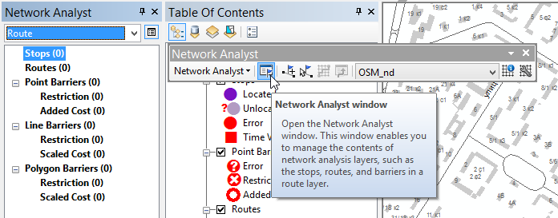

Предположим, что по адресу ул. Профсоюзная, д.9 находится магазин. Вы проживаете по адресу ул. Шверника, д. 19. Необходимо построить прямой и обратный автомобильный маршрут.

1. Выделите в списке набор **Stops**, и, используя инструмент **Create Network Location**, поставьте на графе дорожной сети 2 точки:

    * Рядом со зданием ул. Профсоюзная, д. 9
    * Рядом со зданием ул. Шверника, д. 19

    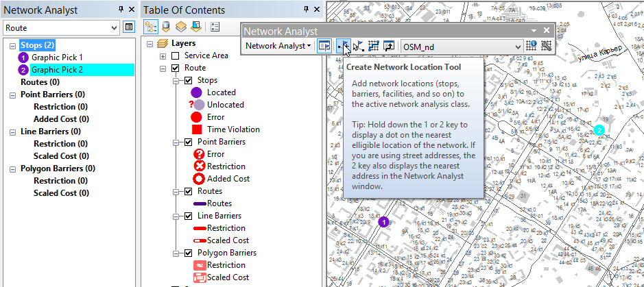

1. Нажмите **Solve**, чтобы построить прямой маршрут:

    

    <kbd>**Снимок экрана №2.** Прямой маршрут</kbd>

1. Поменяйте точки местами в окне **Network Analyst** чтобы построить обратный маршрут. Для этого перетащите нижнюю точку вверх списка. Запустите еще раз **Solve**:

    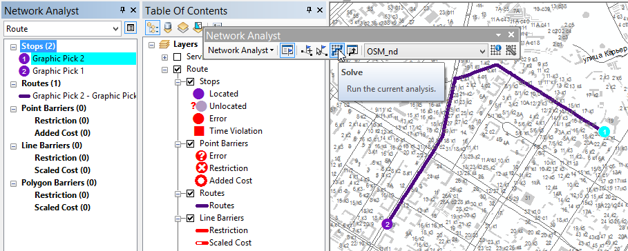

    <kbd> **Снимок экрана №3.** Обратный маршрут</kbd>

Допустим, по адресу проспект 60-летия Октября, д.29к1 ведутся ремонтные работы и движение перекрыто. Поставьте в этом месте барьер и перестройте маршрут. Для этого:

1. Выделите в окне **Network Analyst** пункт **Point Barriers > Restriction** и поставьте точку на граф рядом со зданием проспект 60-летия Октября, д.29к1.

2. Перестройте маршрут:

    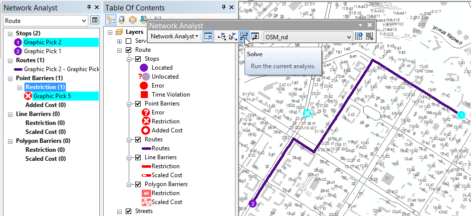

    <kbd>**Снимок экрана №4**  Обратный маршрут с барьером</kbd>

3. Сохраните документ карты.

## Определение зоны обслуживания {#network-analysis-servicearea}
[В начало упражнения ⇡](#network-analysis)

Необходимо определить, какие здания попадают в зону доступности магазина в пределах 1-5 минут движения на автомобиле.

1. Отключите в таблице содержания слой **Route** (снимите галочку).

2. Создайте слой вычисления зон обслуживания с помощью команды **Network Analyst > New Service Area**.

3. Выделите в окне **Network Analyst** слой *Facilities* (пункты обслуживания) и используя тот же инструмент **Create Network Location**, поставьте точку по адресу ул. Профсоюзная, д. 2/22 (пересечение с ул. Дмитрия Ульянова).

    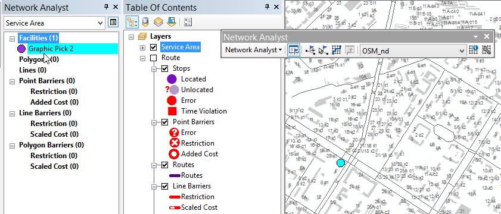

1. Установите время езды до магазина равным 2 минуты. Для этого дважды щелкните на слое *Service Area* в таблице содержания, перейдите на вкладку **Analysis Settings** и поменяйте следующие настройки:

    Параметр          Значение  
    ----------------- --------
    *Default Breaks*  2  
    *Direction*       Towards Facility

    > Режим *Towards Facility* означает, что движение будет моделироваться от потребителя к точке обслуживания

1. Нажмите **Solve** на панели **Network Analyst**, чтобы построить зону обслуживания:

    

    <kbd>**Снимок экрана №5**.  Зона обслуживания 2 мин</kbd>

1. Постройте иерархию зон обслуживания от 1 до 5 минут. Для этого поменяйте значение параметра **Breaks** в настройках слоя *Service Area* на *1 2 3 4 5* (через пробелы):

    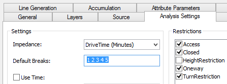

1. Перезапустите расчет зон обслуживания.

    Примерный результат должен выглядеть следующим образом:

    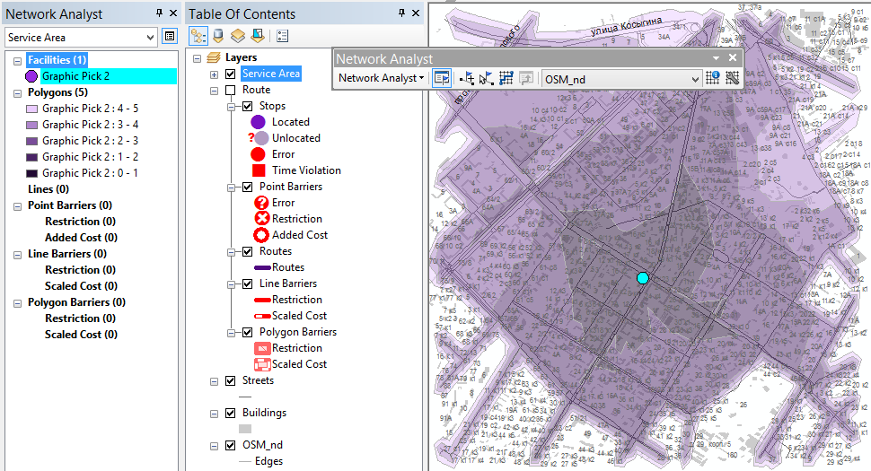

    <kbd>**Снимок экрана №6**  Иерархия зон обслуживания от 1 до 5 мин</kbd>

Получив зоны обслуживания, вы можете выделить с их помощью здания и провести экономико-географический анализ. Для этого можно воспользоваться пространственной выборкой.

1. Раскройте список **Polygons** в окне **Network Analyst**, чтобы увидеть легенду слоя. Выберите зону *Graphic Pick 1: 1 – 2*, она соответствует интервалу движения от 1 до 2 минут до магазина. Соответствующий полигон подсветится на карте.

2. Откройте диалог пространственной выборки (**Selection > Select By Location**). Задайте в качестве целевого слоя *(Target) Buildings*, а в качестве слоя-источника (**Source**) — *Polygons* из группы **Service Area**. Отметьте галочкой **Use selected features**, чтобы пространственный запрос осуществлялся выбранной зоной. Диалог пространственной выборки примет следующий вид:

    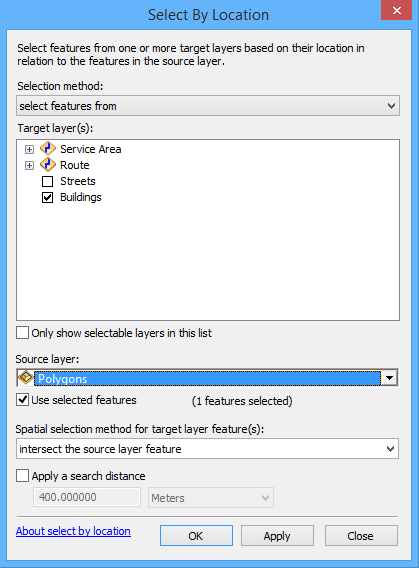

1. Нажмите **ОК**. На карте будут отобраны здания, попадающие в заданный интервал транспортной доступности:

    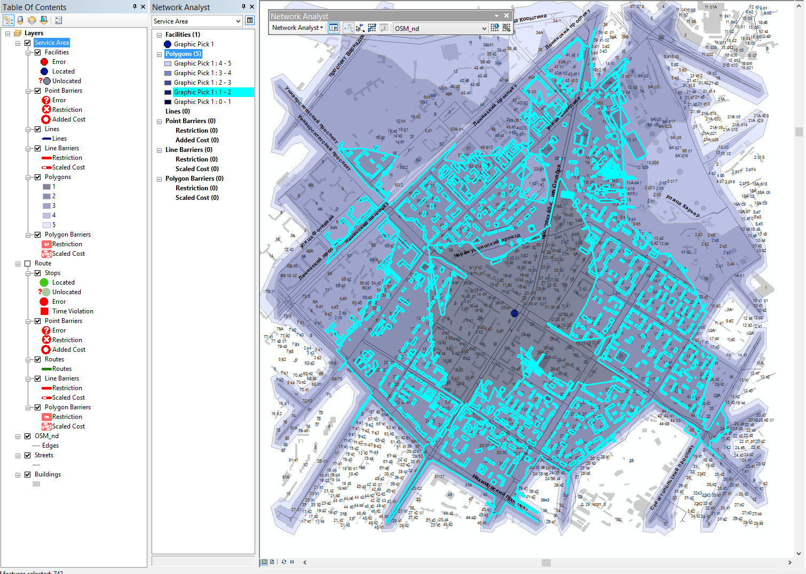

    <kbd>**Снимок экрана №7.**  Выборка зданий</kbd>

    Полученную выборку зданий вы можете далее использовать для проведения статистического и географического анализа.

1. Сохраните документ карты

## Определение ближайшего пункта обслуживания {#network-analysis-facility}
[В начало упражнения ⇡](#network-analysis)

Предположим, что есть 2 магазина и 5 семей, которые живут в разных районах. Необходимо определить, какой магазин является ближайшим для каждой семьи и построить маршрут.

1. Отключите слой *Service Area* в таблице содержания и снимите выборку со всех объектов.

2. Создайте слой определения ближайшего пункта обслуживания с помощью команды **Network Analyst > New Closest Facility**.

3. Используя навыки предыдущего анализа, поставьте два пункта обслуживания (*Facilities*) по адресам:

    * Ул. Вавилова д. 48
    * Ул. Новочеремушкинская, д. 23

4. Поставьте 5 пунктов потребления (*Incidents*) по адресам:

    * Ул Шверника, д. 19

    * Ленинский проспект, д. 44

    * Нахимовский проспект, д. 67

    * Проспект 60-летия Октября, д. 19

    * Ул. Кржижановского, д. 16к1

5. Нажмите **Solve**, чтобы запустить расчет маршрутов.

Инструмент выберет ближайшие пункты обслуживания (магазины) для каждого потребителя и построит маршруты:


<kbd> **Снимок экрана №8**.  Ближайшие пункты обслуживания</kbd>


## Размещение—распределение {#network-analysis-allocation}
[В начало упражнения ⇡](#network-analysis)

Задача размещения—распределения (location-allocation) звучит следующим образом: есть *N* потенциальных точек для размещения пунктов обслуживания (магазины, кафе, пожарные станции, транспортные узлы, сервисные центры и т.д.), а также *K* точек потребления (обычно это здания, из которых выезжают люди за услугами, или к которым эти услуги поставляются). Необходимо из *N* точек обслуживания выбрать *n* ≤ *N* точек таким образом, чтобы минимизировать некую стоимостную функцию (например, суммарное время движения от каждого пункта потребления до ближайшего пункта обслуживания). После чего распределить точки по ближайшим пунктам обслуживания. Данный тип анализа позволяет также моделировать противостояние конкурирующих сетей обслуживания и подбирать оптимальные места размещения пунктов для максимального охвата рынка.

1. Отключите слой Closest Facility в таблице содержания

2. Создайте слой размещения—распределения с помощью команды **Network Analyst > New Location-Allocation**.

3. Расставьте потенциальные пункты обслуживания (*Facilities*) по
  следующим адресам:

    * Ул. Большая Черемушкинская, д.11к3

    * Ул. Дмитрия Ульянова, д. 42

    * Ул. Профсоюзная, д. 19

    * Ленинский проспект, д. 67

    * Ленинский проспект, д. 44

    * Проспект 60-летия Октября, д. 19к1

    * Ул. Дмитрия Ульянова, 26к1

4. Добавьте на карту слой *Points* из базы геоданных *Ex12*. Это слой центроидов зданий, необходимый для загрузки точек потребления.

5. Сделайте точки черного цвета диаметром 3 пункта

    Изображение примет следующий вид:

    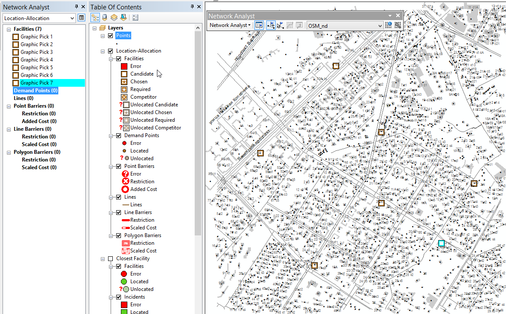

1. Загрузите точки в пункты потребления. Для этого щелкните правой кнопкой мыши на строке *Demand Points* окна **Network Analyst** и выберите команду **Load Locations**:

    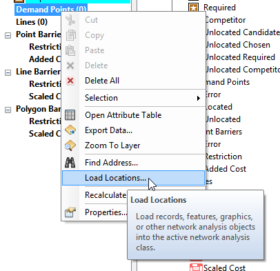

2. В появившемся диалоге выберите в списке **Load From** слой *Points* и нажмите *ОК*. Потребуется некоторое время, чтобы точки привязались к графу дорожной сети. За процессом вы можете следить в строке состояния приложения (внизу).

    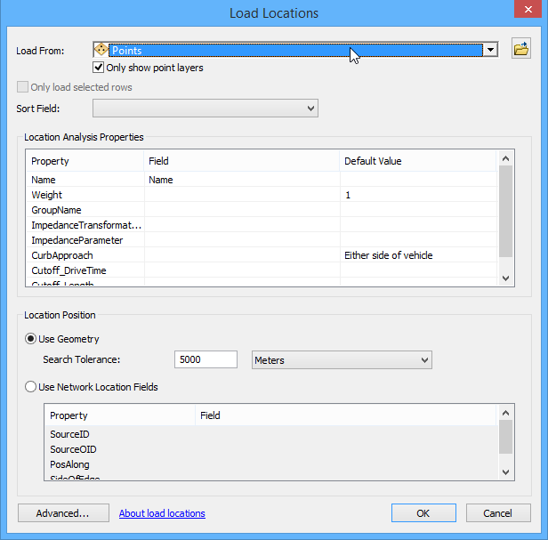

1. Дважды щелкните на слое *Location-Allocation* в таблице содержания, чтобы изменить настройки анализа. Перейдите на вкладку **Advanced Settings**:

    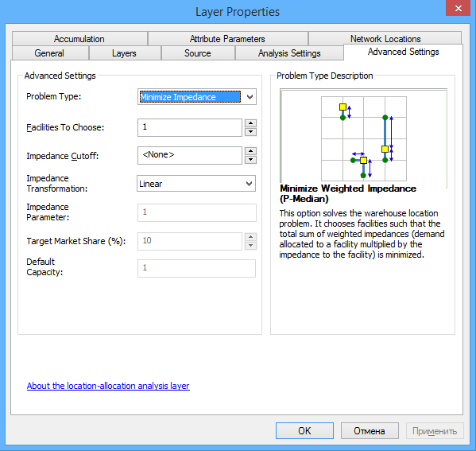

1. Попробуйте выбрать различные варианты решения задачи в списке **Problem Type** и прочитайте их описание. Подумайте, где можно применить такой анализ.

2. Выберите режим *Minimize Impedance* (минимизировать суммарное время движения от потребителей к ближайшим пунктам обслуживания).

3. Установите количество отбираемых кандидатов (**Facilities to Choose**) равное *4*.

    

1. Установите направление движения *Demand to Facility* (потребитель к услугам) на вкладке **Analysis Settings**:

    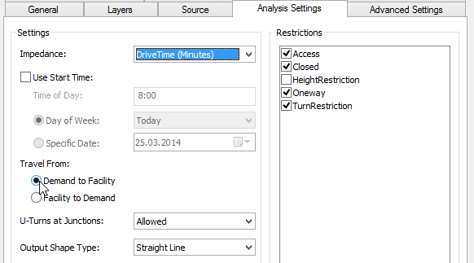

1. Нажмите **ОК** и запустите решение задачи на панели **Network Analyst**. Будут выбраны 4 наиболее оптимальных пункта обслуживания, а здания будут распределены между ними в виде веерной диаграммы. Программа выдаст предупреждение, что некоторые точки оказались непривязанными — проигнорируйте его. Это связано с тем, что некоторые здания по краям области транспортно недоступны, поскольку к ним требуется подъезд извне изучаемого района. Вы можете их видеть по отсутствию исходящих линий.

    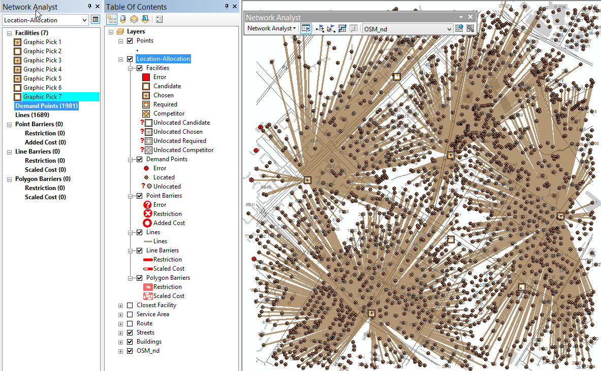

    <kbd>**Снимок экрана №9.**  Результат размещения---распределения</kbd>

1. Сохраните документ карты

## Районирование города по зонам обслуживания {#network-analysis-zoning}
[В начало упражнения ⇡](#network-analysis)

На основе полученного распределения можно произвести районирования территории. Для этого вы построите диаграмму Вороного точек потребления и объедините полигоны, отнесенные к одному пункту обслуживания.

1. Исключите нераспределенные точки. Для этого дважды щелкните на слое *Demand Points* в таблице содержания, перейдите на вкладку **Definition Query**, нажмите **Query Builder** и введите следующий запрос:
    ```
    "FacilityID" IS NOT NULL
    ```
    

1. Создайте в вашем каталоге *Ex12* базу геоданных *Regions.gdb* и назначьте ее базой данных по умолчанию:

    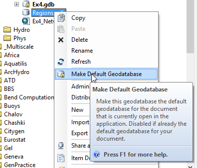

1. Откройте **ArcToolbox**.

2. Запустите инструмент геообработки **Analysis Tools > Proximity > Create Thiessen Polygons** и заполните его параметры следующим образом:

    Параметр          Значение  
    ----------------- --------
    *Input Features*  `Location-Allocation\\Demand Points`  
    *Output Features*  `…\\Ex12\\Regions.gdb\\DemandPoints\_Voronoy`  
    *Output Fields*   `ALL`

    Запустите инструмент. Полученный слой будет добавлен на карту и будет иметь следующую структуру:

    

> *Диаграмма Вороного* обладает следующим свойством: какую бы точку мы не взяли внутри каждого полигона, она будет ближе к центроиду этого полигона, чем к любому другому центроиду.

Объединив полигоны Вороного, точки которых отнесены к одному и тому же пункту обслуживания, вы получите районирование территории по зонам обслуживания. Для этого:

1. Запустите инструмент **Data Management Tools > Generalization > Dissolve** и заполните его параметры следующим образом:

    Параметр                Значение  
    ----------------------  --------
    *Input Features*        `DemandPoints_Voronoy`  
    *Output Feature Class*  `…\Ex12\Regions.gdb\Regions`  
    *Dissolve Field(s)*     FacilityID

    Остальные параметры оставьте по умолчанию. Диалог инструмента примет следующий вид:

    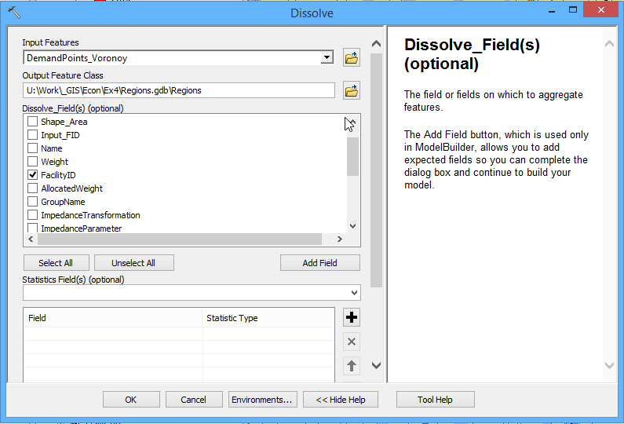

1. Нажмите **ОК**. После обработки слой районирования будет добавлен на карту.

2. Отключите слои диаграммы Вороного, а также точек зданий.

3. Переместите слой Regions под слои зданий и дорог.

4. Измените оформление слоя Regions следующим образом:

    * Способ изображения **Categories > Unique Values**

    * Поле отображения *Facility ID*

    * Цвета отображения спокойные, пастельные, одинаковые по насыщенности.

    * Обводка полигонов отсутствует. Чтобы убрать обводку сразу у всех плашек, щелкните на заголовке столбца **Symbol**, выберите пункт **Properties for All Symbols** и установите параметр **Outline Color** в положение **No Color**.

    Примерный вид диалога свойств слоя *Regions* выглядит следующим образом:

    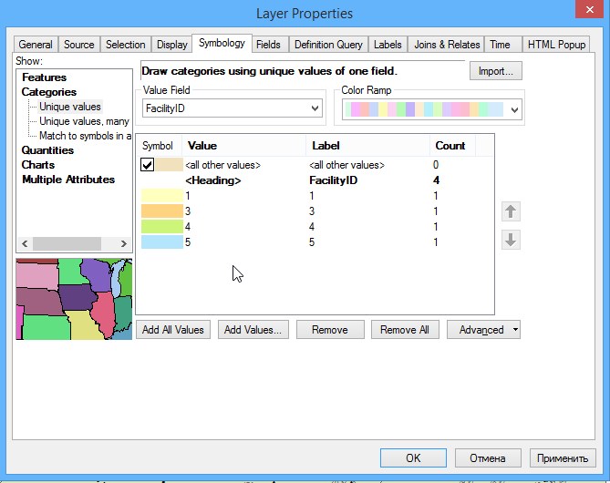

1. Нажмите **ОК**, чтобы завершить оформление

2. В группе *Location-Allocation* оставьте включенным только слой *Facilities*.

3. Выгрузите отобранные пункты в отдельный слой. Для этого в окне **Network Analyst** выделите в списке *Facilities* пункты, помеченные звездочками (зажав клавишу <kbd>Ctrl</kbd>). Далее в контекстном меню слоя *Facilities* выберите команду **Export Data**.

    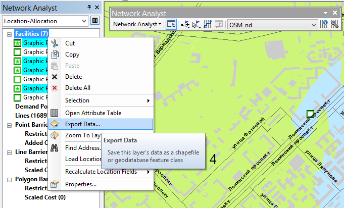

4. Сохраните выборку в базу геоданных *Regions.gdb* под названием
  *Selected*:

    

1. На вопрос добавить ли созданный слой на карту, ответьте утвердительно. Переименуйте слой в «*Пункты обслуживания*». Визуализируйте слой методом категорий (**Categories — Unique Values**) по полю *Name*. В качестве символа используйте кружки диаметром 16 пунктов. Цвет кружков приведите в соответствии с цветом зоны, но сделайте его более ярким и насыщенным.

2. Проделайте аналогичную операцию для не выбранных пунктов обслуживания, выделив их в списке. Сохраните их в базу геоданных под названием Rejected. Полученный слой на карте назовите «*Не выбранные пункты обслуживания*» Присвойте полученному слою единый символ в виде темно-серого кружка диаметром 12 пунктов.

3. Включите подписи номеров районов по полю *FacilityID* (размер шрифта 18)

4. Отключите слой *Location-Allocation* целиком.

Ваш проект примет следующий вид:

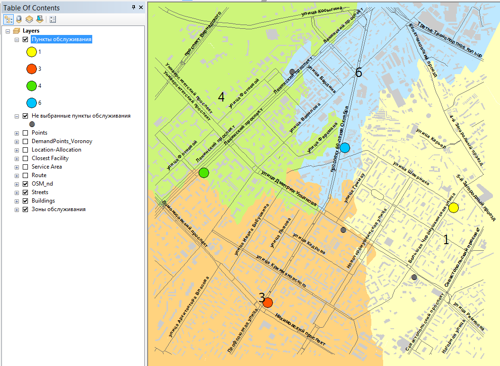

<kbd>**Снимок экрана №10.**  Районирование территории</kbd>

## Компоновка карты {#network-analysis-layout}
[В начало упражнения ⇡](#network-analysis)

Оформите карту в режиме компоновки в соответствии с нижеприведенным образцом. Экспортируйте результат в графический файл и вставьте его в отчет.


## Контрольные вопросы {#network-analysis-questions}
[В начало упражнения ⇡](#network-analysis)

1. Какой слой необходим для проведения сетевого анализа?

2. Какую задачу позволяет решить инструмент *Route*?

3. Какую задачу позволяет решить инструмент *Service Area*?

4. Можно ли построить сразу несколько зон обслуживания? Как это сделать?

5. Какую задачу позволяет решить инструмент *Closest Facility*?

6. Какую задачу позволяет решить инструмент *Location-Allocation*?

7. Какая последовательность действий позволяет перейти от распределений точек к площадному районированию территории?
