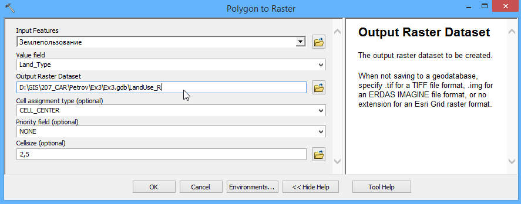
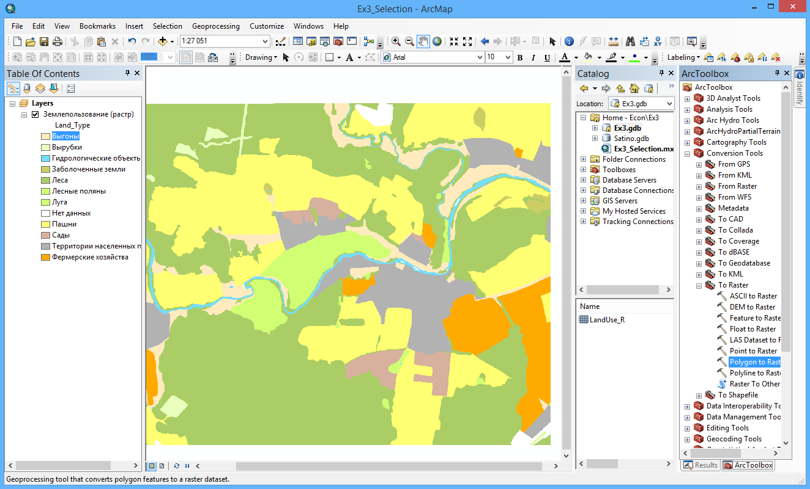
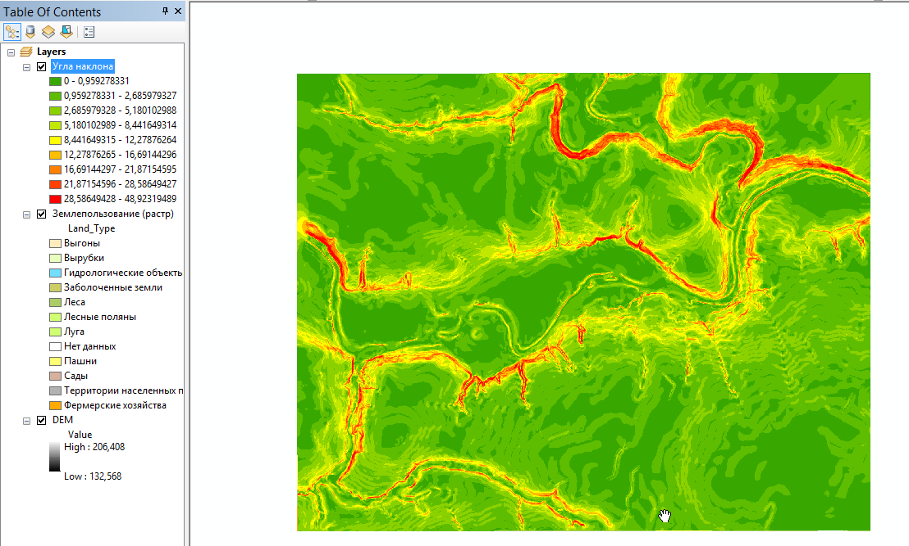
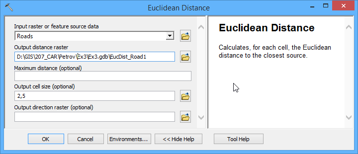
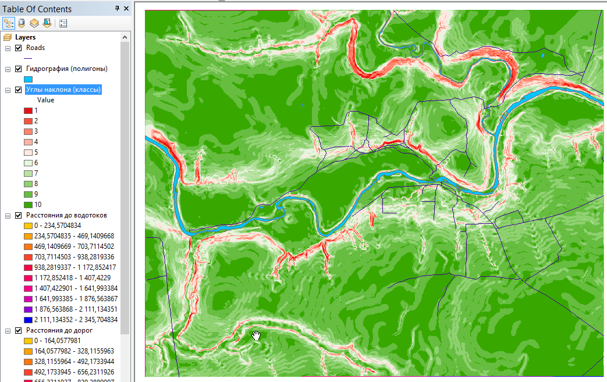
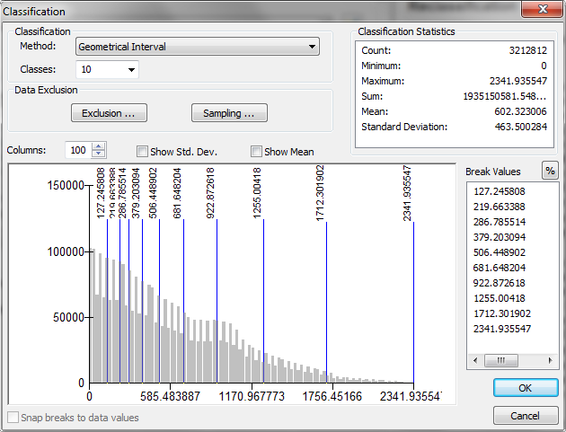
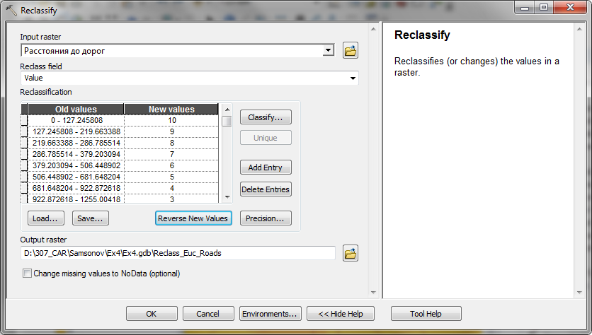
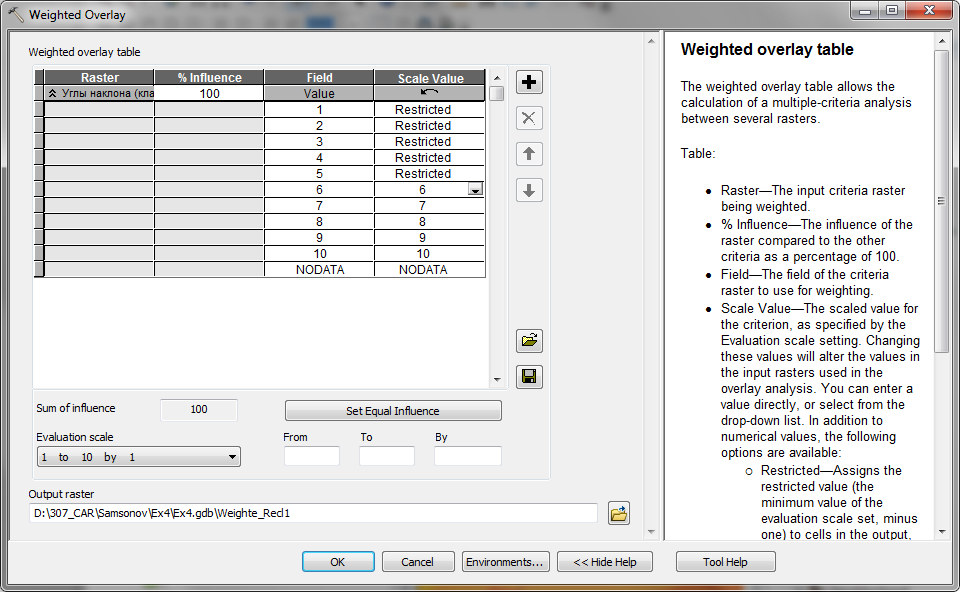
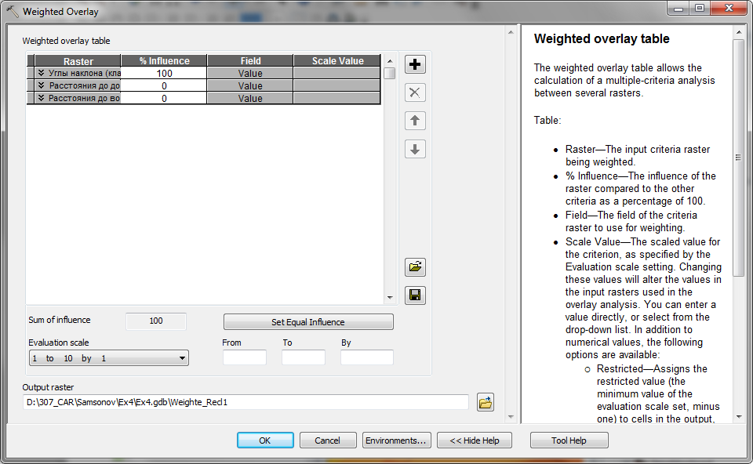

# Геокодирование {#geocoding}

## Введение {#geocoding-intro}

**Цель** --- научиться выполнять геокодирование по адресным данным, строить поля непрерывного распределения показателя по точкам.

Параметр                    Значение
--------------------------  --------
*Теоретическая подготовка*  Геокодирование, адресные локаторы и их типы, интерполяция по данным в нерегулярно расположенных точках, методы интерполяции.
*Практическая подготовка*   Знание основных компонент интерфейса ArcGIS Desktop (каталог, таблица содержания, карта). Настройка символики и подписей объектов. Выделение объектов на карте. Пространственные и атрибутивные запросы. Оверлей. Инструменты геообработки.
*Исходные данные*           Таблица адресов ресторанов McDonald’s на территорию Манхэттена (Нью-Йорк) с данными о средней посещаемости. Картографический сервис Esri Streets. Сервис геокодирования NYSGIS.
*Результат*                 Геокодированные точки адресов. Визуализация точек значками разного диаметра в соответствии с посещаемостью. Поле посещаемости, построенное по точечным данным. Проект карты с элементами компоновки (легенда, масштаб).
*Ключевые слова*            Геокодирование, адресный локатор, интерполяция данных.

### Контрольный лист {#geocoding-control}

* Подключить картографический сервис Esri Streets
* Подключить сервис геокодирования NYSGIS
* Добавить на карту таблицу с адресами и геокодировать их в автоматическом режиме
* Исправить вручную несопоставленные точки
* Визуализировать точки значками разного диаметра в соответствии с числом посетителей
* Построить по точкам поле посещаемости методом естественных соседов (Natural Neighbor).
* Оформить итоговую карту распределения

### Аннотация {#geocoding-annotation}

Задание посвящено знакомству с геокодированием и построением непрерывных полей на основе точечных данных. Геокодирование — это определение координат объектов по их географическим текстовым описаниям, которые, как правило, выражены в виде адресов и/или почтовых кодов.

На основе точечных данных часто восстанавливают поле распределения некоторого показателя. В случае социально-экономических показателей это такие поля являются абстрактными и показываются псевдоизолиниями. Несмотря на то, что признак может не иметь истинно непрерывного распределения (как в случае этого задания — посещаемость ресторанов), показ с помощью изолиний бывает наглядным, дает лучшее представление о дифференциации территории, чем просто значки.

В работе вам предлагается совместно использовать эти 2 метода.

> **ВНИМАНИЕ**: для выполнения задания необходимо подключение к сети
Интернет.

## Подключение к сервисам {#geocoding-connection}
[В начало упражнения ⇡](#geocoding)

1. Добавьте на карту в качестве основы картографический сервис *Esri Streets*. Его можно выбрать, используя команду **Add Basemap** на главной панели инструментов:

    

    В появившемся диалоге выберите *Streets*:

    

    Если подключение произошло корректно, появится картографическое
    изображение.

1. Увеличьте масштаб карты таким образом, чтобы был хорошо виден Манхэттен:

    

1. Подключитесь к ГИС-серверу официального портала штата Нью-Йорк. Для этого в окне каталога выберите команду **GIS Servers > Add ArcGIS Server** и в появившемся диалоге выберите **Use GIS Services** (использовать ГИС-сервисы), нажмите Далее:

    

1. В следующем диалоге в параметр **Server URL** скопируйте и вставьте следующий адрес и нажмите **Finish** (имя пользователя и пароль вводить не надо):

    `http://gisservices.dhses.ny.gov/arcgis/rest/services`

    Если соединение прошло удачно, в списке ГИС-серверов появится новое подключение к ГИС-серверу. Внутри него среди прочих сервисов должен располагаться адресный локатор *Street\_and\_Address\_Composite*:

    

1. Подключитесь в окне **Каталога** к вашей папке *Ex14* и создайте в ней новую базу геоданных под названием *Ex14*. Назначьте ее базой данных по умолчанию.

## Геокодирование адресов {#geocoding-addresses}
[В начало упражнения ⇡](#geocoding)

1. В окне **Каталога** раскройте таблицу *NYMcDonalds.xlx* и перетащите ее первый лист на карту:

    

1. Откройте таблицу, чтобы просмотреть ее содержимое. В ней есть несколько полей, отвечающих за адрес, а также поле *Visitors*, хранящее информацию о среднем числе посетителей, обслуживаемых за один час:

    

1. Выберите в контекстном меню таблицы опцию **Geocode Addresses**, чтобы приступить к геокодированию:

    

    В появившемся диалоге необходимо добавить сервис геокодирования, к которому вы осуществили подключение ранее.

1. Нажмите **Add...** и, используя навигацию по папкам, перейдите в каталог **GIS Servers** и найдите сервис геокодирования *Street\_and\_Address\_Composite*. Выделите его и нажмите **Add**:

    

1. Далее выделите его и нажмите ОК:

    

1. В появившемся диалоге настроек геокодирования необходимо выбрать поля атрибутивной таблицы, из которых будет браться адресная информация. Заполните его следующим образом:

    Параметр                            Значение
    ----------------------------------- --------
    *Street or Intersection*            Address
    *City or Placename*                 City
    *State*                             State
    *Output Shapefile or Feature Class* `…\Ex14\Ex14.gdb\NYMcDonalds`

    Выберите в поле **Save as Type** фильтр *File and Personal Geodatabase Feature Class*

    Остальные параметры оставьте по умолчанию и нажмите **ОК**. После выполнения геокодирования появится диалог, сообщающий процент удачно геокодированных адресов (*Matched*). Нажмите Rematch, чтобы приступить к исправлению ошибок: 

    Появится диалог сопоставления адресов, а на карту будет добавлены удачно геокодированные точки. Выберите в списке **Show Results** режим **Unmatched Addresses**. Не закрывая диалог, увеличьте изображение таким образом, чтобы точки было хорошо видно:

    

    <kbd>**Снимок экрана №1.** Автоматически геокодированные точки на карте и список негеокодированных точек</kbd>

Возникшие проблемы сопоставления адресов почти во всех случаях обусловлены тем, что для зданий на перекрестках указано сразу 2 адреса (*427 10TH AVE & 34TH).* Такая форма адреса не соответствует требованиям геокодера. Исключение составляет адрес «*139TH & ADAM CLAYTON POWELL*», в котором не указан номер дома ни по одной из улиц. Его вы обработаете отдельно.

1. Для разрешения неоднозначности выполните следующие действия:

    * Выделите строку с идентификатором *«10»* в таблице. В поле **Street or Intersection** в нижней левой части окна сотрите знак `&` и все что после него. Строка «*154 W 14TH ST & 7TH AVE*» должна превратиться в строку «*154 W 14TH ST*»:

         

    * Нажмите **Search**. Среди полученных вариантов выберите имеющий ранг *Score* равный *100* (полное совпадение). Если таких адресов несколько, следует выбрать тот, что имеет заполненное поле *House* (дом).

    * Нажмите **Match**, чтобы сопоставить адрес. Результат должен выглядеть следующим образом:

        

1. Повторите эту последовательность действий для всех оставшихся строк.

2. Для кафе, располагающегося на перекрестке *139TH & ADAM CLAYTON POWELL* вам необходимо узнать точный адрес по одной из этих улиц. Найдите этот адрес, используя поисковые возможности сети Интернет и введите его полностью (включая номер дома и полное название улицы) в поле **Street or Intersection**.

    После выполнения правок все адреса должны быть сопоставлены и диалог примет следующий вид:

    

    <kbd>**Снимок экрана №2.** Результат ручного сопоставления адресов</kbd>

1. Нажмите **Close**, чтобы завершить геокодирование.

2. Сохраните документ карты в свою папку *Ex14* под названием *Ex14\_Geocoding.mxd*.

## Визуализация посещаемости в точках {#geocoding-visitors}
[В начало упражнения ⇡](#geocoding)

1. Визуализируйте слой полученных точек методом значков. Выберите способ изображения **Quantities — Graduated Symbols** и задайте следующие параметры:

    Параметр            Значение
    ------------------- --------
    *Поле отображения*  Visitors
    *Классификация*     С равным интервалом через 100
    *Размеры кружков*   От 8 до 24
    *Цвет кружков*      Голубой   

    Диалог настройки свойств слоя примет следующий вид:

    

1. Установите прозрачность значков на вкладке *Display* равной *50%*.

2. Переименуйте слой в «*Рестораны McDonalds*», а значение подписи показателя в заголовке легенды измените на «чел/час». Картографическое изображение примет следующий вид:

    

1. Откройте панель инструментов **Labeling** и включите механизм *Maplex*, чтобы получить доступ к расширенным настройкам подписей.

2. Включите подписи точек по полю *Address*. Установите размер шрифта равным *7*.

    Чтобы полученные надписи не загораживали значки, необходимо установить значкам высокий вес при размещении подписей.

1. Нажмите кнопку **Label Weight Ranking** на панели **Labeling**:

    

1. В открывшемся диалоге установите значение веса точек равным *1000*:

    

1. Нажмите **ОК**. После выполнения этих действий подписи будут размещены в стороне от значков:

    

    <kbd>**Снимок экрана №3.** Градуированные значки с подписями</kbd>

1. Сохраните документ карты

## Построение поля посещаемости {#geocoding-field}
[В начало упражнения ⇡](#geocoding)

Наглядность представления пространственного распределения можно повысить, построив по точкам непрерывное поле и отобразив его методом послойной окраски. Восстановление поля по точечным данным делается с помощью интерполяции. Методы интерполяции расположены в группе инструментов **Spatial Analyst Tools > Interpolation**.

1. Запустите инструмент интерполяции данных **Spatial Analyst Tools > Interpolation > Natural Neighbor** ([метод естественного соседа](http://desktop.arcgis.com/ru/arcmap/10.3/tools/spatial-analyst-toolbox/natural-neighbor.htm)) и заполните его параметры следующим образом:

    Параметр                Значение
    ----------------------- --------
    *Input Point Features*  Рестораны McDonalds
    *Z Value Field*         Visitors
    *Output Raster*         `…\Ex14\Ex14.gdb\Visitors`
    *Output Cell Size*      50  

    Метод естественного соседа осуществляет интерполяцию на основе диаграммы Вороного точек. Полученный растр будет добавлен на экран. Переименуйте его в *«Посещаемость»*:

    

1. Дважды щелкните на растре, перейдите на вкладку **Symbology** и измените параметры его отображения следующим образом:

    Параметр              Значение
    --------------------- --------
    *Способ отображения*  Classified
    *Классификация*       С равным интервалом через 100
    *Шкала*               От желтого к темно-красному

    Диалог настройки слоя примет следующий вид:

    

1. Перейдите на вкладку **Display** и установите параметр прозрачности (**Transparency**) равным *20%*, чтобы сделать послойную окраску полупрозрачной. Нажмите **ОК**. Картографическое изображение примет следующий вид:

    

    <kbd>**Снимок экрана №4.** Поле распределения посещаемости</kbd>

1. Сохраните документ карты

## Оформление карты {#geocoding-design}
[В начало упражнения ⇡](#geocoding)

Переключитесь в режим компоновки и установите масштаб карты равным *1:100 000*. Оформите карту в соответствии с нижеприведенным образцов, экспортируйте ее в графический файл и вставьте в отчет.

## Ответы на вопросы {#geocoding-questions}
[В начало упражнения ⇡](#geocoding)

Заполните отчетный файл и положите его в сетевую папку для проверки преподавателем.
