# Интерполяция и картографирование гидрометеорологических полей {#interpolation}

## Введение

**Цель** --- научиться на основе точечных данных восстанавливать поля распределения непрерывных показателей различными способами. Осуществлять визуализацию методом изолиний с послойной окраской, строить профили по полученным поверхностям.

Параметр                    Значение
--------------------------  --------
*Теоретическая подготовка*  Построение растровых поверхностей. Интерполяция по данным в нерегулярно расположенных точках. Методы интерполяции: обратно взвешенных расстояний, естественного соседа, тренда, сплайнов, кригинга.
*Практическая подготовка*   Знание основных компонент интерфейса ArcGIS Desktop (каталог, таблица содержания, карта). Настройка символики и подписей объектов. Пространственные и атрибутивные запросы, оверлей. Создание базы геоданных и классов пространственных объектов. Редактирование классов пространственных объектов. Инструменты геообработки ArcToolbox. Создание компоновки карты: название легенда, масштаб, градусная сетка.
*Исходные данные*           Данные [дрейфующих буев ARGO](http://www.argo.ucsd.edu) на акваторию Северной Атлантики, границы стран мелкомасштабной картографической основы.
*Результат*                 Поверхности температуры за 30.01.2011, построенные различными методами; поверхность кригинга, полученная после обработки фильтром 3х3; изолинии по данной поверхности с шагом 2,5 градуса; профиль температуры по меридиану 38° з.д.; карта с названием, легендой, масштабом и профилем
*Ключевые слова*            Интерполяция, аппроксимация, гидрометеорологические поля, картографирование, профили.       

### Контрольный лист:

* Добавить на карту границы стран и точки наблюдений, оформить в соответствии с указаниями
* Оценить максимально возможное разрешение растра
* Построить поверхность методом обратно взвешенных расстояний
* Построить поверхность методом естественного соседа
* Построить поверхность методом сплайнов с натяжением
* Построить поверхности методом полиномиального тренда со степенями 1,2,3,4,5
* Построить поверхность методом кригинга
* Сгладить данную поверхность фильтром с плавающим окном размера 3х3
* Построить изолинии по данной поверхности
* Построить профиль по меридиану 38° з.д.
* Оформить карту с легендой и масштабом

### Аннотация

Моделирование физических полей --- основа гидрометеорологического картографирования. Типичный рабочий процесс при создании карт температуры, давления, скорости ветра и прочих непрерывных в пространстве явлений заключается в восстановлении поверхности на основе точечных измерений (или модельных значений). Полученные поверхности можно визуализировать, выполнять их анализ, строить профили и разрезы.

В задании предлагается восстановить поле температуры в Северной Атлантике по данным [дрейфующих буев ARGO](http://www.argo.ucsd.edu); проанализировать отличия поверхностей, полученных разными методами. В заключении работы необходимо построить профиль и оформить карту в режиме компоновки.

## Оформление базовых слоев
[В начало упражнения ⇡](#interpolation)

1. Скопируйте каталог *Ex4* в свой рабочий каталог.

2. Подключитесь в окне каталога к вашей папке *Ex4*. Убедитесь, что в ней находится база геоданных *Argo.gdb*.

3. Используя контекстное меню базы данных, назначьте ее базой данных по умолчанию.

4. Добавьте на карту слои *ArgoBuoys* и *Countries* и оформите их следующим образом:

   * *ArgoBuoys*  --- черные кружки диаметром 3 пункта
   * *Countries*  --- заливка серым цветом 30%, обводка серым цветом 60%

1. Включите подписи слоя *ArgoBuoys* по полю *Temp*, установите размер шрифта равным 7 пунктам.

    Картографическое изображение примет следующий вид:

    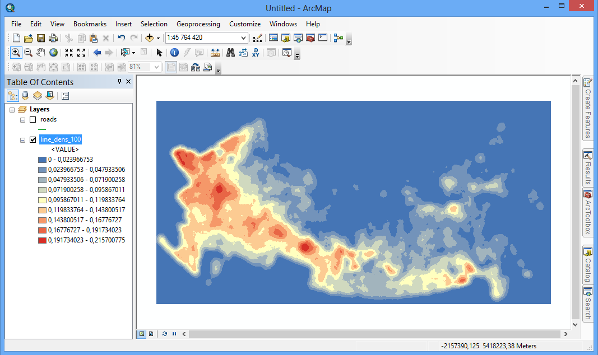

    <kbd>**Снимок экрана №1.**  Исходные данные</kbd>

1. Сохраните документ карты в свою папку под названием *Ex4_Interpolation.mxd*

## Оценка необходимого разрешения растра
[В начало упражнения ⇡](#interpolation)

Для оценки минимально необходимого разрешения растра следует вычислить для массива исходных точек среднее расстояние до ближайшего соседа (*Nearest Neighbor Distance, NND*), которое дает оценку пространственной частоты. Согласно [теореме Котельникова](https://ru.wikipedia.org/wiki/Теорема_Котельникова), потерь данных можно избежать, если частота дискретизации будет вдвое больше максимальной пространственной частоты. Данная частота дискретизации именуется *частотой Найквиста*. Интерпретируя это утверждение в терминах растрового анализа, можно сказать, что *разрешение растра R должно быть по крайней мере в 2 раза мельче, чем среднее расстояние до ближайшего соседа*.

1. Запустите инструмент геообработки **Analysis Tools > Proximity > Near** и задайте его параметры следующим образом:

    Параметр          Значение
    ----------------- --------
    *Input Features*  ArgoBuoys  
    *Near Features*   ArgoBuoys  

    Нажмите **ОК**:

    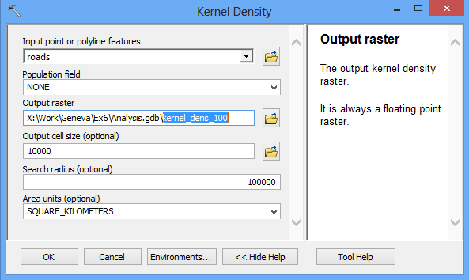

1. После завершения работы инструмента откройте атрибутивную таблицу слоя *ArgoBuoys* и в контекстном меню заголовка поля *Near\_DIST* выберите команду **Statistics**, чтобы открыть диалог со статистикой поля.

2. Найдите в диалоговом окне строку *Mean* (среднее значение), разделите его пополам и округлите полученное значение в меньшую сторону до ближайшего числа, кратного 0,5. Если все сделано правильно, то в результате должно получиться разрешение *2,5 градуса*.

==✔︎ *Более подробно с решением проблемы выбора оптимального разрешения растра вы можете ознакомиться в статье [Hengl T. Finding the right pixel size // Comput. Geosci. 2006. Vol. 32, № 9. P. 1283–1298.](https://www.researchgate.net/publication/222014409_Finding_the_right_pixel_size)*==

## Интерполяция поверхностей
[В начало упражнения ⇡](#interpolation)

Используя инструменты геообработки, находящиеся в **ArcToolbox** в группе **Spatial Analyst Tools > Interpolation**, постройте растровые поверхности нижеуказанными методами:

Метод | Инструмент геообработки | Выходной растр
------|-------------------------|---------------
[Обратно взвешенных расстояний](http://desktop.arcgis.com/ru/arcmap/latest/tools/3d-analyst-toolbox/how-idw-works.htm) | **IDW** | `.Ex4/Argo.gdb/Temp_IDW`
[Естественного соседа](http://desktop.arcgis.com/ru/arcmap/latest/tools/3d-analyst-toolbox/how-natural-neighbor-works.htm) | **Natural Neighbor** | `…/Ex4/Argo.gdb/Natural`
[Сплайнов](http://desktop.arcgis.com/ru/arcmap/latest/tools/3d-analyst-toolbox/how-spline-works.htm) | **Spline** | `…/Ex4/Argo.gdb/Spline`
[Кригинга](http://desktop.arcgis.com/ru/arcmap/latest/tools/3d-analyst-toolbox/how-kriging-works.htm) | **Kriging** | `…/Ex4/Argo.gdb/Temp_Kriging`
[Тренда](http://desktop.arcgis.com/ru/arcmap/latest/tools/3d-analyst-toolbox/how-trend-works.htm) 1,2,3,4,5 степени | **Trend** (для указания степени полинома используйте параметр Polynomial Order) |  `…/Ex4/Argo.gdb/Trend1`,`…/Ex4/Argo.gdb/Trend2`,`…/Ex4/Argo.gdb/Trend3`,`…/Ex4/Argo.gdb/Trend4`,`…/Ex4/Argo.gdb/Trend5`

> Используя гиперссылки в таблице, вы можете перейти на страницу справки и изучить принципы работы каждого из методов интерполяции.

Для всех инструментов будут общими следующие параметры:

Параметр                Значение
----------------------- --------
*Input Point Features*  ArgoBuoys
*Z value field*         Temp
*Output Cell Size*      2,5

Если все выполнено верно, то в вашей базе геоданных и таблице содержания должно появиться *9 новых растров*, отражающих поверхность распределения температуры:

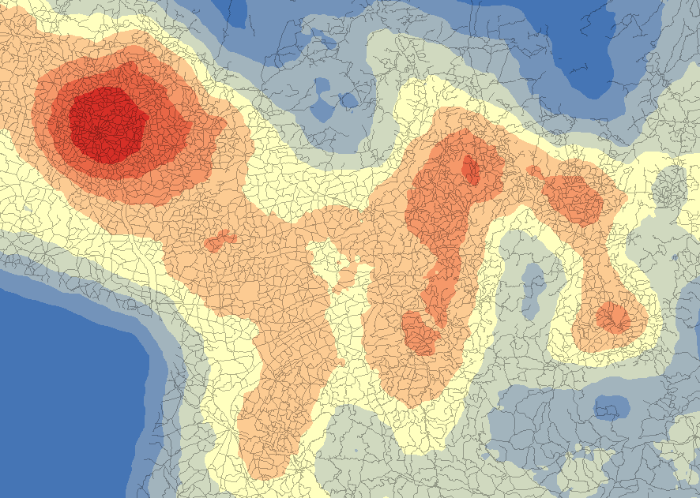

<kbd>**Снимок экрана №2**.  Построенные поверхности</kbd>

## Настройка отображения поверхностей
[В начало упражнения ⇡](#interpolation)

Для того чтобы поверхности можно было сравнивать, необходимо визуализировать их в единой цветовой шкале и с одинаковым шагом температуры. Рассмотрим последовательность действий на примере растра, полученного методом кригинга:

1. Убедитесь, что в свойствах слоя *Temp_Kriging* на вкладке **Symbology** включен режим отображения *Classified*. Нажмите на этой же вкладке кнопку **Classify…**

2. В появившемся диалоге выберите метод классификации *Defined* (заданный интервал), установите интервал равным 2,5 метра и нажмите **ОК**:

    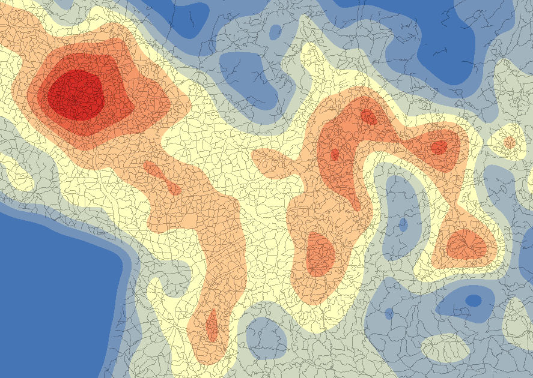

1. Выберите сине-бело-красную шкалу для отображения температуры. Диалог свойств слоя примет следующий вид:

    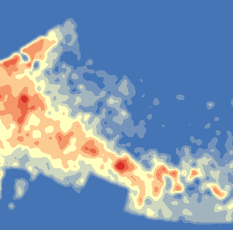

1. Нажмите **ОК**. Картографическое изображение примет следующий вид:

    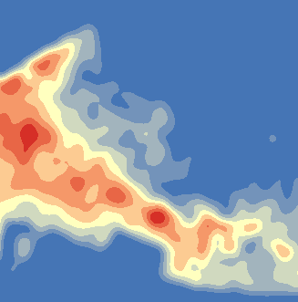

    <kbd>**Снимок экрана №3.** Поле температуры методом кригинга</kbd>

1. Повторите эту операцию для оставшихся растров.

2. Поочередно *включая только нужный растр* (так чтобы на карте был виден именно он) сделайте снимки экрана:

  <kbd>**Снимок экрана №4.**  Поле температуры методом обратно взвешенных расстояний</kbd>

  <kbd>**Снимок экрана №5.**  Поле температуры методом естественного соседа</kbd>

  <kbd>**Снимок экрана №6.**  Поле температуры методом сплайнов</kbd>

  <kbd>**Снимок экрана №7.**  Поле температуры методом тренда 1 степени</kbd>

  <kbd>**Снимок экрана №8.**  Поле температуры методом тренда 2 степени</kbd>

  <kbd>**Снимок экрана №9.**  Поле температуры методом тренда 3 степени</kbd>

  <kbd>**Снимок экрана №10.**  Поле температуры методом тренда 4 степени</kbd>

  <kbd>**Снимок экрана №11.**  Поле температуры методом тренда 5 степени</kbd>

## Сглаживание поверхности, полученной методом кригинга
[В начало упражнения ⇡](#interpolation)

Мелкие неровности поверхности, обусловленные методом интерполяции, можно устранить с помощью сглаживания. Для этого часто используется фильтрация с помощью плавающего окна.

1. Отключите все растры кроме построенного методом кригинга.

2. Запустите инструмент **Spatial Analyst Tools > Neighborhood > Focal Statistics** и настройте его параметры следующим образом:

    Параметр        Значение
    --------------- --------
    *Input Raster*  Temp\_Kriging  
    *Output Raster* `.Ex4\Argo.gdb\Temp_Kriging_3x3`  

    Остальные параметры (включая размер окна 3×3) оставьте по умолчанию. Нажмите **ОК**. После выполнения сглаженный растр будет добавлен в таблицу содержания:

    

    Обратите внимание на размер ячейки.

1. Визуализируйте сглаженный растр аналогично созданным ранее растрам. Для этого вам потребуется сменить способ его отображения на **Classified**.

2. Нажмите **ОК**. Изображение примет цветной, но по прежнему пикселизованный вид:

    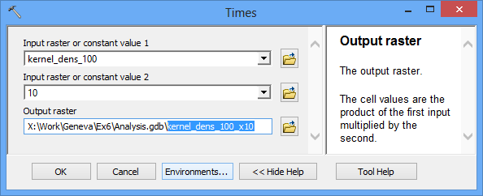

1. Дважды щелкните на слое *Temp\_Kriging\_3x3*, перейдите на вкладку **Display** и установите режим [передискретизации](https://ru.wikipedia.org/wiki/Передискретизация) слоя **Сubic Convolution** (кубическая свертка):

    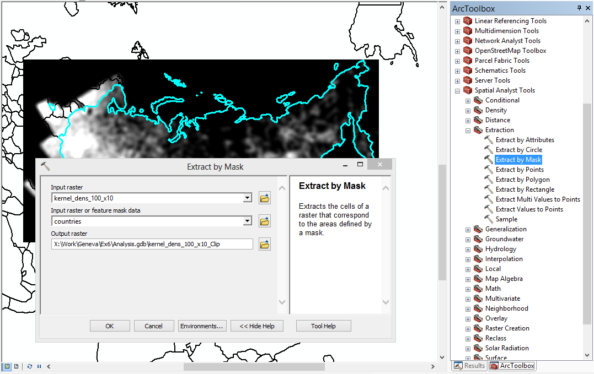

1. Нажмите **ОК**. Изображение примет более привычный гладкий вид непрерывной поверхности:

    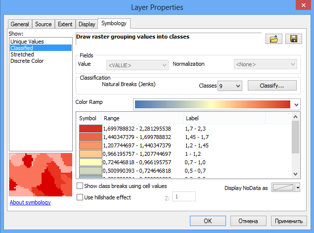

    <kbd>**Снимок экрана №12.**  Сглаженная поверхность поля температуры</kbd>

## Построение линии профиля
[В начало упражнения ⇡](#interpolation)

Распространенная задача при анализе полей температуры, солености, давление — построение профилей или разрезов. Вам предлагается построить профиль температуры по меридиану 38°з.д.

1. Создайте в базе геоданных *Argo* линейный класс пространственных объектов c названием *Profile* и системой координат *WGS84* из группы **Geographic Coordinate Systems > World**.

2. Добавьте этот слой на карту и смените его символ на линию черного цвета.

3. Включите режим редактирования.

4. Выберите в окне **Create Features** слой **Profiles** и щелкните правой кнопкой мыши на карте. В появившемся диалоге выберите команду **Absolute X,Y** чтобы задать координаты первой точки профиля:

    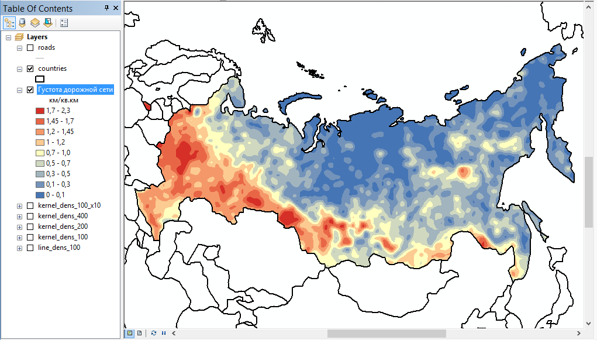

1. В появившемся мини-диалоге введите значения для долготы и широты соответственно -38 и 0 и нажмите на клавиатуре <kbd>Enter</kbd>.

    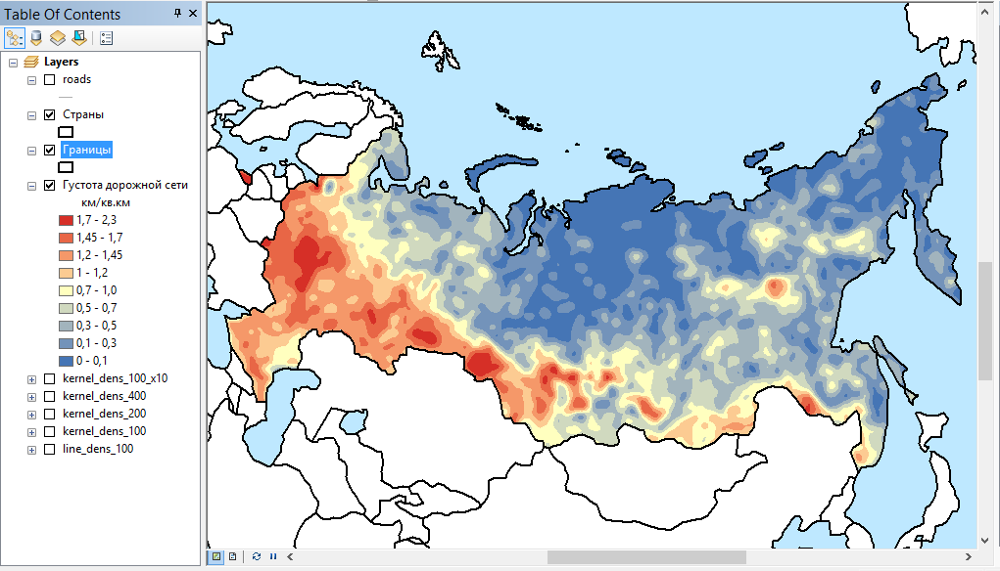

1. Повторите эту операцию для ввода конечной точки профиля (координаты -38 и 63 соответственно)

2. Нажмите на клавиатуре <kbd>F2</kbd>, чтобы завершить создание линии:

    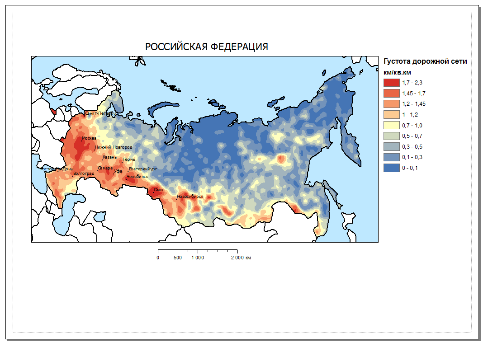

1. Завершите сеанс редактирования, выбрав на панели **Editor** команду **Editor > Stop Editing**.

## Определение температур по линии профиля
[В начало упражнения ⇡](#interpolation)

Для построения профиля вдоль созданной линии необходимо перенести величины температур с поверхности на узлы линии профиля. Для этого можно воспользоваться функцией интерполяции объектов.

> Интерполяция объектов позволяет перенести информацию с поверхности на перекрывающиеся с ней объекты. В частности, при интерполяции линии каждый ее узел получит значение, интерполированное в той же точке с поверхности растра.

1. Запустите инструмент **3D Analyst Tools > Functional Surface > Interpolate Shape** и заполните его параметры следующим образом:

    Параметр                Значение
    ----------------------- --------
    *Input Surface*         Temp_Kriging_3x3  
    *Input Feature Class*   Profile
    *Output Feature Class*  `.Ex4\Argo.gdb\Profile_Temp`  

    Остальные параметры оставьте по умолчанию и нажмите **ОК**.

1. Для корректного отображения широты коневертируйте линию в точки. Для  этого запустите инструмент **Data Management Tools > Features > Feature  Vertices to Points**. Назовите выходной класс *Profile\_Temp\_Pts.*

2. Добавьте в точки значения широты, долготы и температуры. Для этого воспользуйтесь инструментом **Data Management Tools > Features > Add XY Coordinates**.

3. Откройте атрибутивную таблицу получившегося слоя. Она должна иметь  следующий вид:

    

1. Выберите команду меню **View > Graphs > Create Graph**:

    

1. Настройте параметры графика следующим образом:

    Параметр        Значение  
    --------------- --------
    *Graph Type*    Vertical Line  
    *Layer/Table*   Profile\_Temp\_Pts  
    *Y Field*       POINT\_Z  
    *X Field*       POINT\_Y
    *Add to Legend* Отключено  

    Диалог примет следующий вид:

    

1. Нажмите **Next** и настройте отображение графика следующим образом:

    Параметр                    Значение  
    --------------------------- --------
    *Title*                     Профиль температуры по меридиану 38° з.д.  
    *Axis Properties > Left*    Температура, °С  
    *Axis Properties > Bottom*  Широта, °

    Диалог примет следующий вид:

    

1. Нажмите **Finish**. Построенный профиль будет добавлен в окно
  приложения:

    

    <kbd>**Снимок экрана №13**.  Профиль температуры</kbd>

## Оформление карты
[В начало упражнения ⇡](#interpolation)

1. Переключитесь в режим компоновки.

2. Установите масштаб равным 1:70 000 000.

3. Щелкните на профиле правой кнопкой мыши и выберите команду **Add To Layout**, чтобы добавить его на страницу компоновки.

4. Оформите карту в соответствии с нижеприведенным изображением. Добавьте на нее название, легенду и численный масштаб:

    

    Для установки нулевого расстояния между плашками цветовой шкалы дважды щелкните на легенде, перейдите на вкладку **Layout** и установите параметр **Vertical Patch Gap** равным *0 pt*:

    

1. Экспортируйте изображение в файл формата *PNG* и вставьте его в отчет.

2. Сохраните документ карты.

## Ответы на вопросы
[В начало упражнения ⇡](#interpolation)

Заполните отчетный файл и положите его в сетевую папку для проверки преподавателем.
